# PLAN: Backtest System Scaling & Refactoring

> 🤖 **Applying knowledge of `@[project-planner]`...**
>
> **Date:** 2026-02-10 | **Based on:** Jules's completed Phase 1-8 code

---

## Decisions (Confirmed)

| # | Decision | Answer |
|---|----------|--------|
| 1 | Fix stubs approach | **One-by-one**, verify each before moving to next |
| 2 | Refactor timing | **After** all stubs are fixed + verified. Then refactor + re-verify. |
| 3 | Phase C tools | **All of them** (8 analysis tools) |
| 4 | Auto-discovery | **TBD** — include as optional in Phase B |

---

## Current State

Jules completed all 8 phases. The pipeline is:

```
Frontend (React/30 components) → BridgeAPI (PyWebView) → Analysis Modules → BacktestEngine
                                        ✅                    ⚠️ STUBS          ✅ WORKS
```

**The problem:** Analysis modules exist but return **fake data** instead of calling the real engine.

---

## Phase A: Wire Real Engine (6 Tasks, One-by-One)

> Replace stubs with real `BacktestEngine` calls. Verify each before moving on.
>
> **Reference:** [run_single_backtest()](file:///c:/Users/Windows/OneDrive/Documents/GitHub/rsi_bot/app/backtest/run_batch_analysis.py#L218-L319) — the pattern to follow.

---

### A1. Fix Broken Import + Wire `run_backtest()`

**File:** [app/ui/api/backtest.py](file:///c:/Users/Windows/OneDrive/Documents/GitHub/rsi_bot/app/ui/api/backtest.py)

**Issues:**
- Line 3: `from app.backtest.data import load_csv_data` — **module doesn't exist**, will crash at import
- Lines 14-59: `run_backtest()` returns hardcoded `{"total_profit": 100.0}`

**Fix:**
1. Remove broken import on line 3
2. Replace stub `run_backtest()` with real engine integration:
   - Parse config → get strategy class via `load_strategy()`
   - Find data file path from `app/backtest/data/`
   - Run `BacktestEngine(data_path, strategy_class, config).run()`
   - Use `BacktestReporter` to extract metrics
   - Save run + results + trades + timeseries to DB via `BacktestRepository`
   - Return `run_id` + real metrics
3. Fix `get_run_history()` to return real `net_profit_pct` (currently returns `0.0`)

**Verify:**
```bash
conda run -n rsi python -c "from app.ui.api.backtest import BacktestAPIMixin; print('import OK')"
```

---

### A2. Wire `grid_search.py`

**File:** [app/backtest/grid_search.py](file:///c:/Users/Windows/OneDrive/Documents/GitHub/rsi_bot/app/backtest/grid_search.py)

**Current:** Returns `100.0 * (1 + modifier)` fake metrics per combination.

**Fix:**
1. Import `BacktestEngine`, `BacktestReporter`, `load_strategy`
2. For each parameter combination:
   - `copy.deepcopy(base_config)` → merge params
   - Create `BacktestEngine(data_file, strategy_class, config)`
   - `engine.run()`
   - Extract metrics via `BacktestReporter`
   - Save to DB
3. Sort results by profit descending, return real data

**Verify:**
```bash
conda run -n rsi python -c "
from app.backtest.grid_search import run_grid_search
r = run_grid_search('rsi_no_retest', 'BTC/USDT', 'app/backtest/data/BTCUSDT_15m.csv', {'rsi_period': [10, 14]}, {})
print(f'{len(r)} results, profit: {r[0][\"profit\"]}')"
```

---

### A3. Wire `walk_forward.py`

**File:** [app/backtest/walk_forward.py](file:///c:/Users/Windows/OneDrive/Documents/GitHub/rsi_bot/app/backtest/walk_forward.py)

**Current:** Returns 5 static hardcoded windows with fake IS/OOS profit numbers.

**Fix:**
1. Load full CSV data, determine date range
2. Generate rolling windows based on `train_days`, `test_days`, `step_days`
3. For each window: slice data → save temp CSV → run engine → get metrics
4. Calculate IS profit, OOS profit, efficiency ratio per window
5. Calculate aggregate stats (consistency_score, avg_efficiency)
6. Clean up temp files

**Verify:**
```bash
conda run -n rsi python -c "
from app.backtest.walk_forward import run_walk_forward
r = run_walk_forward('rsi_no_retest', 'BTC/USDT', 'app/backtest/data/BTCUSDT_15m.csv', {}, train_days=60, test_days=14, step_days=14)
print(f'{len(r[\"windows\"])} windows, consistency: {r[\"aggregate\"][\"consistency_score\"]}')"
```

---

### A4. Wire `sensitivity.py`

**File:** [app/backtest/sensitivity.py](file:///c:/Users/Windows/OneDrive/Documents/GitHub/rsi_bot/app/backtest/sensitivity.py)

**Current:** Returns `100.0 - (dist * 10)` simulated bell curve.

**Fix:**
1. For each value in `param_range`, run `BacktestEngine` with that parameter
2. Collect the chosen metric (profit, win_rate, sharpe, etc.)
3. Find optimal value, calculate stability score (coefficient of variation)
4. Return real values

**Verify:**
```bash
conda run -n rsi python -c "
from app.backtest.sensitivity import run_sensitivity
r = run_sensitivity('rsi_no_retest', 'BTC/USDT', 'app/backtest/data/BTCUSDT_15m.csv', {}, 'rsi_period', [10, 14, 20])
print(f'Optimal: {r[\"optimal\"]}, stability: {r[\"stability_score\"]}')"
```

---

### A5. Wire `get_strategy_config()`

**File:** [app/ui/api/config.py](file:///c:/Users/Windows/OneDrive/Documents/GitHub/rsi_bot/app/ui/api/config.py)

**Current:** Returns `{"default": {}, ...}` — empty default config.

**Fix:**
1. Import strategy class via `load_strategy()` or dynamic import
2. Read its `DEFAULT_CONFIG` attribute
3. Merge with JSON override from `config/strategy_overrides/{name}.json`
4. Return `{"default": DEFAULT_CONFIG, "override": override, "merged": merged}`

**Verify:**
```bash
conda run -n rsi python -c "
from app.ui.api.config import ConfigAPIMixin
c = ConfigAPIMixin()
r = c.get_strategy_config('rsi_no_retest')
print(f'Default keys: {list(r[\"default\"].keys())}')"
```

---

### A6. Verify All Stubs Fixed

Run ALL verifications together:
```bash
conda run -n rsi python -c "
from app.ui.api import BridgeAPI
api = BridgeAPI()
print('1. Data files:', len(api.get_data_files()))
print('2. Strategies:', [s['name'] for s in api.get_strategies()])
print('3. Config:', list(api.get_strategy_config('rsi_no_retest')['default'].keys())[:3])
print('ALL STUBS VERIFIED')
"
```

---

## Phase B: Refactor Folder Structure (After Phase A)

> Only start after ALL stubs are verified working.

| Task | What | From → To |
|------|------|-----------|
| B1 | Extract metrics | `reporting.py` (43KB) → `app/metrics/calculator.py` + `app/metrics/risk.py` |
| B2 | Split batch runner | `run_batch_analysis.py` (33KB) → `app/analysis/batch_run.py` + `app/analysis/single_run.py` |
| B3 | Move engine core | `app/backtest/engine.py` + `mock_exchange.py` → `app/engine/` |
| B4 | Move analysis tools | `app/backtest/grid_search.py` etc → `app/analysis/` |
| B5 | (Optional) Strategy auto-discovery | Auto-scan `app/strategies/` for `BaseStrategy` subclasses |
| B-VERIFY | **Full re-test** | Run ALL Phase A verifications again to confirm nothing broke |

---

## Phase C: New Analysis Features (After Phase B)

| # | Feature | Difficulty | Est. Time |
|---|---------|-----------|-----------|
| C1 | Monte Carlo Simulation | Medium | 3-4h |
| C2 | Parameter Stability Heatmap | Easy | 2h |
| C3 | Correlation Matrix | Easy | 2h |
| C4 | Regime Analysis | Medium | 4h |
| C5 | Slippage Sensitivity | Easy | 2h |
| C6 | Risk-of-Ruin Calculator | Easy | 1h |
| C7 | Strategy Combination | Hard | 6h |
| C8 | OOS Degradation Tracker | Medium | 3h |

Each tool needs: Python module + Bridge API method + React component + verification test.

---

## Phase D: Advanced Infrastructure (Long-term)

| Feature | Description |
|---------|-------------|
| Vectorized engine v2 | Pure vectorized ops for 100x speed |
| Multi-timeframe backtesting | 5m data with 1h signal filter |
| Real-time paper trading | MockExchange → live WebSocket |
| Cloud execution | Offload heavy grid searches |
| Data management UI | Download/update OHLCV from UI |
| HTTP API | REST layer for external access |

---

## Execution Sequence

```mermaid
graph LR
    A1["A1: Fix import\n+ run_backtest()"] --> A2["A2: grid_search"]
    A2 --> A3["A3: walk_forward"]
    A3 --> A4["A4: sensitivity"]
    A4 --> A5["A5: strategy_config"]
    A5 --> A6["A6: VERIFY ALL"]
    A6 --> B["Phase B:\nRefactor"]
    B --> BV["B-VERIFY:\nRe-test"]
    BV --> C["Phase C:\nNew Tools"]
    C --> D["Phase D:\nAdvanced"]

    style A1 fill:#ff4444,color:#fff
    style A2 fill:#ff4444,color:#fff
    style A3 fill:#ff4444,color:#fff
    style A4 fill:#ff4444,color:#fff
    style A5 fill:#ff4444,color:#fff
    style A6 fill:#ff6600,color:#fff
    style B fill:#ffaa00,color:#000
    style BV fill:#ff6600,color:#fff
    style C fill:#44aa44,color:#fff
    style D fill:#4444ff,color:#fff
```


