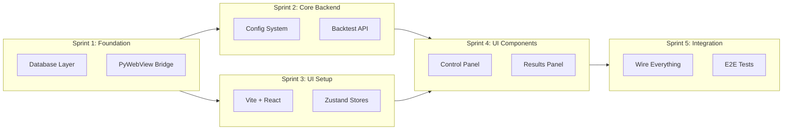

# Implementation Plan: Backtest UI

> **Plan Type:** Divide & Conquer Implementation  
> **Agent:** project-planner  
> **Status:** Awaiting Approval

---

## Overview

Transform the 18 architecture documents into working code using a **Sprint-based Divide & Conquer** approach. Each sprint is independent and can be implemented in parallel by different agents.



---

## Sprint Structure

| Sprint | Focus | Agent(s) | Parallel? | Est. Files |
|--------|-------|----------|-----------|------------|
| **1** | Foundation | database-architect, backend-specialist | ✅ Yes | 5 |
| **2** | Core Backend | backend-specialist | After S1 | 4 |
| **3** | UI Setup | frontend-specialist | ✅ Parallel with S2 | 10 |
| **4** | UI Components | frontend-specialist | After S2+S3 | 15 |
| **5** | Integration | test-engineer, devops-engineer | After S4 | 5 |

---

## Sprint 1: Foundation (Database + Bridge)

### Goal
Create the data persistence layer and PyWebView shell.

### Agent 1: database-architect

**Files to Create:**

| File | Purpose | Reference |
|------|---------|-----------|
| `app/db/connection.py` | SQLite connection manager | [DATABASE.md](../docs/DATABASE.md) |
| `app/db/models.py` | Pydantic models for all tables | [DATABASE.md](../docs/DATABASE.md) |
| `app/db/repositories/runs.py` | CRUD for runs table | [INTEGRATION_PLAN.md](../docs/database/INTEGRATION_PLAN.md) |
| `app/db/repositories/trades.py` | CRUD for trades table | [INTEGRATION_PLAN.md](../docs/database/INTEGRATION_PLAN.md) |
| `app/db/init_db.py` | Schema creation script | [DATABASE.md](../docs/DATABASE.md) |

**Verification:**
```bash
pytest tests/db/ -v  # Unit tests for repositories
```

---

### Agent 2: backend-specialist

**Files to Create:**

| File | Purpose | Reference |
|------|---------|-----------|
| `app/ui/bridge.py` | PyWebView window setup | [SYSTEM_OVERVIEW.md](../docs/architecture/SYSTEM_OVERVIEW.md) |
| `app/ui/api/__init__.py` | API namespace | - |
| `main_ui.py` | Entry point for UI app | [SYSTEM_OVERVIEW.md](../docs/architecture/SYSTEM_OVERVIEW.md) |

**Verification:**
```bash
python main_ui.py --test  # Verify window opens
```

---

## Sprint 2: Core Backend (Config + Backtest API)

### Goal
Implement the PyWebView API methods for backtest execution.

### Agent: backend-specialist

**Files to Create:**

| File | Purpose | Reference |
|------|---------|-----------|
| `app/ui/api/backtest.py` | BacktestAPI class | [API_CONTRACTS.md](../docs/backend/API_CONTRACTS.md) |
| `app/ui/api/config.py` | ConfigAPI class | [CONFIG_SYSTEM.md](../docs/backend/CONFIG_SYSTEM.md) |
| `app/ui/api/data.py` | DataAPI class | [API_CONTRACTS.md](../docs/backend/API_CONTRACTS.md) |
| `app/config/loader.py` | Config merge logic | [CONFIG_SYSTEM.md](../docs/backend/CONFIG_SYSTEM.md) |

**Key Implementation:**

```python
# app/ui/api/backtest.py
class BacktestAPI:
    def get_data_files(self) -> list[dict]:
        """Scan app/backtest/data/ for CSV files"""
        
    def get_strategies(self) -> list[dict]:
        """Discover strategy classes"""
        
    def run_backtest(self, params: dict) -> dict:
        """Execute backtest, save to DB, return results"""
```

**Verification:**
```bash
pytest tests/api/ -v
```

---

## Sprint 3: UI Setup (Vite + React + Stores)

### Goal
Bootstrap the React app with Zustand stores (no API calls yet).

### Agent: frontend-specialist

**Files to Create:**

| File | Purpose | Reference |
|------|---------|-----------|
| `ui/package.json` | Dependencies | [MIGRATION_STRATEGY.md](../docs/frontend/MIGRATION_STRATEGY.md) |
| `ui/vite.config.ts` | Build config | [PERFORMANCE_PLAN.md](../docs/frontend/PERFORMANCE_PLAN.md) |
| `ui/src/main.tsx` | Entry point | - |
| `ui/src/App.tsx` | Root component | [COMPONENT_MANIFEST.md](../docs/frontend/COMPONENT_MANIFEST.md) |
| `ui/src/types/pywebview.d.ts` | Type definitions | [MIGRATION_STRATEGY.md](../docs/frontend/MIGRATION_STRATEGY.md) |
| `ui/src/stores/useBacktestStore.ts` | Backtest state | [STATE_MANAGEMENT.md](../docs/frontend/STATE_MANAGEMENT.md) |
| `ui/src/stores/useConfigStore.ts` | Config state | [STATE_MANAGEMENT.md](../docs/frontend/STATE_MANAGEMENT.md) |
| `ui/src/stores/useUIStore.ts` | UI state | [STATE_MANAGEMENT.md](../docs/frontend/STATE_MANAGEMENT.md) |
| `ui/src/hooks/usePyWebView.ts` | Bridge hook | [MIGRATION_STRATEGY.md](../docs/frontend/MIGRATION_STRATEGY.md) |
| `ui/tailwind.config.js` | Styling | - |

**Setup Commands:**
```bash
cd ui
npm create vite@latest . -- --template react-ts
npm install zustand lightweight-charts framer-motion
npm install -D tailwindcss postcss autoprefixer
npx tailwindcss init -p
```

**Verification:**
```bash
npm run dev  # Verify dev server starts
npm run build  # Verify production build
```

---

## Sprint 4: UI Components (Controls + Results)

### Goal
Build all React components using mock data.

### Agent: frontend-specialist

**Files to Create (Controls):**

| File | Purpose |
|------|---------|
| `ui/src/components/Layout.tsx` | Main layout shell |
| `ui/src/components/Sidebar.tsx` | Navigation |
| `ui/src/components/DataFileSelector.tsx` | File dropdown |
| `ui/src/components/StrategySelector.tsx` | Strategy dropdown |
| `ui/src/components/ParameterEditor.tsx` | Config form |
| `ui/src/components/RunButton.tsx` | Execute button |

**Files to Create (Results):**

| File | Purpose |
|------|---------|
| `ui/src/components/ResultsPanel.tsx` | Results container |
| `ui/src/components/MetricsCards.tsx` | KPI display |
| `ui/src/components/EquityChart.tsx` | Equity line chart |
| `ui/src/components/TradesTable.tsx` | Trades list |

**Files to Create (Pages):**

| File | Purpose |
|------|---------|
| `ui/src/pages/DashboardPage.tsx` | Home/backtest page |
| `ui/src/pages/HistoryPage.tsx` | Run history |
| `ui/src/pages/SettingsPage.tsx` | Global settings |

**Verification:**
```bash
npm run dev  # Visual inspection
npm run test  # Component tests
```

---

## Sprint 5: Integration & Testing

### Goal
Connect frontend to backend, run E2E tests.

### Agent 1: test-engineer

**Files to Create:**

| File | Purpose |
|------|---------|
| `tests/e2e/test_backtest_flow.py` | Full backtest E2E |
| `tests/e2e/test_config_save.py` | Config persistence |
| `tests/integration/test_api.py` | API integration |

**Verification:**
```bash
pytest tests/e2e/ -v
pytest tests/integration/ -v
```

---

### Agent 2: devops-engineer

**Files to Create:**

| File | Purpose |
|------|---------|
| `scripts/build_ui.py` | Build automation |
| `scripts/run_desktop.py` | Desktop launcher |
| `.github/workflows/test.yml` | CI pipeline (optional) |

**Verification:**
```bash
python scripts/run_desktop.py  # Full app test
```

---

## Dependency Graph

```
Sprint 1 ─┬─> Sprint 2 ─┐
          │             ├──> Sprint 4 ──> Sprint 5
          └─> Sprint 3 ─┘
```

- **S1 → S2**: Backend APIs need database layer
- **S1 → S3**: UI can start in parallel (mock data)
- **S2+S3 → S4**: Components need stores + API ready
- **S4 → S5**: Integration needs all pieces

---

## File Count Summary

| Sprint | New Files | Modified | Total |
|--------|-----------|----------|-------|
| Sprint 1 | 8 | 0 | 8 |
| Sprint 2 | 4 | 1 | 5 |
| Sprint 3 | 10 | 0 | 10 |
| Sprint 4 | 15 | 2 | 17 |
| Sprint 5 | 5 | 0 | 5 |
| **Total** | **42** | **3** | **45** |

---

## Agent Assignment Summary

| Agent | Sprints | Focus |
|-------|---------|-------|
| database-architect | S1 | Repositories, models |
| backend-specialist | S1, S2 | Bridge, APIs |
| frontend-specialist | S3, S4 | React app, components |
| test-engineer | S5 | E2E tests |
| devops-engineer | S5 | Build scripts |

**Total Agents:** 5

---

## Verification Checklist (Final)

Before marking complete:

- [ ] `python scripts/run_desktop.py` launches app
- [ ] Backtest executes and displays results
- [ ] Config saves to JSON override files
- [ ] Run history shows in database
- [ ] All tests pass: `pytest tests/ -v`

---

## Approval Request

> [!IMPORTANT]
> This plan creates **45 files** across **5 sprints** using **5 specialized agents**.
> 
> **Estimated implementation time:** 3-4 focused sessions
> 
> **Ready to proceed?**
> - ✅ **Approve** → Start Sprint 1
> - ❌ **Revise** → Specify changes needed

---

## Cross-Reference

| Document | Purpose |
|----------|---------|
| [MASTER_ORCHESTRATION_PLAN.md](../../.gemini/antigravity/brain/a0aa2d48-04ff-42d0-b65d-571b45823c45/MASTER_ORCHESTRATION_PLAN.md) | Original orchestration |
| [All 18 Architecture Docs](../docs/) | Implementation reference |
