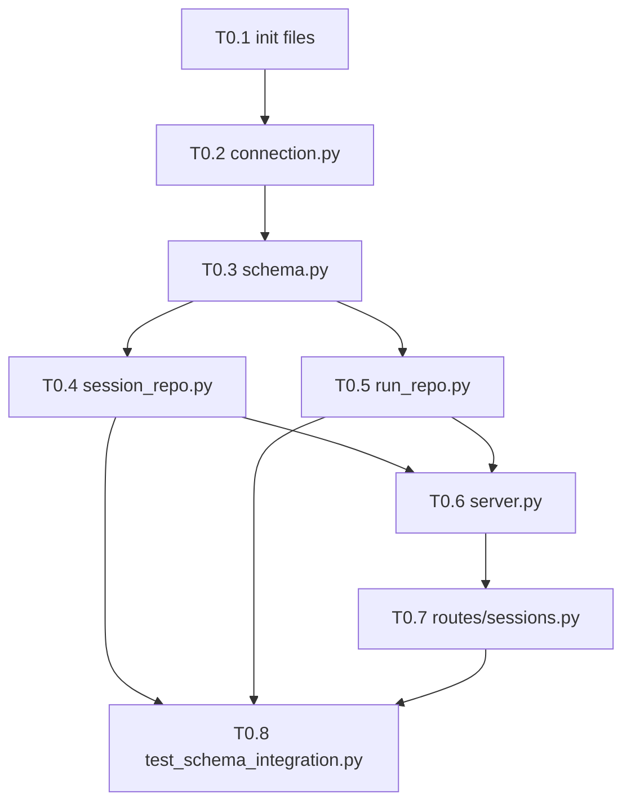

# Phase 0: Foundation — Schema + API + Safety Net

> **Parent Plan:** [PLAN-mode-engine.md](file:///D:/GitHub/rsi_bot/docs/PLAN-mode-engine.md) > **Phase Goal:** Prove the full stack works (DB schema → Python repos → FastAPI endpoints → integration test) BEFORE touching any UI code.

---

## 🔴 AGENT RULES — READ BEFORE CODING

### STOP Conditions (MANDATORY)

If ANY of these occur, **STOP coding and ask the user:**

1. You encounter a conflict between this plan and `docs/DATABASE.md`
2. You need to modify ANY existing file not listed in this plan
3. A Python import fails and you're not sure which module to use
4. You need to install a package not listed in the Dependencies section
5. A test fails and you can't determine why within 2 attempts
6. You're unsure about a function signature or return type

### DO NOT

- ❌ Modify any files in `ui/src/` (that's Phase 1+)
- ❌ Modify `app/backtest/engine.py` or `app/backtest/reporting.py`
- ❌ Modify `app/repository/` (existing live trading DB — separate system)
- ❌ Create mock data generators
- ❌ Use `float` for monetary values — use `Decimal` and store as `TEXT`
- ❌ Use `app/repository/db_connect.py` as a reference — it's for live trading, different pattern
- ❌ Add `sqlalchemy` to the new DB layer — use raw `sqlite3` for simplicity and control

### DO

- ✅ Create ALL new files in `app/db/` and `app/api/` directories
- ✅ Create ALL test files in `tests/` directory
- ✅ Use Python `sqlite3` standard library (no ORM for backtest DB)
- ✅ Use `Decimal` for all monetary values, store as `TEXT` in SQLite
- ✅ Use `zlib` compression for BLOB fields (equity curves)
- ✅ Follow existing patterns from `app/core/events.py` (dataclasses)
- ✅ Run `conda run -n rsi` for ALL Python commands
- ✅ Pin FastAPI + uvicorn versions in `requirements.txt`

---

## Dependencies to Install

```bash
# Add to requirements.txt:
fastapi==0.115.0
uvicorn[standard]==0.34.0
pydantic>=2.0
sse-starlette==2.1.0
```

```bash
# Install:
conda run -n rsi pip install fastapi==0.115.0 "uvicorn[standard]==0.34.0" "pydantic>=2.0" sse-starlette==2.1.0
```

---

## Task Breakdown

### T0.1 — Create `app/db/__init__.py` + `app/db/repositories/__init__.py`

Empty init files to make the directories Python packages.

**Files:**

- `app/db/__init__.py` (empty)
- `app/db/repositories/__init__.py` (empty)

**Verify:** `conda run -n rsi python -c "import app.db; import app.db.repositories"` → no errors.

---

### T0.2 — Create `app/db/connection.py` — SQLite Connection Manager

**Purpose:** Thread-safe SQLite connection manager with context manager pattern.

**Key Design Decisions:**

- DB path: `data/backtest.db` (relative to project root)
- Uses `sqlite3` standard library (NOT SQLAlchemy)
- WAL mode for concurrent reads (important for API serving)
- Foreign keys enforced via `PRAGMA foreign_keys = ON`

**Function Signatures:**

```python
import sqlite3
import os
from contextlib import contextmanager

# DB path constant
DB_PATH = os.path.join(os.path.dirname(os.path.dirname(os.path.dirname(
    os.path.abspath(__file__)))), "data", "backtest.db")

@contextmanager
def get_connection(db_path: str = None) -> sqlite3.Connection:
    """
    Context manager for SQLite connections.
    Uses WAL mode and enforces foreign keys.

    Usage:
        with get_connection() as conn:
            cursor = conn.cursor()
            cursor.execute("SELECT ...")
    """

def get_db_size_mb(db_path: str = None) -> float:
    """Returns the database file size in MB."""
```

**Verify:**

```bash
conda run -n rsi python -c "
from app.db.connection import get_connection
with get_connection('test_conn.db') as conn:
    conn.execute('CREATE TABLE test (id INTEGER PRIMARY KEY)')
    conn.execute('INSERT INTO test (id) VALUES (1)')
    result = conn.execute('SELECT * FROM test').fetchone()
    assert result == (1,), f'Expected (1,), got {result}'
    print('Connection manager works!')
import os; os.remove('test_conn.db')
"
```

---

### T0.3 — Create `app/db/schema.py` — Full Schema Definition

**Purpose:** Contains ALL CREATE TABLE statements. Single source of truth for the database schema.

**CRITICAL:** This must include BOTH the existing tables from `docs/DATABASE.md` AND the new session/quant tables from `docs/PLAN-mode-engine.md`. This is a **clean slate** — no migrations from old schema.

**Function Signatures:**

```python
def init_db(db_path: str = None) -> None:
    """
    Initialize the database with all tables.
    Safe to call multiple times (uses CREATE TABLE IF NOT EXISTS).

    Tables created:
    - strategies (from DATABASE.md)
    - themes (from DATABASE.md)
    - sessions (NEW)
    - runs (MODIFIED — includes session_id, run_type, version_number)
    - run_configs (from DATABASE.md)
    - run_results (from DATABASE.md)
    - run_timeseries (from DATABASE.md)
    - trades (from DATABASE.md)
    - tags (from DATABASE.md)
    - comparisons (from DATABASE.md)
    - grid_search_results (NEW)
    - walk_forward_results (NEW)
    - sensitivity_results (NEW)
    - db_settings (NEW)
    """

def seed_defaults(db_path: str = None) -> None:
    """
    Insert default strategies, themes, and settings.
    Uses INSERT OR IGNORE to be idempotent.
    """
```

**Schema Requirements (MUST FOLLOW EXACTLY):**

1. **`runs` table** — Merged schema (existing + new columns):

```sql
CREATE TABLE IF NOT EXISTS runs (
    id INTEGER PRIMARY KEY AUTOINCREMENT,
    strategy_id INTEGER NOT NULL,
    session_id TEXT,                              -- NEW: links to sessions
    run_type TEXT DEFAULT 'backtest',             -- NEW: backtest|grid_search|walk_forward|sensitivity
    version_number INTEGER DEFAULT 1,            -- NEW: for version chaining
    parent_run_id INTEGER,                       -- NEW: points to previous version
    auto_quant_config JSON,                      -- NEW: which tools were auto-triggered
    created_at DATETIME DEFAULT CURRENT_TIMESTAMP,
    started_at DATETIME,
    completed_at DATETIME,
    status TEXT DEFAULT 'pending',               -- pending|running|completed|failed|partial
    git_hash TEXT,
    version TEXT,
    is_grid_search BOOLEAN DEFAULT FALSE,        -- KEPT for backward compat queries
    grid_search_parent_id INTEGER,
    grid_search_total INTEGER,
    grid_search_completed INTEGER,

    FOREIGN KEY (strategy_id) REFERENCES strategies(id),
    FOREIGN KEY (session_id) REFERENCES sessions(id),
    FOREIGN KEY (parent_run_id) REFERENCES runs(id),
    FOREIGN KEY (grid_search_parent_id) REFERENCES runs(id)
);
```

2. **All monetary TEXT columns** from DATABASE.md must remain TEXT.
3. **All BLOB columns** (equity_curve, drawdown_curve) must use `zlib` compression.
4. **Seed data** must include the `rsi_no_retest` strategy with its DEFAULT_CONFIG from DATABASE.md.

**Verify:**

```bash
conda run -n rsi python -c "
from app.db.schema import init_db, seed_defaults
init_db('test_schema.db')
seed_defaults('test_schema.db')
import sqlite3
conn = sqlite3.connect('test_schema.db')
tables = [r[0] for r in conn.execute(\"SELECT name FROM sqlite_master WHERE type='table'\").fetchall()]
expected = ['strategies','themes','sessions','runs','run_configs','run_results',
            'run_timeseries','trades','tags','comparisons',
            'grid_search_results','walk_forward_results','sensitivity_results','db_settings']
for t in expected:
    assert t in tables, f'Missing table: {t}'
# Check seed data
strat = conn.execute('SELECT name FROM strategies').fetchone()
assert strat[0] == 'rsi_no_retest', f'Expected rsi_no_retest, got {strat}'
print(f'All {len(expected)} tables created. Seed data verified.')
conn.close()
import os; os.remove('test_schema.db')
"
```

---

### T0.4 — Create `app/db/repositories/session_repo.py` — Session CRUD

**Purpose:** Create, read, list, and archive sessions.

**Function Signatures:**

```python
import uuid
from datetime import datetime
from typing import Optional

def create_session(
    conn,
    mode_type: str,           # "single" | "batch"
    strategy_id: int,
    config_snapshot: dict,
    git_hash: str = None,
    notes: str = None
) -> str:
    """
    Create a new session. Returns the session_id (UUID string).
    Auto-generates: id (UUID), created_at, last_accessed, status='active'.
    """

def get_session(conn, session_id: str) -> Optional[dict]:
    """Get a single session by ID. Returns None if not found."""

def list_sessions(
    conn,
    mode_type: str = None,    # Filter by mode
    status: str = None,        # Filter by status
    limit: int = 50,
    offset: int = 0
) -> list[dict]:
    """List sessions with optional filters, ordered by created_at DESC."""

def archive_session(conn, session_id: str) -> bool:
    """Set session status to 'archived'. Returns True if updated."""

def update_last_accessed(conn, session_id: str) -> None:
    """Update last_accessed to current timestamp."""

def delete_session(conn, session_id: str) -> bool:
    """
    Hard-delete a session and ALL related data (cascading).
    Used by cleanup policy. Returns True if deleted.
    """
```

**Data Format:** Functions return plain `dict` (not dataclasses) for simplicity. JSON fields are parsed with `json.loads()`. Example:

```python
{
    "id": "sess_abc123",
    "mode_type": "single",
    "strategy_id": 1,
    "created_at": "2026-02-13T17:00:00",
    "last_accessed": "2026-02-13T17:05:00",
    "status": "active",
    "config_snapshot": {"symbol": "BTC/USDT", "params": {...}},
    "git_hash": "a1b2c3d",
    "notes": null
}
```

**Verify:**

```bash
conda run -n rsi python -c "
from app.db.schema import init_db, seed_defaults
from app.db.connection import get_connection
from app.db.repositories import session_repo

init_db('test_session.db')
seed_defaults('test_session.db')

with get_connection('test_session.db') as conn:
    # Create
    sid = session_repo.create_session(conn, 'single', 1, {'symbol': 'BTC/USDT'})
    print(f'Created session: {sid}')

    # Read
    s = session_repo.get_session(conn, sid)
    assert s['mode_type'] == 'single'
    assert s['config_snapshot']['symbol'] == 'BTC/USDT'

    # List
    sessions = session_repo.list_sessions(conn)
    assert len(sessions) == 1

    # Archive
    session_repo.archive_session(conn, sid)
    s2 = session_repo.get_session(conn, sid)
    assert s2['status'] == 'archived'

    print('Session CRUD: ALL PASSED')

import os; os.remove('test_session.db')
"
```

---

### T0.5 — Create `app/db/repositories/run_repo.py` — Run CRUD with Version Chaining

**Purpose:** Create runs linked to sessions, with version chaining support.

**Function Signatures:**

```python
def create_run(
    conn,
    strategy_id: int,
    session_id: str,
    run_type: str = "backtest",     # backtest|grid_search|walk_forward|sensitivity
    version_number: int = 1,
    parent_run_id: int = None,
    git_hash: str = None,
    version: str = None,
    auto_quant_config: dict = None
) -> int:
    """Create a new run. Returns the run_id (auto-incremented integer)."""

def update_run_status(conn, run_id: int, status: str, completed_at: str = None) -> None:
    """Update run status (pending → running → completed|failed|partial)."""

def get_run(conn, run_id: int) -> Optional[dict]:
    """Get a single run by ID."""

def get_runs_by_session(
    conn,
    session_id: str,
    run_type: str = None       # Filter by type
) -> list[dict]:
    """Get all runs in a session, optionally filtered by type."""

def get_run_versions(conn, session_id: str, run_type: str) -> list[dict]:
    """
    Get all versions of a specific run type within a session.
    Ordered by version_number ASC.
    Used for version comparison UI.
    """

def save_run_config(conn, run_id: int, config: dict) -> None:
    """Save run configuration to run_configs table."""

def save_run_results(conn, run_id: int, results: dict) -> None:
    """Save scalar results to run_results table. Monetary values as TEXT."""

def save_run_timeseries(conn, run_id: int, equity_curve: list, drawdown_curve: list = None, monthly_returns: dict = None) -> None:
    """Save compressed timeseries to run_timeseries. Uses zlib for BLOBs."""

def save_trades(conn, run_id: int, trades: list[dict]) -> None:
    """Batch-insert trades for a run."""
```

**Version Chaining Example:**

```python
# First backtest in session
run_v1 = create_run(conn, strategy_id=1, session_id="sess_abc",
                     run_type="grid_search", version_number=1)

# User tweaks params, reruns → version 2
run_v2 = create_run(conn, strategy_id=1, session_id="sess_abc",
                     run_type="grid_search", version_number=2,
                     parent_run_id=run_v1)

# Query all versions
versions = get_run_versions(conn, "sess_abc", "grid_search")
# → [{"id": run_v1, "version_number": 1}, {"id": run_v2, "version_number": 2, "parent_run_id": run_v1}]
```

**Verify:**

```bash
conda run -n rsi python -c "
from app.db.schema import init_db, seed_defaults
from app.db.connection import get_connection
from app.db.repositories import session_repo, run_repo

init_db('test_run.db')
seed_defaults('test_run.db')

with get_connection('test_run.db') as conn:
    sid = session_repo.create_session(conn, 'single', 1, {'symbol': 'BTC/USDT'})

    # Create v1 backtest
    r1 = run_repo.create_run(conn, 1, sid, 'backtest', version_number=1)
    run_repo.update_run_status(conn, r1, 'completed')

    # Create v1 grid search
    gs1 = run_repo.create_run(conn, 1, sid, 'grid_search', version_number=1)
    # Create v2 grid search (user tweaked params)
    gs2 = run_repo.create_run(conn, 1, sid, 'grid_search', version_number=2, parent_run_id=gs1)

    # Check version chain
    versions = run_repo.get_run_versions(conn, sid, 'grid_search')
    assert len(versions) == 2
    assert versions[0]['version_number'] == 1
    assert versions[1]['version_number'] == 2
    assert versions[1]['parent_run_id'] == gs1

    # Check runs by session
    all_runs = run_repo.get_runs_by_session(conn, sid)
    assert len(all_runs) == 3  # 1 backtest + 2 grid_search

    print('Run CRUD + version chaining: ALL PASSED')

import os; os.remove('test_run.db')
"
```

---

### T0.6 — Create `app/api/__init__.py` + `app/api/routes/__init__.py` + `app/api/server.py`

**Purpose:** FastAPI application with CORS enabled for local UI dev server.

**Key Design:**

- Host: `0.0.0.0`, Port: `8765`
- CORS: Allow `http://localhost:5173` (Vite default) and `http://localhost:3000`
- Auto-docs at `http://localhost:8765/docs` (Swagger UI)
- Lifespan: Initialize DB on startup

**File: `app/api/server.py`**

```python
from fastapi import FastAPI
from fastapi.middleware.cors import CORSMiddleware
from contextlib import asynccontextmanager
from app.db.schema import init_db, seed_defaults

@asynccontextmanager
async def lifespan(app: FastAPI):
    """Initialize database on startup."""
    init_db()
    seed_defaults()
    yield

app = FastAPI(
    title="RSI Bot Backtest API",
    version="0.1.0",
    lifespan=lifespan
)

app.add_middleware(
    CORSMiddleware,
    allow_origins=["http://localhost:5173", "http://localhost:3000"],
    allow_credentials=True,
    allow_methods=["*"],
    allow_headers=["*"],
)

# Health check
@app.get("/api/health")
def health():
    return {"status": "ok", "version": "0.1.0"}

# Include route modules (added in T0.7)
# from app.api.routes import sessions
# app.include_router(sessions.router, prefix="/api")

if __name__ == "__main__":
    import uvicorn
    uvicorn.run("app.api.server:app", host="0.0.0.0", port=8765, reload=True)
```

**Verify:**

```bash
# Start server in background, test health endpoint, then kill
conda run -n rsi python -c "
import subprocess, time, urllib.request, json, sys
proc = subprocess.Popen([sys.executable, '-m', 'app.api.server'], cwd='D:/GitHub/rsi_bot')
time.sleep(3)
try:
    resp = urllib.request.urlopen('http://localhost:8765/api/health')
    data = json.loads(resp.read())
    assert data['status'] == 'ok', f'Unexpected: {data}'
    print('FastAPI health check: PASSED')
finally:
    proc.terminate()
    proc.wait()
"
```

---

### T0.7 — Create `app/api/routes/sessions.py` — Session REST Endpoints

**Purpose:** CRUD endpoints for sessions.

**Endpoints:**

| Method  | Path                                 | Body                                                                  | Response                     |
| ------- | ------------------------------------ | --------------------------------------------------------------------- | ---------------------------- |
| `POST`  | `/api/sessions`                      | `{"mode_type": "single", "strategy_id": 1, "config_snapshot": {...}}` | `{"session_id": "sess_..."}` |
| `GET`   | `/api/sessions`                      | Query: `?mode_type=single&status=active&limit=50`                     | `[{session}, ...]`           |
| `GET`   | `/api/sessions/{session_id}`         | —                                                                     | `{session}`                  |
| `PATCH` | `/api/sessions/{session_id}/archive` | —                                                                     | `{"success": true}`          |

**Implementation Pattern:**

```python
from fastapi import APIRouter, HTTPException
from pydantic import BaseModel
from typing import Optional
from app.db.connection import get_connection
from app.db.repositories import session_repo

router = APIRouter(tags=["sessions"])

class CreateSessionRequest(BaseModel):
    mode_type: str          # "single" | "batch"
    strategy_id: int
    config_snapshot: dict
    git_hash: Optional[str] = None
    notes: Optional[str] = None

@router.post("/sessions")
def create_session(req: CreateSessionRequest):
    with get_connection() as conn:
        session_id = session_repo.create_session(
            conn, req.mode_type, req.strategy_id,
            req.config_snapshot, req.git_hash, req.notes
        )
    return {"session_id": session_id}

# ... GET, PATCH endpoints
```

**Then register in `server.py`:**

```python
from app.api.routes import sessions
app.include_router(sessions.router, prefix="/api")
```

**Verify:**

```bash
# With server running:
# POST
curl -X POST http://localhost:8765/api/sessions \
  -H "Content-Type: application/json" \
  -d '{"mode_type":"single","strategy_id":1,"config_snapshot":{"symbol":"BTC/USDT"}}'
# Should return: {"session_id": "sess_..."}

# GET list
curl http://localhost:8765/api/sessions
# Should return: [{...}]

# GET single
curl http://localhost:8765/api/sessions/{session_id}
# Should return: {...}
```

---

### T0.8 — Create `tests/test_schema_integration.py` — SAFETY NET TEST

**Purpose:** The ONE test that proves the entire Phase 0 foundation works. If this passes, the schema and repos are correct and safe for Phase 1.

**What It Tests:**

1. Database initialization (all tables created)
2. Seed data (strategy + themes exist)
3. Session CRUD lifecycle
4. Run CRUD with version chaining
5. Run config, results, timeseries persistence
6. Foreign key constraints work
7. Cleanup (delete session cascades to runs)

**Test Structure:**

```python
"""
Phase 0 Safety Net: Database Schema Integration Test
=====================================================
Tests the complete lifecycle: DB init → session → run → results → cleanup.

Run: conda run -n rsi python -m pytest tests/test_schema_integration.py -v
"""
import pytest
import os
import sqlite3
import json
import zlib
from decimal import Decimal

@pytest.fixture
def test_db(tmp_path):
    """Create a fresh test database for each test."""
    db_path = str(tmp_path / "test.db")
    from app.db.schema import init_db, seed_defaults
    init_db(db_path)
    seed_defaults(db_path)
    yield db_path
    # Cleanup happens automatically via tmp_path

class TestSchemaCreation:
    def test_all_tables_exist(self, test_db): ...
    def test_seed_strategies(self, test_db): ...
    def test_seed_themes(self, test_db): ...
    def test_indexes_created(self, test_db): ...

class TestSessionCRUD:
    def test_create_session(self, test_db): ...
    def test_get_session(self, test_db): ...
    def test_list_sessions_with_filters(self, test_db): ...
    def test_archive_session(self, test_db): ...
    def test_delete_session_cascades(self, test_db): ...

class TestRunCRUD:
    def test_create_run(self, test_db): ...
    def test_version_chaining(self, test_db): ...
    def test_run_status_transitions(self, test_db): ...
    def test_get_runs_by_session(self, test_db): ...
    def test_get_run_versions(self, test_db): ...

class TestRunData:
    def test_save_run_config(self, test_db): ...
    def test_save_run_results_decimal_precision(self, test_db): ...
    def test_save_run_timeseries_compressed(self, test_db): ...
    def test_save_trades(self, test_db): ...

class TestForeignKeys:
    def test_run_requires_valid_session(self, test_db): ...
    def test_run_requires_valid_strategy(self, test_db): ...
```

**Verify:**

```bash
conda run -n rsi python -m pytest tests/test_schema_integration.py -v
# Expected: ALL PASSED (15+ tests)
```

---

## File Summary

| #   | File                                  | Type   | Purpose                                       |
| --- | ------------------------------------- | ------ | --------------------------------------------- |
| 1   | `app/db/__init__.py`                  | NEW    | Package init                                  |
| 2   | `app/db/repositories/__init__.py`     | NEW    | Package init                                  |
| 3   | `app/db/connection.py`                | NEW    | SQLite connection manager                     |
| 4   | `app/db/schema.py`                    | NEW    | All CREATE TABLE + seed data                  |
| 5   | `app/db/repositories/session_repo.py` | NEW    | Session CRUD                                  |
| 6   | `app/db/repositories/run_repo.py`     | NEW    | Run CRUD + version chaining                   |
| 7   | `app/api/__init__.py`                 | NEW    | Package init                                  |
| 8   | `app/api/routes/__init__.py`          | NEW    | Package init                                  |
| 9   | `app/api/server.py`                   | NEW    | FastAPI app + CORS + lifespan                 |
| 10  | `app/api/routes/sessions.py`          | NEW    | Session REST endpoints                        |
| 11  | `tests/test_schema_integration.py`    | NEW    | Safety net integration test                   |
| 12  | `requirements.txt`                    | MODIFY | Add fastapi, uvicorn, pydantic, sse-starlette |

**Total: 11 new files + 1 modification. Zero changes to existing code.**

---

## Dependency Graph



**Critical Path:** T0.1 → T0.2 → T0.3 → T0.4/T0.5 (parallel) → T0.6 → T0.7 → T0.8

---

## Done When

- [ ] `conda run -n rsi python -m pytest tests/test_schema_integration.py -v` → **ALL PASS**
- [ ] `conda run -n rsi python -m app.api.server` → starts, `/api/health` returns `{"status":"ok"}`
- [ ] `curl POST /api/sessions` → creates session, returns ID
- [ ] `curl GET /api/sessions` → lists sessions
- [ ] `data/backtest.db` has 14 tables with indexes
- [ ] No existing files were modified (except `requirements.txt`)
