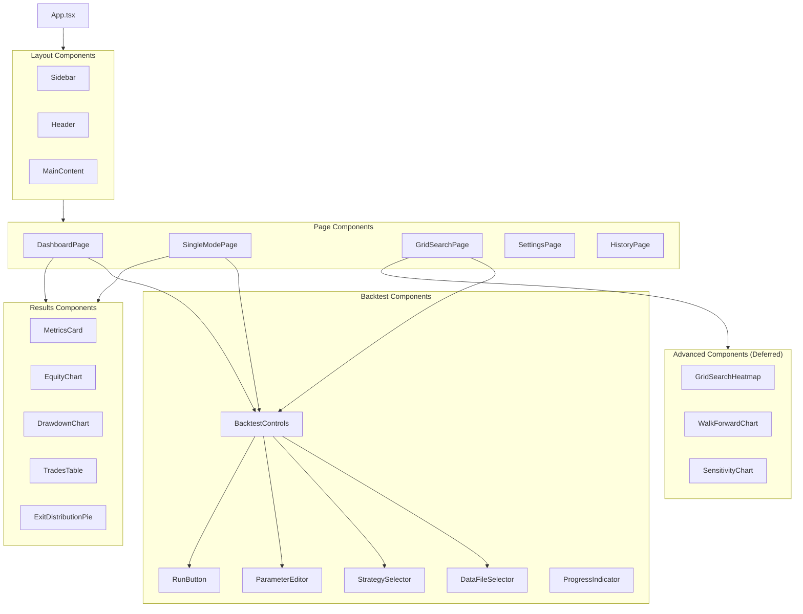
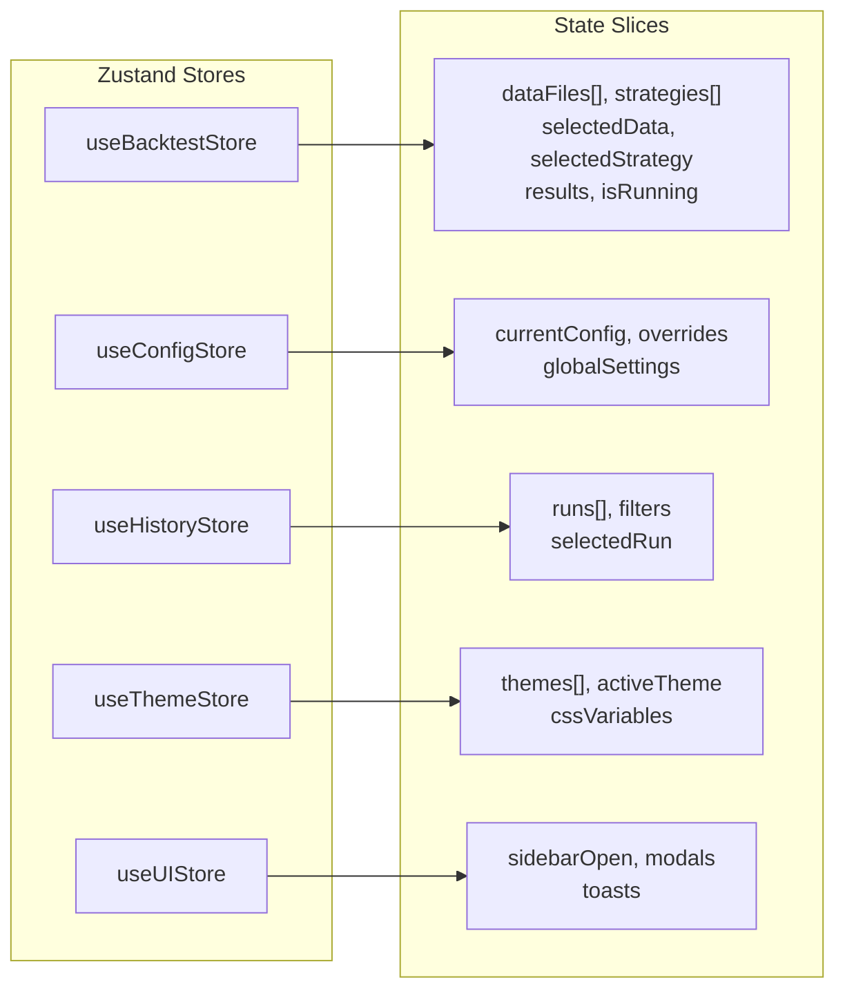
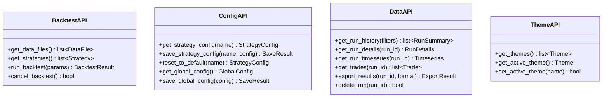

# Component Diagram - Backtest UI

> **Document Type:** Component Architecture  
> **Agent:** project-planner  
> **Status:** Phase 1 Documentation

---

## 1. React Component Tree



---

## 2. Zustand Store Architecture



### Store Responsibilities

| Store | Responsibility | PyWebView API Calls |
|-------|----------------|---------------------|
| `useBacktestStore` | Backtest execution, results | `run_backtest()`, `get_data_files()` |
| `useConfigStore` | Strategy config CRUD | `get_strategy_config()`, `save_strategy_config()` |
| `useHistoryStore` | Run history, comparisons | `get_run_history()`, `get_run_details()` |
| `useThemeStore` | Theme management | `get_themes()`, `set_active_theme()` |
| `useUIStore` | UI state (modals, toasts) | None (local only) |

---

## 3. Python Module Structure

```
app/
├── ui_bridge/                  # PyWebView Integration
│   ├── __init__.py
│   ├── main.py                 # Entry point, window creation
│   ├── backtest_api.py         # BacktestAPI class (js_api)
│   ├── config_api.py           # ConfigAPI class (js_api)
│   └── data_api.py             # DataAPI class (js_api)
│
├── backtest/                   # Backtest Engine (existing)
│   ├── engine.py               # BacktestEngine class
│   ├── reporting.py            # BacktestReporter class
│   └── data/                   # CSV data files
│
├── strategies/                 # Strategy Library (existing)
│   ├── base.py                 # BaseStrategy
│   ├── rsi_wma_retest.py       # RSI WMA Retest strategy
│   └── rsi_no_retest.py        # RSI No Retest strategy
│
├── repository/                 # Data Access (new)
│   ├── __init__.py
│   ├── db.py                   # SQLite connection manager
│   ├── runs_repo.py            # Runs table operations
│   ├── trades_repo.py          # Trades table operations
│   └── themes_repo.py          # Themes table operations
│
└── cli/                        # CLI Tools (new)
    └── db_manager.py           # init, migrate, seed commands
```

---

## 4. PyWebView API Classes



---

## 5. Component Migration Map

| Original (Figma UI) | New Location | Status | Notes |
|---------------------|--------------|--------|-------|
| `Designstrategycommandcenter/src/components/` | `ui/src/components/` | PENDING | Direct copy |
| `Designstrategycommandcenter/src/pages/` | `ui/src/pages/` | PENDING | Adapt for local |
| `Designstrategycommandcenter/src/stores/` | `ui/src/stores/` | PENDING | Replace API calls |
| `Designstrategycommandcenter/src/types/` | `ui/src/types/` | PENDING | Add pywebview.d.ts |

---

## 6. Cross-Reference

| Related Document | Purpose |
|------------------|---------|
| [SYSTEM_OVERVIEW.md](./SYSTEM_OVERVIEW.md) | High-level architecture |
| [MIGRATION_STRATEGY.md](../frontend/MIGRATION_STRATEGY.md) | UI migration details |
| [API_CONTRACTS.md](../backend/API_CONTRACTS.md) | PyWebView API surface |
