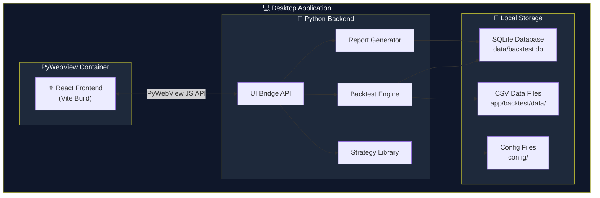
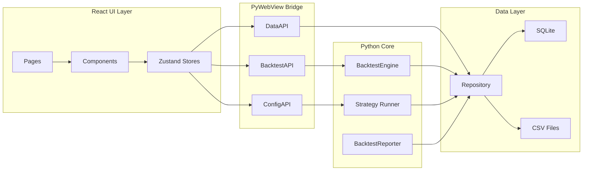

# System Overview - Backtest UI Architecture

> **Document Type:** Architecture Overview  
> **Agent:** project-planner  
> **Status:** Phase 1 Documentation

---

## 1. High-Level Architecture



---

## 2. Architecture Layers

| Layer | Technology | Responsibility |
|-------|------------|----------------|
| **Presentation** | React 18 + TypeScript | UI components, charts, forms |
| **Bridge** | PyWebView `js_api` | Python↔JavaScript communication |
| **Business Logic** | Python 3.10+ | Backtest execution, strategy analysis |
| **Data Access** | SQLite + CSV | Persistence, historical data |
| **Configuration** | YAML + JSON | Strategy params, global settings |

---

## 3. Key Architectural Decisions

### 3.1 Desktop Framework: PyWebView
**Rationale:**
- ✅ No Rust/C++ compilation (unlike Tauri)
- ✅ Direct Python↔JS calls without HTTP server
- ✅ End user only needs Python (no Node.js runtime)
- ✅ Single `.bat` or `.exe` launch

### 3.2 Frontend: Migrated React UI
**Source:** `Designstrategycommandcenter/` folder  
**Target:** `ui/` folder  
**Approach:** Copy, adapt, delete original

### 3.3 Database: SQLite
**Location:** `data/backtest.db`  
**Schema:** See `docs/DATABASE.md` (CTO-approved)  
**Key Tables:** runs, run_results, run_timeseries, trades, themes

### 3.4 Configuration: Dual System
| Config Type | File | Edited By |
|-------------|------|-----------|
| Strategy Params | `config/strategy_overrides/{name}.json` | UI (safe) |
| Global Settings | `config/config.yaml` | UI (validated) |
| Default Params | `app/strategies/*.py` | Developer only |

---

## 4. Component Boundaries



---

## 5. Data Flow Summary

| Flow | Direction | Description |
|------|-----------|-------------|
| **Backtest Execution** | UI → Python → DB | User triggers run, engine executes, results stored |
| **Config Loading** | DB/File → Python → UI | Strategy params loaded and displayed in forms |
| **Config Saving** | UI → Python → File | Form values written to JSON override |
| **Results Display** | DB → Python → UI | Metrics/trades fetched on dashboard load |
| **Chart Data** | DB → Python → UI | Equity curves lazy-loaded on click |

---

## 6. Deployment Model

### Development
```bash
# Terminal 1: Build UI
cd ui && npm run build

# Terminal 2: Launch App
conda activate rsi && python -m app.ui_bridge.main
```

### End User
```batch
:: run_backtest_ui.bat
@echo off
call conda activate rsi
python -m app.ui_bridge.main
```

### Future (Optional)
```bash
# Create standalone .exe
pyinstaller --onefile --windowed app/ui_bridge/main.py
```

---

## 7. Cross-Reference

| Related Document | Purpose |
|------------------|---------|
| [COMPONENT_DIAGRAM.md](./COMPONENT_DIAGRAM.md) | Detailed component relationships |
| [TECH_STACK.md](./TECH_STACK.md) | Technology decisions with rationale |
| [API_CONTRACTS.md](../backend/API_CONTRACTS.md) | PyWebView API surface |
| [DATABASE.md](../DATABASE.md) | SQLite schema (CTO-approved) |
