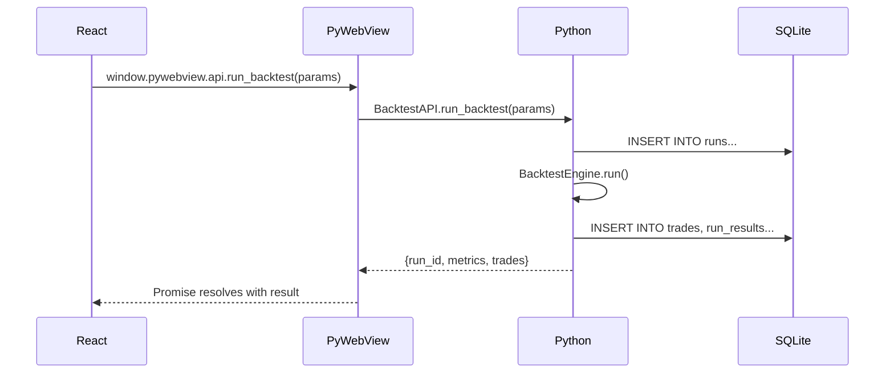

# API Contracts - PyWebView Bridge

> **Document Type:** API Surface Definition  
> **Agent:** backend-specialist  
> **Status:** Phase 2 Documentation

---

## Overview

PyWebView exposes Python methods to JavaScript via `window.pywebview.api`. This document defines the complete API surface.



---

## 1. BacktestAPI

### `get_data_files() → DataFile[]`

Scan CSV files in data directory.

**Response:**
```typescript
interface DataFile {
  name: string;           // "XPLUSDT_5m.csv"
  symbol: string;         // "XPL/USDT" (inferred)
  timeframe: string;      // "5m" (inferred)
  path: string;           // Absolute path
  size_mb: number;        // 2.5
  rows: number;           // 50000 (estimated)
  modified: string;       // ISO timestamp
}
```

**Python Implementation:**
```python
def get_data_files(self) -> list[dict]:
    data_dir = Path("app/backtest/data")
    files = []
    for f in data_dir.glob("*.csv"):
        stat = f.stat()
        # Infer symbol/timeframe from filename: XPLUSDT_5m.csv
        parts = f.stem.split("_")
        files.append({
            "name": f.name,
            "symbol": self._parse_symbol(parts[0]),
            "timeframe": parts[1] if len(parts) > 1 else "unknown",
            "path": str(f.absolute()),
            "size_mb": round(stat.st_size / 1024 / 1024, 2),
            "modified": datetime.fromtimestamp(stat.st_mtime).isoformat()
        })
    return sorted(files, key=lambda x: x["modified"], reverse=True)
```

---

### `get_strategies() → Strategy[]`

List available strategies from STRATEGY_MAP.

**Response:**
```typescript
interface Strategy {
  name: string;           // "rsi_wma_retest"
  display_name: string;   // "RSI WMA Retest"
  description: string;    // From docstring
  has_override: boolean;  // JSON override file exists
}
```

---

### `get_strategy_config(strategy_name: string) → StrategyConfig`

Load merged strategy configuration.

**Response:**
```typescript
interface StrategyConfig {
  default: Record<string, any>;    // From DEFAULT_CONFIG
  override: Record<string, any>;   // From JSON file
  merged: Record<string, any>;     // default + override
  schema: ParameterSchema[];       // For form generation
}

interface ParameterSchema {
  key: string;
  type: "number" | "select" | "boolean";
  label: string;
  group: "indicators" | "risk" | "exits";
  min?: number;
  max?: number;
  step?: number;
  options?: string[];
  description?: string;
}
```

---

### `save_strategy_config(strategy_name: string, config: object) → SaveResult`

Save config to JSON override file.

**Request:**
```typescript
{
  strategy_name: "rsi_wma_retest",
  config: {
    rsi_period: 14,
    rsi_wma_length: 45,
    // ... other params
  }
}
```

**Response:**
```typescript
interface SaveResult {
  success: boolean;
  path: string;           // "config/strategy_overrides/rsi_wma_retest.json"
  error?: string;
}
```

**Validation:**
- All keys must exist in DEFAULT_CONFIG
- Values must match expected types
- Numeric values within bounds

---

### `run_backtest(params: BacktestParams) → BacktestResult`

Execute backtest and return results.

**Request:**
```typescript
interface BacktestParams {
  data_file: string;        // Absolute path to CSV
  strategy_name: string;    // From STRATEGY_MAP
  initial_balance: number;  // Default: 10000
  leverage: number;         // Default: 10
  symbol?: string;          // Override auto-detection
  timeframe?: string;       // Override auto-detection
}
```

**Response:**
```typescript
interface BacktestResult {
  run_id: number;           // Database ID
  success: boolean;
  
  metrics: {
    net_profit: number;
    net_profit_pct: number;
    win_rate: number;
    profit_factor: number;
    sharpe_ratio: number;
    sortino_ratio: number;
    calmar_ratio: number;
    max_drawdown_pct: number;
    total_trades: number;
    winning_trades: number;
    losing_trades: number;
  };
  
  // Only first 100 points for dashboard
  equity_preview: [number, number][];  // [timestamp, balance]
  
  // Summary by exit reason
  exit_distribution: {
    TP1: number;
    TP2: number;
    TP3: number;
    SL: number;
    EOD: number;
  };
  
  error?: string;
}
```

**Notes:**
- Full equity curve is NOT returned here (lazy load)
- Trades list is NOT returned here (separate call)
- Run is persisted to SQLite automatically

---

## 2. DataAPI

### `get_run_history(filters?: RunFilters) → RunSummary[]`

Get list of past runs for dashboard.

**Request:**
```typescript
interface RunFilters {
  strategy?: string;
  symbol?: string;
  date_from?: string;
  date_to?: string;
  limit?: number;          // Default: 50
  offset?: number;         // Default: 0
}
```

**Response:**
```typescript
interface RunSummary {
  run_id: number;
  strategy_name: string;
  symbol: string;
  timeframe: string;
  net_profit_pct: number;
  win_rate: number;
  sharpe_ratio: number;
  total_trades: number;
  created_at: string;
  tags: string[];
}
```

---

### `get_run_details(run_id: number) → RunDetails`

Get full details for a single run.

**Response:**
```typescript
interface RunDetails {
  run: {
    id: number;
    strategy_name: string;
    status: string;
    created_at: string;
    git_hash: string;
    version: string;
  };
  config: Record<string, any>;
  results: BacktestResult["metrics"];
}
```

---

### `get_run_timeseries(run_id: number) → TimeseriesData`

**Lazy load** equity and drawdown curves.

**Response:**
```typescript
interface TimeseriesData {
  equity_curve: [number, number][];      // [timestamp, balance]
  drawdown_curve: [number, number][];    // [timestamp, drawdown_pct]
  monthly_returns: Record<string, number>; // {"2025-01": 5.2}
}
```

**Note:** This is the only place full curves are returned. Dashboard uses `equity_preview`.

---

### `get_trades(run_id: number, options?: TradeOptions) → Trade[]`

Get trades for a run with pagination.

**Request:**
```typescript
interface TradeOptions {
  limit?: number;          // Default: 50
  offset?: number;
  exit_reason?: string;    // Filter by TP1, SL, etc.
  sort_by?: string;        // "entry_time" | "pnl" | "pnl_pct"
  sort_order?: "asc" | "desc";
}
```

**Response:**
```typescript
interface Trade {
  id: number;
  symbol: string;
  side: "LONG" | "SHORT";
  entry_time: string;
  exit_time: string;
  entry_price: string;     // Decimal as string
  exit_price: string;
  quantity: string;
  pnl: string;
  pnl_pct: number;
  exit_reason: string;
  hold_time_hours: number;
  note?: string;           // User annotation
}
```

---

### `export_results(run_id: number, format: string) → ExportResult`

Export run to file.

**Request:**
```typescript
{
  run_id: 123,
  format: "csv" | "json" | "html"
}
```

**Response:**
```typescript
interface ExportResult {
  success: boolean;
  file_path: string;       // Absolute path to generated file
  error?: string;
}
```

---

## 3. ConfigAPI

### `get_global_config() → GlobalConfig`

Load config.yaml settings.

**Response:**
```typescript
interface GlobalConfig {
  strategy: string;        // Active strategy name
  symbols: string[];       // Trading symbols
  timeframe: string;
  backtest: {
    initial_balance: number;
    leverage: number;
  };
  exchange: string;
}
```

---

### `save_global_config(config: GlobalConfig) → SaveResult`

Save to config.yaml.

---

## 4. ThemeAPI

### `get_themes() → Theme[]`

List available themes from database.

**Response:**
```typescript
interface Theme {
  id: number;
  name: string;           // "cyberpunk_neon"
  display_name: string;   // "Cyberpunk Neon"
  is_dark: boolean;
}
```

---

### `get_active_theme() → ThemeDetails`

Get current theme with CSS variables.

**Response:**
```typescript
interface ThemeDetails extends Theme {
  css_variables: Record<string, string>;
}
```

---

### `set_active_theme(name: string) → boolean`

Switch active theme.

---

## 5. Error Handling

All API methods follow this error pattern:

```typescript
// Success
{
  success: true,
  data: { ... }
}

// Error
{
  success: false,
  error: "Error message",
  error_code: "STRATEGY_NOT_FOUND"
}
```

**Error Codes:**
| Code | Description |
|------|-------------|
| `STRATEGY_NOT_FOUND` | Unknown strategy name |
| `FILE_NOT_FOUND` | CSV file doesn't exist |
| `VALIDATION_ERROR` | Config validation failed |
| `DB_ERROR` | Database operation failed |
| `BACKTEST_ERROR` | Engine execution failed |

---

## 6. TypeScript Definitions

Full type definitions for the UI:

```typescript
// ui/src/types/pywebview.d.ts

declare global {
  interface Window {
    pywebview: {
      api: {
        // BacktestAPI
        get_data_files(): Promise<DataFile[]>;
        get_strategies(): Promise<Strategy[]>;
        get_strategy_config(name: string): Promise<StrategyConfig>;
        save_strategy_config(name: string, config: object): Promise<SaveResult>;
        run_backtest(params: BacktestParams): Promise<BacktestResult>;
        
        // DataAPI
        get_run_history(filters?: RunFilters): Promise<RunSummary[]>;
        get_run_details(run_id: number): Promise<RunDetails>;
        get_run_timeseries(run_id: number): Promise<TimeseriesData>;
        get_trades(run_id: number, options?: TradeOptions): Promise<Trade[]>;
        export_results(run_id: number, format: string): Promise<ExportResult>;
        
        // ConfigAPI
        get_global_config(): Promise<GlobalConfig>;
        save_global_config(config: GlobalConfig): Promise<SaveResult>;
        
        // ThemeAPI
        get_themes(): Promise<Theme[]>;
        get_active_theme(): Promise<ThemeDetails>;
        set_active_theme(name: string): Promise<boolean>;
      }
    }
  }
}

export {};
```

---

## Cross-Reference

| Document | Purpose |
|----------|---------|
| [INTEGRATION_PLAN.md](../database/INTEGRATION_PLAN.md) | Repository layer |
| [CONFIG_SYSTEM.md](./CONFIG_SYSTEM.md) | Dual config details |
| [STATE_MANAGEMENT.md](../frontend/STATE_MANAGEMENT.md) | How UI calls API |
