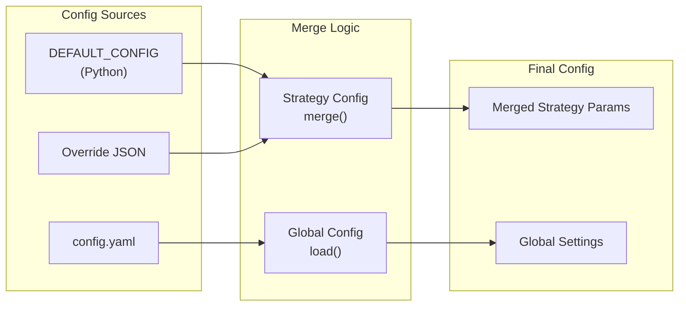

# Config System - Dual Configuration

> **Document Type:** Configuration Design  
> **Agent:** backend-specialist  
> **Status:** Phase 2 Documentation

---

## Overview

The backtest UI uses a **dual configuration system**:

| Config Type | File | Edited By | Contains |
|-------------|------|-----------|----------|
| **Strategy Config** | `config/strategy_overrides/{name}.json` | UI | Strategy parameters |
| **Global Config** | `config/config.yaml` | UI | Runtime settings |



---

## 1. Strategy Configuration

### Source: DEFAULT_CONFIG (Read-Only)

Located in strategy Python files:

```python
# app/strategies/rsi_wma_retest.py

DEFAULT_CONFIG = {
    # Indicator Settings
    "rsi_period": 21,
    "rsi_ema_length": 9,
    "rsi_wma_length": 45,
    "price_ema_fast": 21,
    "price_ema_slow": 200,
    
    # Entry Settings
    "nr_lookback": 30,
    "nr_max_above_ema21": 1,
    "nr_rsi_spread_min": 1.5,
    
    # Risk Settings
    "nr_sl_mode": "lowest_close",
    "sl_buffer_pct": 0.0,
    "disaster_sl_multiplier": 3.0,
    
    # Exit Settings
    "nr_tp1_rr": 1.0,
    "nr_tp2_rr": 2.0,
    "nr_tp3_rr": 3.0,
    "tp1_close_pct": 0.50,
    "tp2_close_pct": 0.50,
}
```

### Override: JSON Files (UI Editable)

```json
// config/strategy_overrides/rsi_wma_retest.json
{
  "rsi_period": 14,
  "rsi_wma_length": 50,
  "nr_tp1_rr": 1.5
}
```

### Merge Logic

```python
# app/config/strategy_loader.py

from pathlib import Path
import json

OVERRIDE_DIR = Path("config/strategy_overrides")

def load_strategy_config(strategy_name: str, strategy_class) -> dict:
    """Load merged strategy config."""
    # 1. Get DEFAULT_CONFIG from strategy class
    default = getattr(strategy_class, 'DEFAULT_CONFIG', {})
    
    # 2. Load override if exists
    override_path = OVERRIDE_DIR / f"{strategy_name}.json"
    override = {}
    if override_path.exists():
        with open(override_path) as f:
            override = json.load(f)
    
    # 3. Merge (override takes precedence)
    merged = {**default, **override}
    
    return {
        "default": default,
        "override": override,
        "merged": merged
    }

def save_strategy_override(strategy_name: str, config: dict) -> str:
    """Save strategy override to JSON."""
    OVERRIDE_DIR.mkdir(exist_ok=True)
    path = OVERRIDE_DIR / f"{strategy_name}.json"
    
    with open(path, 'w') as f:
        json.dump(config, f, indent=2)
    
    return str(path)

def reset_strategy_override(strategy_name: str) -> bool:
    """Delete override file, reverting to defaults."""
    path = OVERRIDE_DIR / f"{strategy_name}.json"
    if path.exists():
        path.unlink()
        return True
    return False
```

---

## 2. Global Configuration

### Source: config.yaml

```yaml
# config/config.yaml

# Active strategy selection
strategy: rsi_wma_retest

# Trading pair(s)
symbols:
  - XPL/USDT

# Timeframe
timeframe: 5m

# Exchange (for symbol definitions)
exchange: binance

# Backtest settings
backtest:
  initial_balance: 10000
  leverage: 10

# Risk settings
risk:
  max_position_size_pct: 1.0
  max_daily_loss_pct: 5.0
```

### Load/Save Logic

```python
# app/config/global_loader.py

from pathlib import Path
import yaml

CONFIG_PATH = Path("config/config.yaml")

def load_global_config() -> dict:
    """Load global config from YAML."""
    if not CONFIG_PATH.exists():
        return get_default_global_config()
    
    with open(CONFIG_PATH) as f:
        return yaml.safe_load(f)

def save_global_config(config: dict) -> None:
    """Save global config to YAML."""
    # Validate before saving
    validate_global_config(config)
    
    with open(CONFIG_PATH, 'w') as f:
        yaml.dump(config, f, default_flow_style=False)

def get_default_global_config() -> dict:
    """Return default global config."""
    return {
        "strategy": "rsi_wma_retest",
        "symbols": ["XPL/USDT"],
        "timeframe": "5m",
        "exchange": "binance",
        "backtest": {
            "initial_balance": 10000,
            "leverage": 10
        }
    }
```

---

## 3. UI Integration

### Form Generation from Schema

The UI generates parameter forms from a schema:

```python
# app/config/schema.py

def get_parameter_schema(strategy_name: str) -> list:
    """Generate form schema from DEFAULT_CONFIG."""
    config = STRATEGY_MAP[strategy_name].DEFAULT_CONFIG
    
    schema = []
    for key, value in config.items():
        param = {
            "key": key,
            "type": _infer_type(value),
            "label": _key_to_label(key),
            "group": _infer_group(key),
            "default": value
        }
        
        # Add constraints
        if param["type"] == "number":
            param.update(_get_numeric_constraints(key))
        
        schema.append(param)
    
    return schema

def _infer_type(value):
    if isinstance(value, bool):
        return "boolean"
    if isinstance(value, (int, float)):
        return "number"
    if isinstance(value, str):
        return "select" if value in KNOWN_SELECTS else "text"
    return "text"

def _infer_group(key: str) -> str:
    if any(x in key for x in ["rsi", "ema", "wma", "period"]):
        return "indicators"
    if any(x in key for x in ["sl", "tp", "close_pct"]):
        return "exits"
    if any(x in key for x in ["buffer", "multiplier", "risk"]):
        return "risk"
    return "general"
```

### React Form Component

```typescript
// ui/src/components/ParameterEditor.tsx

interface Props {
  schema: ParameterSchema[];
  values: Record<string, any>;
  onChange: (key: string, value: any) => void;
}

const ParameterEditor: React.FC<Props> = ({ schema, values, onChange }) => {
  const grouped = groupBy(schema, 'group');
  
  return (
    <div className="space-y-6">
      {Object.entries(grouped).map(([group, params]) => (
        <div key={group}>
          <h3 className="text-lg font-medium">{GROUP_LABELS[group]}</h3>
          <div className="grid grid-cols-2 gap-4">
            {params.map(param => (
              <ParameterInput
                key={param.key}
                param={param}
                value={values[param.key]}
                onChange={(v) => onChange(param.key, v)}
              />
            ))}
          </div>
        </div>
      ))}
    </div>
  );
};
```

---

## 4. Validation

### Strategy Config Validation

```python
def validate_strategy_config(config: dict, schema: list) -> list:
    """Validate config against schema. Returns list of errors."""
    errors = []
    
    for param in schema:
        key = param["key"]
        if key not in config:
            continue
        
        value = config[key]
        
        # Type check
        if param["type"] == "number":
            if not isinstance(value, (int, float)):
                errors.append(f"{key}: must be a number")
                continue
            
            if "min" in param and value < param["min"]:
                errors.append(f"{key}: must be >= {param['min']}")
            if "max" in param and value > param["max"]:
                errors.append(f"{key}: must be <= {param['max']}")
    
    return errors
```

### Global Config Validation

```python
def validate_global_config(config: dict) -> None:
    """Validate global config. Raises ValueError on error."""
    # Strategy must exist
    if config.get("strategy") not in STRATEGY_MAP:
        raise ValueError(f"Unknown strategy: {config['strategy']}")
    
    # Balance must be positive
    balance = config.get("backtest", {}).get("initial_balance", 0)
    if balance <= 0:
        raise ValueError("initial_balance must be positive")
    
    # Leverage must be reasonable
    leverage = config.get("backtest", {}).get("leverage", 1)
    if leverage < 1 or leverage > 125:
        raise ValueError("leverage must be 1-125")
```

---

## 5. File Structure

```
config/
├── config.yaml                    # Global settings (UI editable)
├── strategy_overrides/            # Strategy-specific overrides
│   ├── rsi_wma_retest.json       # Override for RSI WMA Retest
│   └── rsi_no_retest.json        # Override for RSI No Retest
└── .gitignore                     # Ignore user-specific overrides
```

### .gitignore for Overrides

```gitignore
# config/.gitignore
# Include template, ignore user overrides
!*.example.json
*.json
```

---

## 6. Cross-Reference

| Document | Purpose |
|----------|---------|
| [API_CONTRACTS.md](./API_CONTRACTS.md) | API for config CRUD |
| [SECURITY_RULES.md](../constraints/SECURITY_RULES.md) | File write boundaries |
| [USER_STORIES.md](../use-cases/USER_STORIES.md) | US-010 to US-021 |
