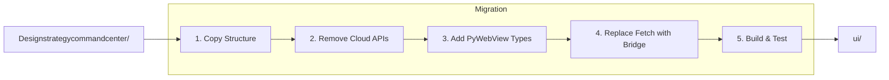

# Migration Strategy - Figma UI to Local App

> **Document Type:** Migration Plan  
> **Agent:** frontend-specialist  
> **Status:** Phase 3 Documentation

---

## Overview

Migrate the existing React UI from `Designstrategycommandcenter/` to a PyWebView-compatible local app in `ui/`.



---

## 1. Source Analysis

### Current Structure
```
Designstrategycommandcenter/
├── src/
│   ├── components/       # UI components
│   ├── pages/            # Page routes
│   ├── stores/           # Zustand stores
│   ├── types/            # TypeScript types
│   ├── hooks/            # Custom hooks
│   ├── utils/            # Utility functions
│   ├── App.tsx
│   └── main.tsx
├── public/               # Static assets
├── index.html
├── vite.config.ts
├── tailwind.config.js
└── package.json
```

### Key Dependencies (Keep)
- `react`, `react-dom`
- `zustand`
- `lightweight-charts`
- `framer-motion`
- `tailwindcss`

### Dependencies to Remove
- Any auth libraries (not needed locally)
- Any cloud API clients
- Any SSR-related code

---

## 2. Target Structure

```
ui/
├── src/
│   ├── components/       # Migrated components
│   ├── pages/            # Migrated pages
│   ├── stores/           # Modified stores (no API calls)
│   ├── types/            # Types + pywebview.d.ts
│   ├── hooks/
│   │   ├── usePyWebView.ts    # New: Bridge hook
│   │   └── useDataFiles.ts    # New: Data file hook
│   ├── utils/
│   ├── App.tsx
│   └── main.tsx
├── public/
├── dist/                 # Build output (served by PyWebView)
├── index.html
├── vite.config.ts
├── tailwind.config.js
└── package.json
```

---

## 3. Migration Steps

### Step 1: Project Setup

```bash
# Create new Vite project
cd rsi_bot
npm create vite@latest ui -- --template react-ts
cd ui
npm install

# Install dependencies
npm install zustand lightweight-charts framer-motion
npm install -D tailwindcss postcss autoprefixer
npx tailwindcss init -p
```

### Step 2: Copy Components

```powershell
# Copy source files
Copy-Item -Recurse "Designstrategycommandcenter/src/components" "ui/src/components"
Copy-Item -Recurse "Designstrategycommandcenter/src/pages" "ui/src/pages"
Copy-Item -Recurse "Designstrategycommandcenter/src/types" "ui/src/types"
Copy-Item -Recurse "Designstrategycommandcenter/src/hooks" "ui/src/hooks"
Copy-Item -Recurse "Designstrategycommandcenter/src/utils" "ui/src/utils"
```

### Step 3: Add PyWebView Types

```typescript
// ui/src/types/pywebview.d.ts

declare global {
  interface Window {
    pywebview: {
      api: PyWebViewAPI;
    };
  }
}

interface PyWebViewAPI {
  // BacktestAPI
  get_data_files(): Promise<DataFile[]>;
  get_strategies(): Promise<Strategy[]>;
  get_strategy_config(name: string): Promise<StrategyConfig>;
  save_strategy_config(name: string, config: object): Promise<SaveResult>;
  run_backtest(params: BacktestParams): Promise<BacktestResult>;
  
  // DataAPI
  get_run_history(filters?: RunFilters): Promise<RunSummary[]>;
  get_run_details(run_id: number): Promise<RunDetails>;
  get_run_timeseries(run_id: number): Promise<TimeseriesData>;
  get_trades(run_id: number, options?: TradeOptions): Promise<Trade[]>;
  
  // ConfigAPI
  get_global_config(): Promise<GlobalConfig>;
  save_global_config(config: GlobalConfig): Promise<SaveResult>;
  
  // ThemeAPI
  get_themes(): Promise<Theme[]>;
  get_active_theme(): Promise<ThemeDetails>;
  set_active_theme(name: string): Promise<boolean>;
}

export {};
```

### Step 4: Create Bridge Hook

```typescript
// ui/src/hooks/usePyWebView.ts

import { useState, useEffect, useCallback } from 'react';

export function usePyWebView() {
  const [isReady, setIsReady] = useState(false);
  
  useEffect(() => {
    // PyWebView sets window.pywebview when ready
    const checkReady = () => {
      if (window.pywebview) {
        setIsReady(true);
      }
    };
    
    // Check immediately
    checkReady();
    
    // Also listen for custom event
    window.addEventListener('pywebviewready', checkReady);
    return () => window.removeEventListener('pywebviewready', checkReady);
  }, []);
  
  const api = isReady ? window.pywebview.api : null;
  
  return { isReady, api };
}
```

### Step 5: Replace API Calls in Stores

**Before (fetch-based):**
```typescript
// stores/backtestStore.ts (OLD)
const runBacktest = async (params) => {
  const response = await fetch('/api/backtest', {
    method: 'POST',
    body: JSON.stringify(params)
  });
  return response.json();
};
```

**After (PyWebView-based):**
```typescript
// stores/backtestStore.ts (NEW)
const runBacktest = async (params) => {
  if (!window.pywebview) throw new Error('PyWebView not ready');
  return window.pywebview.api.run_backtest(params);
};
```

### Step 6: Update Vite Config

```typescript
// ui/vite.config.ts
import { defineConfig } from 'vite';
import react from '@vitejs/plugin-react';

export default defineConfig({
  plugins: [react()],
  base: './',  // Relative paths for local file serving
  build: {
    outDir: 'dist',
    assetsDir: 'assets',
    // Don't split chunks for simpler loading
    rollupOptions: {
      output: {
        manualChunks: undefined
      }
    }
  }
});
```

### Step 7: Build for PyWebView

```bash
cd ui
npm run build
```

Output in `ui/dist/` served by PyWebView.

---

## 4. Component Modifications

### Components Requiring Changes

| Component | Change Type | Reason |
|-----------|-------------|--------|
| All API calls | Replace | fetch → pywebview.api |
| Auth components | Remove | Not needed locally |
| Loading states | Simplify | No network latency |
| Error handling | Adapt | Different error types |

### Components Unchanged

| Component | Reason |
|-----------|--------|
| UI primitives (Button, Input) | Pure presentation |
| Charts | Same library |
| Layout components | No API calls |
| Modals, Toasts | Pure UI |

---

## 5. Store Modifications

### Pattern: Async Store Actions

```typescript
// ui/src/stores/useBacktestStore.ts
import { create } from 'zustand';

interface BacktestState {
  dataFiles: DataFile[];
  strategies: Strategy[];
  selectedData: DataFile | null;
  selectedStrategy: Strategy | null;
  results: BacktestResult | null;
  isRunning: boolean;
  error: string | null;
  
  // Actions
  loadDataFiles: () => Promise<void>;
  loadStrategies: () => Promise<void>;
  runBacktest: () => Promise<void>;
}

export const useBacktestStore = create<BacktestState>((set, get) => ({
  dataFiles: [],
  strategies: [],
  selectedData: null,
  selectedStrategy: null,
  results: null,
  isRunning: false,
  error: null,
  
  loadDataFiles: async () => {
    try {
      const files = await window.pywebview.api.get_data_files();
      set({ dataFiles: files });
    } catch (e) {
      set({ error: String(e) });
    }
  },
  
  loadStrategies: async () => {
    try {
      const strategies = await window.pywebview.api.get_strategies();
      set({ strategies });
    } catch (e) {
      set({ error: String(e) });
    }
  },
  
  runBacktest: async () => {
    const { selectedData, selectedStrategy } = get();
    if (!selectedData || !selectedStrategy) return;
    
    set({ isRunning: true, error: null });
    
    try {
      const results = await window.pywebview.api.run_backtest({
        data_file: selectedData.path,
        strategy_name: selectedStrategy.name
      });
      set({ results, isRunning: false });
    } catch (e) {
      set({ error: String(e), isRunning: false });
    }
  }
}));
```

---

## 6. Testing Strategy

### Unit Tests (Vitest)
```bash
npm install -D vitest @testing-library/react
npm run test
```

### Mock PyWebView API
```typescript
// tests/mocks/pywebview.ts
const mockApi: PyWebViewAPI = {
  get_data_files: vi.fn().mockResolvedValue([
    { name: 'test.csv', symbol: 'BTC/USDT', timeframe: '5m' }
  ]),
  // ... other methods
};

window.pywebview = { api: mockApi };
```

### Integration Test with PyWebView
```python
# tests/test_ui_integration.py
import webview
import pytest

def test_ui_loads():
    window = webview.create_window('Test', 'ui/dist/index.html')
    # Check UI loads without errors
```

---

## 7. Post-Migration Cleanup

- [ ] Delete `Designstrategycommandcenter/` after verification
- [ ] Update imports in any docs referencing old location
- [ ] Add `ui/` to main README
- [ ] Update `.gitignore` for `ui/dist/`

---

## Cross-Reference

| Document | Purpose |
|----------|---------|
| [COMPONENT_MANIFEST.md](./COMPONENT_MANIFEST.md) | What to migrate |
| [STATE_MANAGEMENT.md](./STATE_MANAGEMENT.md) | Store patterns |
| [API_CONTRACTS.md](../backend/API_CONTRACTS.md) | API to call |
