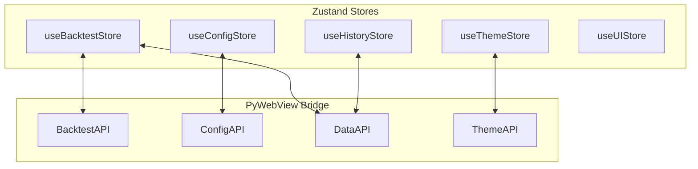

# State Management - Zustand Store Design

> **Document Type:** State Architecture  
> **Agent:** frontend-specialist  
> **Status:** Phase 3 Documentation

---

## Overview

State management using Zustand with slices for different domains.



---

## 1. Store Architecture

| Store | Purpose | Persisted? |
|-------|---------|------------|
| `useBacktestStore` | Backtest execution, data/strategy selection | No |
| `useConfigStore` | Strategy params, global settings | No |
| `useHistoryStore` | Run history, filters, selected runs | No |
| `useThemeStore` | Active theme, CSS variables | localStorage |
| `useUIStore` | Sidebar, modals, toasts | No |

---

## 2. useBacktestStore

```typescript
// ui/src/stores/useBacktestStore.ts

interface BacktestState {
  // Data
  dataFiles: DataFile[];
  strategies: Strategy[];
  
  // Selection
  selectedData: DataFile | null;
  selectedStrategy: Strategy | null;
  
  // Execution
  isRunning: boolean;
  progress: number;  // 0-100
  
  // Results
  results: BacktestResult | null;
  
  // Error
  error: string | null;
}

interface BacktestActions {
  // Initialization
  loadDataFiles: () => Promise<void>;
  loadStrategies: () => Promise<void>;
  
  // Selection
  selectDataFile: (file: DataFile) => void;
  selectStrategy: (strategy: Strategy) => void;
  
  // Execution
  runBacktest: () => Promise<void>;
  cancelBacktest: () => void;
  
  // Cleanup
  clearResults: () => void;
  clearError: () => void;
}

export const useBacktestStore = create<BacktestState & BacktestActions>((set, get) => ({
  // Initial state
  dataFiles: [],
  strategies: [],
  selectedData: null,
  selectedStrategy: null,
  isRunning: false,
  progress: 0,
  results: null,
  error: null,
  
  // Actions
  loadDataFiles: async () => {
    try {
      const files = await window.pywebview.api.get_data_files();
      set({ dataFiles: files });
      
      // Auto-select first if none selected
      if (files.length > 0 && !get().selectedData) {
        set({ selectedData: files[0] });
      }
    } catch (e) {
      set({ error: `Failed to load data files: ${e}` });
    }
  },
  
  loadStrategies: async () => {
    try {
      const strategies = await window.pywebview.api.get_strategies();
      set({ strategies });
      
      // Auto-select first if none selected
      if (strategies.length > 0 && !get().selectedStrategy) {
        set({ selectedStrategy: strategies[0] });
      }
    } catch (e) {
      set({ error: `Failed to load strategies: ${e}` });
    }
  },
  
  selectDataFile: (file) => set({ selectedData: file }),
  selectStrategy: (strategy) => set({ selectedStrategy: strategy }),
  
  runBacktest: async () => {
    const { selectedData, selectedStrategy } = get();
    if (!selectedData || !selectedStrategy) {
      set({ error: 'Please select data file and strategy' });
      return;
    }
    
    set({ isRunning: true, progress: 0, error: null, results: null });
    
    try {
      const results = await window.pywebview.api.run_backtest({
        data_file: selectedData.path,
        strategy_name: selectedStrategy.name
      });
      
      set({ results, isRunning: false, progress: 100 });
    } catch (e) {
      set({ error: String(e), isRunning: false });
    }
  },
  
  cancelBacktest: () => {
    // TODO: Implement via API
    set({ isRunning: false, progress: 0 });
  },
  
  clearResults: () => set({ results: null }),
  clearError: () => set({ error: null })
}));
```

---

## 3. useConfigStore

```typescript
// ui/src/stores/useConfigStore.ts

interface ConfigState {
  // Strategy config
  currentStrategy: string | null;
  defaultConfig: Record<string, any>;
  overrideConfig: Record<string, any>;
  mergedConfig: Record<string, any>;
  schema: ParameterSchema[];
  
  // Staged changes (not yet saved)
  stagedChanges: Record<string, any>;
  hasUnsavedChanges: boolean;
  
  // Validation
  errors: Record<string, string>;
  
  // Global config
  globalConfig: GlobalConfig | null;
}

interface ConfigActions {
  loadStrategyConfig: (strategyName: string) => Promise<void>;
  updateParam: (key: string, value: any) => void;
  saveConfig: () => Promise<boolean>;
  resetToDefault: () => Promise<void>;
  
  loadGlobalConfig: () => Promise<void>;
  saveGlobalConfig: (config: GlobalConfig) => Promise<boolean>;
}

export const useConfigStore = create<ConfigState & ConfigActions>((set, get) => ({
  currentStrategy: null,
  defaultConfig: {},
  overrideConfig: {},
  mergedConfig: {},
  schema: [],
  stagedChanges: {},
  hasUnsavedChanges: false,
  errors: {},
  globalConfig: null,
  
  loadStrategyConfig: async (strategyName) => {
    try {
      const config = await window.pywebview.api.get_strategy_config(strategyName);
      set({
        currentStrategy: strategyName,
        defaultConfig: config.default,
        overrideConfig: config.override,
        mergedConfig: config.merged,
        schema: config.schema,
        stagedChanges: {},
        hasUnsavedChanges: false,
        errors: {}
      });
    } catch (e) {
      console.error('Failed to load config:', e);
    }
  },
  
  updateParam: (key, value) => {
    const { stagedChanges, mergedConfig, schema } = get();
    const newStaged = { ...stagedChanges, [key]: value };
    const newMerged = { ...mergedConfig, [key]: value };
    
    // Validate
    const errors = validateConfig(newMerged, schema);
    
    set({
      stagedChanges: newStaged,
      mergedConfig: newMerged,
      hasUnsavedChanges: Object.keys(newStaged).length > 0,
      errors
    });
  },
  
  saveConfig: async () => {
    const { currentStrategy, mergedConfig, errors } = get();
    if (!currentStrategy) return false;
    if (Object.keys(errors).length > 0) return false;
    
    try {
      const result = await window.pywebview.api.save_strategy_config(
        currentStrategy,
        mergedConfig
      );
      
      if (result.success) {
        set({ stagedChanges: {}, hasUnsavedChanges: false });
        return true;
      }
      return false;
    } catch (e) {
      console.error('Failed to save config:', e);
      return false;
    }
  },
  
  resetToDefault: async () => {
    const { currentStrategy, defaultConfig } = get();
    if (!currentStrategy) return;
    
    // Reset to default values
    set({
      mergedConfig: { ...defaultConfig },
      stagedChanges: {},
      hasUnsavedChanges: true,  // Mark as changed (will delete override file)
      errors: {}
    });
  },
  
  loadGlobalConfig: async () => {
    try {
      const config = await window.pywebview.api.get_global_config();
      set({ globalConfig: config });
    } catch (e) {
      console.error('Failed to load global config:', e);
    }
  },
  
  saveGlobalConfig: async (config) => {
    try {
      const result = await window.pywebview.api.save_global_config(config);
      if (result.success) {
        set({ globalConfig: config });
        return true;
      }
      return false;
    } catch (e) {
      console.error('Failed to save global config:', e);
      return false;
    }
  }
}));

// Validation helper
function validateConfig(config: Record<string, any>, schema: ParameterSchema[]): Record<string, string> {
  const errors: Record<string, string> = {};
  
  for (const param of schema) {
    const value = config[param.key];
    
    if (param.type === 'number') {
      if (typeof value !== 'number') {
        errors[param.key] = 'Must be a number';
      } else if (param.min !== undefined && value < param.min) {
        errors[param.key] = `Must be >= ${param.min}`;
      } else if (param.max !== undefined && value > param.max) {
        errors[param.key] = `Must be <= ${param.max}`;
      }
    }
  }
  
  return errors;
}
```

---

## 4. useHistoryStore

```typescript
// ui/src/stores/useHistoryStore.ts

interface HistoryState {
  runs: RunSummary[];
  filters: RunFilters;
  selectedRun: RunDetails | null;
  comparisonRuns: [number, number] | null;
  isLoading: boolean;
}

interface HistoryActions {
  loadRuns: () => Promise<void>;
  setFilters: (filters: Partial<RunFilters>) => void;
  selectRun: (runId: number) => Promise<void>;
  setComparisonRuns: (runA: number, runB: number) => void;
  deleteRun: (runId: number) => Promise<void>;
}

export const useHistoryStore = create<HistoryState & HistoryActions>((set, get) => ({
  runs: [],
  filters: { limit: 50 },
  selectedRun: null,
  comparisonRuns: null,
  isLoading: false,
  
  loadRuns: async () => {
    set({ isLoading: true });
    try {
      const runs = await window.pywebview.api.get_run_history(get().filters);
      set({ runs, isLoading: false });
    } catch (e) {
      set({ isLoading: false });
      console.error('Failed to load runs:', e);
    }
  },
  
  setFilters: (filters) => {
    set({ filters: { ...get().filters, ...filters } });
    get().loadRuns();  // Reload with new filters
  },
  
  selectRun: async (runId) => {
    try {
      const details = await window.pywebview.api.get_run_details(runId);
      set({ selectedRun: details });
    } catch (e) {
      console.error('Failed to load run details:', e);
    }
  },
  
  setComparisonRuns: (runA, runB) => set({ comparisonRuns: [runA, runB] }),
  
  deleteRun: async (runId) => {
    // TODO: Implement delete API
    const runs = get().runs.filter(r => r.run_id !== runId);
    set({ runs });
  }
}));
```

---

## 5. useThemeStore

```typescript
// ui/src/stores/useThemeStore.ts
import { persist } from 'zustand/middleware';

interface ThemeState {
  themes: Theme[];
  activeTheme: ThemeDetails | null;
}

interface ThemeActions {
  loadThemes: () => Promise<void>;
  setActiveTheme: (name: string) => Promise<void>;
}

export const useThemeStore = create<ThemeState & ThemeActions>()(
  persist(
    (set, get) => ({
      themes: [],
      activeTheme: null,
      
      loadThemes: async () => {
        try {
          const themes = await window.pywebview.api.get_themes();
          const active = await window.pywebview.api.get_active_theme();
          set({ themes, activeTheme: active });
          
          // Apply CSS variables
          applyThemeVariables(active.css_variables);
        } catch (e) {
          console.error('Failed to load themes:', e);
        }
      },
      
      setActiveTheme: async (name) => {
        try {
          await window.pywebview.api.set_active_theme(name);
          const active = await window.pywebview.api.get_active_theme();
          set({ activeTheme: active });
          
          // Apply CSS variables
          applyThemeVariables(active.css_variables);
        } catch (e) {
          console.error('Failed to set theme:', e);
        }
      }
    }),
    {
      name: 'theme-storage',
      partialize: (state) => ({ activeTheme: state.activeTheme })
    }
  )
);

function applyThemeVariables(variables: Record<string, string>) {
  const root = document.documentElement;
  for (const [key, value] of Object.entries(variables)) {
    root.style.setProperty(key, value);
  }
}
```

---

## 6. useUIStore

```typescript
// ui/src/stores/useUIStore.ts

interface Toast {
  id: string;
  type: 'success' | 'error' | 'warning' | 'info';
  message: string;
  duration?: number;
}

interface Modal {
  type: string;
  props?: Record<string, any>;
}

interface UIState {
  sidebarOpen: boolean;
  activeModal: Modal | null;
  toasts: Toast[];
}

interface UIActions {
  toggleSidebar: () => void;
  openModal: (modal: Modal) => void;
  closeModal: () => void;
  addToast: (toast: Omit<Toast, 'id'>) => void;
  removeToast: (id: string) => void;
}

export const useUIStore = create<UIState & UIActions>((set, get) => ({
  sidebarOpen: true,
  activeModal: null,
  toasts: [],
  
  toggleSidebar: () => set({ sidebarOpen: !get().sidebarOpen }),
  
  openModal: (modal) => set({ activeModal: modal }),
  closeModal: () => set({ activeModal: null }),
  
  addToast: (toast) => {
    const id = Math.random().toString(36).substring(7);
    const newToast = { ...toast, id };
    set({ toasts: [...get().toasts, newToast] });
    
    // Auto-remove after duration
    setTimeout(() => {
      get().removeToast(id);
    }, toast.duration || 3000);
  },
  
  removeToast: (id) => {
    set({ toasts: get().toasts.filter(t => t.id !== id) });
  }
}));
```

---

## 7. Store → API Mapping

| Store Action | API Method |
|--------------|------------|
| `loadDataFiles()` | `get_data_files()` |
| `loadStrategies()` | `get_strategies()` |
| `runBacktest()` | `run_backtest()` |
| `loadStrategyConfig()` | `get_strategy_config()` |
| `saveConfig()` | `save_strategy_config()` |
| `loadRuns()` | `get_run_history()` |
| `selectRun()` | `get_run_details()` |
| `loadThemes()` | `get_themes()` |
| `setActiveTheme()` | `set_active_theme()` |

---

## Cross-Reference

| Document | Purpose |
|----------|---------|
| [COMPONENT_MANIFEST.md](./COMPONENT_MANIFEST.md) | Components using stores |
| [API_CONTRACTS.md](../backend/API_CONTRACTS.md) | API definitions |
