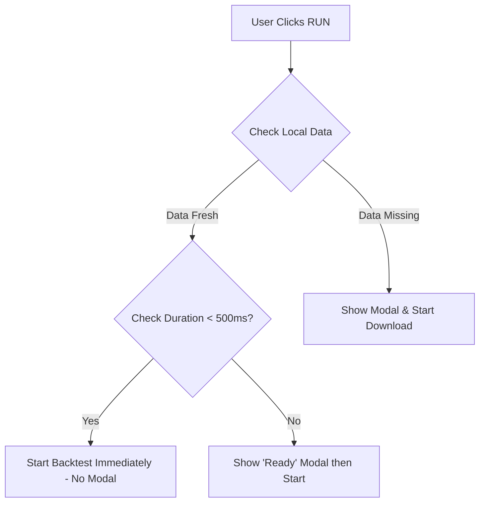

# Figma Agent Prompt: Task 3 — Pre-Download Data Modal

> **Phase:** 1 (Core Layout & Controls)
> **Priority:** 🟡 High (UX Polish)
> **Design Head Status:** ✅ Approved with "Technical Zen" Revisions

---

## 🎯 Objective

Design a **modal dialog** that appears before a backtest runs to manage data downloading. This prevents rate-limiting issues and provides transparency about data state.

**Key Principle:** Make waiting informative without losing professional credibility.

> ⚠️ **CRITICAL: The 500ms Grace Period**
> If `check_time + download_time < 500ms`, **do NOT show this modal**. Just start the backtest. The modal only fades in if the operation exceeds this threshold.

---

## 📐 Modal Layout

```
┌───────────────────────────────────────────────────────────────────────────┐
│                                                                           │
│   ┌───────────────────────────────────────────────────────────────────┐   │
│   │               ⟨ Initializing Data Pipeline ⟩                       │   │
│   │                                                                   │   │
│   │   Validating historical data integrity for backtest.             │   │
│   │                                                                   │   │
│   │   ┌───────────────────────────────────────────────────────────┐   │   │
│   │   │ Symbol           Status          Size        Action       │   │   │ ← Sticky header
│   │   ├───────────────────────────────────────────────────────────┤   │   │
│   │   │ BTC/USDT         ✓ Fresh         1.2 MB      Skip         │   │   │ ← max-height: 200px
│   │   │ ETH/USDT         ⚠ Outdated      0.8 MB      Run Partial  │   │   │ ← scrollable
│   │   │ DOGE/USDT        ✗ Missing       —           Syncing      │   │   │
│   │   │ SOL/USDT         ✓ Fresh         1.0 MB      Skip         │   │   │
│   │   │ ... (scrollable for 50+ symbols)                          │   │   │
│   │   └───────────────────────────────────────────────────────────┘   │   │
│   │                                                                   │   │
│   │   ┌───────────────────────────────────────────────────────────┐   │   │
│   │   │ ████████████████████████░░░░░░░░░░░░  67%                 │   │   │
│   │   │ Syncing ETH/USDT: 0.5 MB / 0.8 MB                         │   │   │
│   │   │ ⏱️ ~23 seconds remaining                                   │   │   │
│   │   └───────────────────────────────────────────────────────────┘   │   │
│   │                                                                   │   │
│   │   📊 BTC averages 12% monthly volatility since 2020.            │   │ ← Context-aware fact
│   │                                                                   │   │
│   │   ┌─────────────────┐         ┌─────────────────────────────┐   │   │
│   │   │     Cancel      │         │       Start Backtest →      │   │   │
│   │   └─────────────────┘         └─────────────────────────────┘   │   │
│   │                                                                   │   │
│   └───────────────────────────────────────────────────────────────────┘   │
│                                                                           │
└───────────────────────────────────────────────────────────────────────────┘
```

---

## 🚦 The 500ms Grace Period Logic



**Implementation:**

```typescript
async function handleRunBacktest() {
  const startTime = Date.now();
  const checkResult = await checkDataStatus(symbols);

  if (checkResult.allFresh && Date.now() - startTime < 500) {
    // Grace Period: Skip modal entirely
    startBacktest();
    return;
  }

  // Show modal
  openDataPrepModal(checkResult);
}
```

---

## 🔄 States & Flows

### Modal States

| State         | Description                                |
| ------------- | ------------------------------------------ |
| `checking`    | Validating existing data files             |
| `ready`       | All data fresh, no download needed         |
| `downloading` | Actively downloading missing/outdated data |
| `error`       | Download failed (rate limit, network)      |
| `complete`    | All downloads done                         |

### Symbol Status Icons

| Status      | Icon                  | Description     | Action Button     |
| ----------- | --------------------- | --------------- | ----------------- |
| Fresh       | `CheckCircle`         | Data up-to-date | "Skip"            |
| Outdated    | `ExclamationTriangle` | Needs refresh   | **"Run Partial"** |
| Missing     | `XCircle`             | No data file    | "Downloading..."  |
| Downloading | `ArrowPath` (spin)    | In progress     | Progress %        |
| Error       | `ExclamationCircle`   | Failed          | "Retry"           |

> ⚠️ **"Run Partial" Escape Hatch:** If status is `Outdated`, users can proceed with incomplete data. Results page should show a "Dirty Data" warning badge.

---

## 🎨 Design Requirements

### Modal Container

- Centered overlay with backdrop blur.
- Glass effect: `bg-surface backdrop-blur-xl`.
- Width: `max-w-lg` (32rem / 512px).
- Border radius: `rounded-2xl`.
- Shadow: Multi-layer glow.

### Symbol Table (Scalable for 50+ symbols)

- **Container:** `max-height: 200px`, `overflow-y: auto`.
- **Header:** **Sticky** (`position: sticky; top: 0`).
- **Scrollbar:** Custom styled (thin, accent color).
- **Rows:** Zebra striping for readability.

### Progress Bar

- **Height:** 8px with rounded ends.
- **Style:** Subtle gradient (accent → success).
- **Animation:** Smooth shimmer (not bouncy).

### Animation Style: "Technical Zen"

> ⚠️ **NO cartoon rockets, coins, or "Going to the Moon" imagery.**

**Approved Animations:**

- Wireframe globe slowly rotating.
- Sine wave stabilizing from noise to flat line.
- Hex-grid cells filling in sequence.
- Abstract data flow visualization.

**Library:** Use `lottiefiles.com` and search for "data", "network", "abstract", "minimal loader".

---

## 💡 Context-Aware Facts

Facts should be **relevant to the symbol being downloaded**:

```typescript
const CONTEXT_FACTS: Record<string, string[]> = {
  BTC: [
    "BTC averages 12% monthly volatility since 2020.",
    "Bitcoin's average drawdown duration is 89 days.",
    "BTC/ETH correlation is currently 0.87.",
  ],
  ETH: [
    "ETH gas fees peaked at $70 in May 2021.",
    "Ethereum merge reduced energy use by 99.95%.",
    "ETH trades 24/7, unlike NYSE's 6.5 hours.",
  ],
  DEFAULT: [
    "The best traders review their losing trades first.",
    "A 60% win rate with 2:1 R:R is highly profitable.",
    "Drawdown is the silent killer of trading accounts.",
    "RSI was invented by J. Welles Wilder in 1978.",
  ],
  ERROR: [
    "Check your API quota in Settings.",
    "Binance rate limit resets every minute.",
    "Try reducing the number of symbols in batch.",
  ],
};

function getFact(symbol: string, isError: boolean): string {
  if (isError) return randomFrom(CONTEXT_FACTS["ERROR"]);
  const base = symbol.split("/")[0]; // "BTC/USDT" → "BTC"
  const facts = CONTEXT_FACTS[base] || CONTEXT_FACTS["DEFAULT"];
  return randomFrom(facts);
}
```

---

## ⚠️ Error Handling

### Rate Limit Error

```
┌─────────────────────────────────────────────────────────────────┐
│ ⚠ Rate Limited                                                  │
│                                                                 │
│ Binance has temporarily blocked requests.                       │
│ Waiting 60 seconds before retry...                              │
│                                                                 │
│ [█████████░░░░░░░░░░░░░░░░░░░░░░] 45s remaining                │
│                                                                 │
│ 💡 Check your API quota in Settings.                            │
│                                                                 │
│ [Retry Now]      [Use Cached Data]      [Cancel]               │
└─────────────────────────────────────────────────────────────────┘
```

### Network Error

```
┌─────────────────────────────────────────────────────────────────┐
│ ✗ Download Failed                                               │
│                                                                 │
│ Could not connect to Binance API.                               │
│ Check your internet connection.                                 │
│                                                                 │
│ [Retry]                           [Cancel]                      │
└─────────────────────────────────────────────────────────────────┘
```

---

## 🎯 Skip Logic (Grace Period Applied)

If **all data is fresh AND check took < 500ms:**

- **No modal shown.** Backtest starts immediately.

If **all data is fresh BUT check took ≥ 500ms:**

- Show minimal "Ready" state for 1 second, then auto-start.

```
┌─────────────────────────────────────────────────────────────────┐
│ ✓ Data Ready                                                    │
│                                                                 │
│ All historical data is up-to-date.                              │
│ Starting in 1s...                                               │
│                                                                 │
│ [Force Refresh]           [Start Now →]                         │
└─────────────────────────────────────────────────────────────────┘
```

---

## 🧊 Edge Case: Delisted Symbols

If a symbol was delisted (e.g., `LUNA/USDT` stopped trading in 2022):

```
┌─────────────────────────────────────────────────────────────────┐
│ ⚠ LUNA/USDT: Data Ends 2022-05-09                               │
│                                                                 │
│ This symbol was delisted. Only historical data is available.   │
│ Backtest range auto-adjusted to available data.                │
│                                                                 │
│ [Show Available Range]              [Proceed Anyway]            │
└─────────────────────────────────────────────────────────────────┘
```

---

## 📦 Components to Create

| Component                 | Description                         |
| ------------------------- | ----------------------------------- |
| `DataPrepModal.tsx`       | Main modal container                |
| `SymbolStatusTable.tsx`   | Scrollable table with sticky header |
| `SymbolRow.tsx`           | Individual symbol row               |
| `AnimatedProgressBar.tsx` | Shimmer progress bar                |
| `TechnicalZenLoader.tsx`  | Abstract data visualization         |
| `ContextFactDisplay.tsx`  | Symbol-aware rotating facts         |

---

## 🔧 State Management

```typescript
interface DataPrepState {
  isOpen: boolean;
  state: "checking" | "ready" | "downloading" | "error" | "complete";

  symbols: Array<{
    symbol: string;
    status: "fresh" | "outdated" | "missing" | "downloading" | "error";
    sizeBytes: number | null;
    downloadedBytes: number;
    lastUpdated: Date | null;
  }>;

  currentDownload: string | null;
  overallProgress: number; // 0-100
  estimatedTimeRemaining: number; // seconds

  // Context-aware
  currentFact: string;
  factUpdateInterval: NodeJS.Timeout | null;
}
```

---

## ✅ Acceptance Criteria

- [ ] **500ms Grace Period** implemented (no modal if fast).
- [ ] Modal appears only when needed.
- [ ] Symbol table scrollable with **sticky header**.
- [ ] "Run Partial" button for outdated data.
- [ ] Progress bar animated (subtle shimmer).
- [ ] **Context-aware facts** based on downloading symbol.
- [ ] **Technical Zen** animation (no rockets/coins).
- [ ] Error states handle rate limits gracefully.
- [ ] All colors use CSS variables.
- [ ] Works in both light and dark themes.

---

## 🚫 Anti-Patterns to Avoid

- ❌ **No cartoon rocket ships or "moon" imagery** — this is a quant tool.
- ❌ No 1-second "success flash" for fast operations (use grace period).
- ❌ No unstyled browser scrollbars — match theme.
- ❌ No emojis in production — use Heroicons.

---

## 📚 Libraries

| Library                  | Purpose                          |
| ------------------------ | -------------------------------- |
| `lottie-react`           | "Technical Zen" abstract loaders |
| `framer-motion`          | Modal & progress animations      |
| `@radix-ui/react-dialog` | Accessible modal base            |
