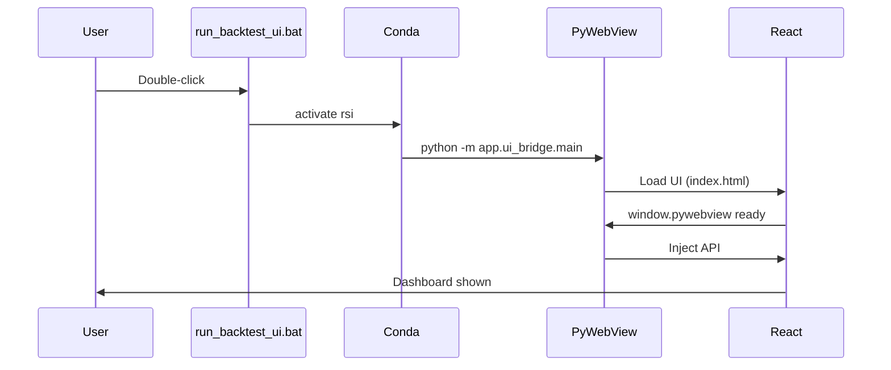
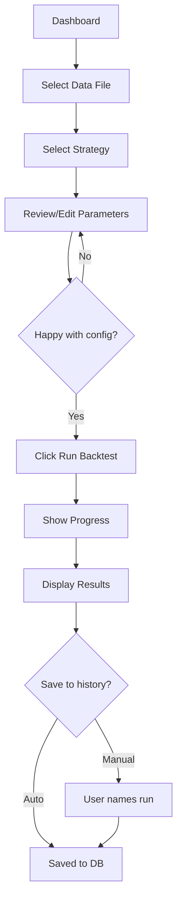
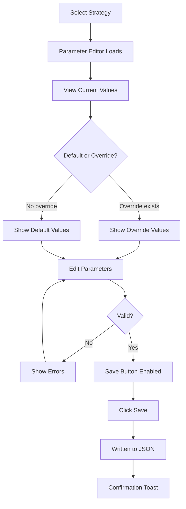
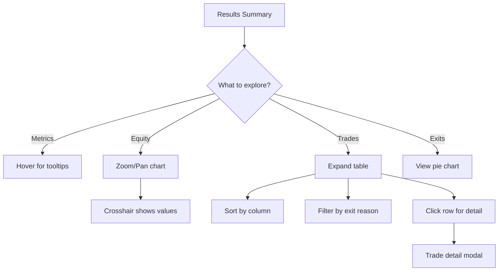
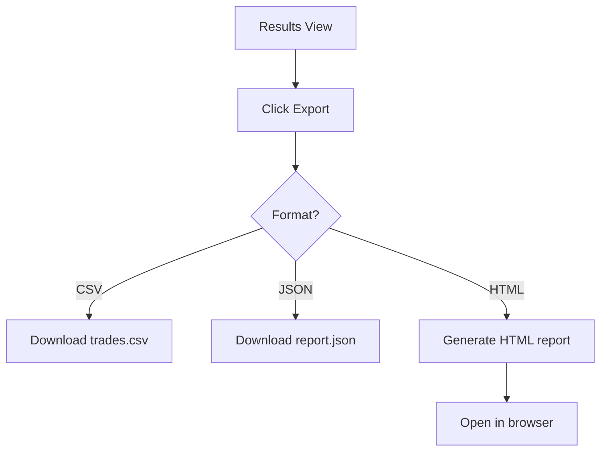
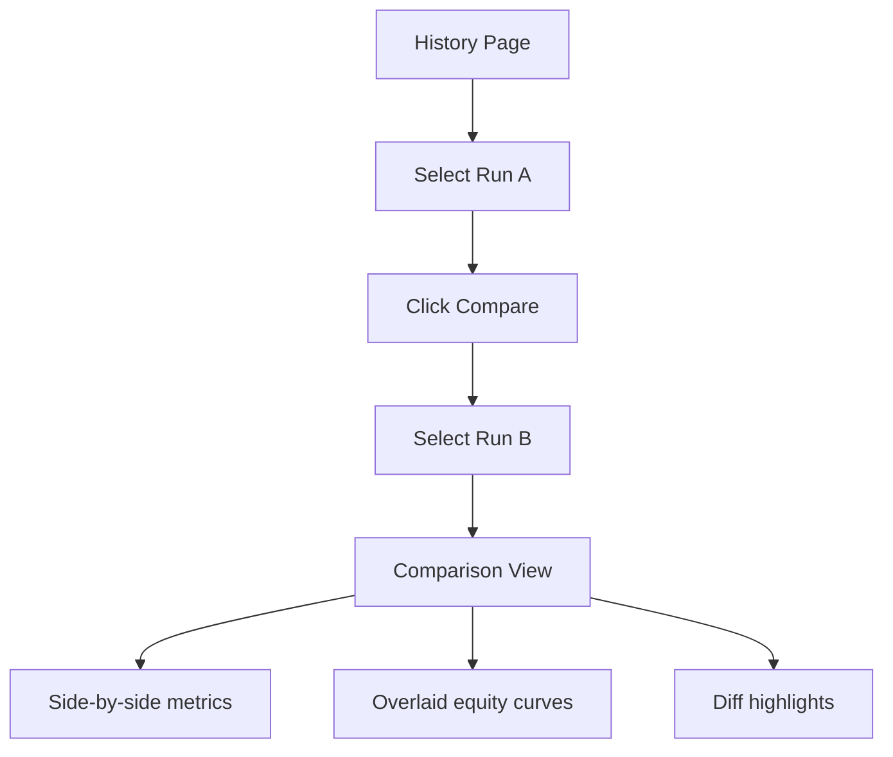

# UI Workflows - Backtest UI

> **Document Type:** Step-by-Step Workflows  
> **Agent:** documentation-writer  
> **Status:** Phase 1 Documentation

---

## Workflow 1: First-Time Launch 🚀



### Steps:
1. User double-clicks `run_backtest_ui.bat`
2. Script activates conda environment `rsi`
3. Python launches PyWebView window
4. React UI loads from built assets
5. Dashboard page appears with empty state
6. System scans for data files and strategies

### Expected State:
- Window: 1400x900 (resizable)
- Theme: Last used or default (Cyberpunk Neon)
- Data selector: Populated with CSV files
- Strategy selector: Populated from STRATEGY_MAP

---

## Workflow 2: Run Single Backtest 🎯



### Step 1: Select Data File
- **Location:** Top of controls panel
- **Action:** Click dropdown → Select CSV file
- **Feedback:** File info displayed (rows, date range)

### Step 2: Select Strategy
- **Location:** Below data selector
- **Action:** Click dropdown → Select strategy
- **Feedback:** Parameter editor loads

### Step 3: Review Parameters
- **Location:** Parameter editor panel
- **Action:** Review default values, modify if needed
- **Feedback:** Changes highlighted, validation shown

### Step 4: Run Backtest
- **Location:** Prominent button at bottom of controls
- **Action:** Click "▶ Run Backtest"
- **Feedback:** 
  - Button changes to "Running..."
  - Progress indicator appears
  - Estimated time shown (if available)

### Step 5: View Results
- **Location:** Main content area
- **Auto-display:**
  - Metrics cards (Net Profit, Win Rate, etc.)
  - Equity curve chart
  - Exit distribution pie
  - Trades table (collapsed by default)

---

## Workflow 3: Edit Strategy Parameters ⚙️



### Parameter Editor Features:
| Feature | Description |
|---------|-------------|
| **Grouped Sections** | Indicators, Risk, Exits |
| **Input Types** | Number (with slider), Select |
| **Validation** | Real-time, shows errors inline |
| **Reset Button** | Returns to DEFAULT_CONFIG |
| **Save Button** | Writes to JSON override |

### Example: RSI WMA Retest Parameters
```
📊 Indicator Settings
├── RSI Period: [21] ───────●─── (range: 5-50)
├── RSI WMA Length: [45] ──────●── (range: 10-100)
└── Price EMA Slow: [200] ─────────●── (range: 50-300)

⚠️ Risk Settings
├── SL Buffer %: [0.0] ──●──────── (range: 0-5)
└── Disaster SL Mult: [3.0] ───●──── (range: 1-5)

💰 Exit Settings
├── TP1 R:R: [1.0] ──●────────── (range: 0.5-3)
├── TP2 R:R: [2.0] ───●───────── (range: 1-5)
└── TP3 R:R: [3.0] ────●──────── (range: 1.5-10)
```

---

## Workflow 4: View Results Detail 📊



### Metrics Card Interactions:
| Metric | Hover Info | Click Action |
|--------|------------|--------------|
| Net Profit % | "Total return on initial capital" | - |
| Win Rate | "Winning trades / Total trades" | - |
| Sharpe Ratio | "Risk-adjusted returns" | - |
| Max Drawdown | "Largest peak-to-trough decline" | Show drawdown chart |

### Equity Chart Interactions:
- **Zoom:** Scroll wheel or pinch
- **Pan:** Click and drag
- **Crosshair:** Shows date, balance, % change
- **Export:** Right-click → Save as PNG

### Trades Table Interactions:
- **Sort:** Click column header
- **Filter:** Dropdown for exit reason
- **Paginate:** 50 rows per page
- **Export:** "Export CSV" button

---

## Workflow 5: Export Results 📤



### Export Options:
| Format | Content | File |
|--------|---------|------|
| **CSV** | Trades only | `backtest_{run_id}_trades.csv` |
| **JSON** | Full results + config | `backtest_{run_id}_report.json` |
| **HTML** | Full report with charts | `backtest_{run_id}_report.html` |

---

## Workflow 6: Compare Runs 🔄



### Comparison View Features:
- **Metrics Table:** Side-by-side with delta column
- **Color Coding:** Green (better), Red (worse)
- **Equity Overlay:** Both curves on same chart
- **Config Diff:** Parameters that changed

---

## Keyboard Shortcuts

| Shortcut | Action |
|----------|--------|
| `Ctrl + Enter` | Run Backtest |
| `Ctrl + S` | Save Parameters |
| `Ctrl + R` | Reset to Default |
| `Escape` | Close modal/drawer |
| `1-5` | Switch dashboard tabs |

---

## Error States

| Error | Display | Recovery |
|-------|---------|----------|
| **No Data Files** | Empty dropdown + help text | Check `app/backtest/data/` folder |
| **Invalid Config** | Red border + inline error | Fix validation issues |
| **Backtest Failed** | Error toast + details | Check Python console |
| **DB Write Failed** | Warning toast | Results still in memory |
