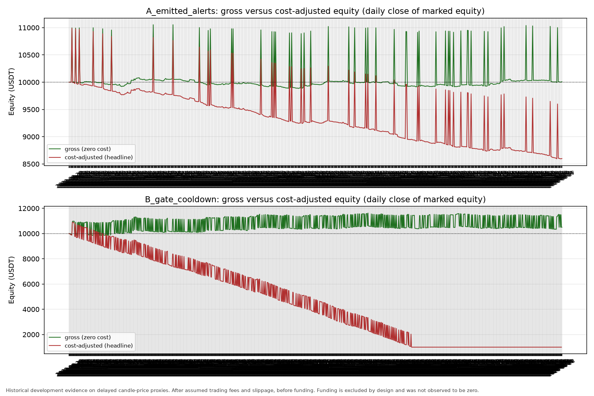
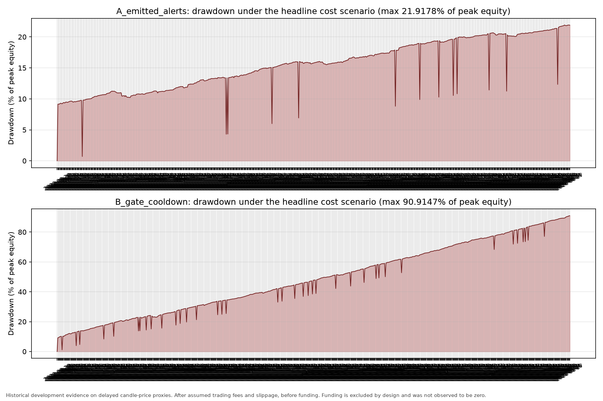

# BTC M15 reference backtest: findings

Date: 2026-09-18. Repository `rsi_bot`, branch `mua-tren-the-nang`.
Canonical packet: `research/results/m15_reference_backtest_runs/run_20260918T103453157146Z_991fd4d1`.

**This is historical development evidence on delayed candle-price proxies, over a
window that has already been examined in this repository.** It is not realized
P&L, not a fill simulation, not a live sizing recommendation, and not evidence of
an edge. `alpha_assessment = NOT_ASSESSED`.

**Cost-adjusted results are labelled: After assumed trading fees and slippage,
before funding.** Perpetual funding is deliberately excluded
(`funding_status = EXCLUDED_BY_DESIGN`). No funding data was downloaded and no
funding accounting was implemented. Excluded funding must **not** be read as
*observed zero* funding — real funding could have been a cost or a credit and is
simply not measured here. Entry and exit rules were not adjusted to avoid or
capture funding settlements, and no production trading logic was touched.

## What was run

One frozen protocol, two policies, one execution rule, fixed 60-minute horizon.
The protocol was written to `protocol.json` (SHA-256 `510b0b2c79efab2e…`) before
any performance number was computed, and the full 3×3 fee/slippage grid was
frozen at the same time.

| Policy | Signal rule | Own cooldown | Signals |
|---|---|---|---:|
| **A** `A_emitted_alerts` | Emitted replay M15 alerts, unchanged: fresh RSI21 EMA9/WMA45 bullish cross **and** M15, H1, H4 closes above native EMA21 | Replay one-hour per-timeframe | 1,175 |
| **B** `B_gate_cooldown` | The same three price-above-EMA21 gates **without** the RSI crossover | **Its own independent** one-hour cooldown | 11,196 |

Policy B is **not** the earlier descriptive `gate_ready_no_cross` population.
That population had no cooldown and contained 38,335 bars. Policy B applies the
one-hour cooldown, so its accepted bars are at least 60 minutes apart — a
different, much smaller signal set.

- **Evaluation window (UTC):** `2022-08-28T00:00:00Z` → `2026-08-27T23:59:59.999999Z`.
- **Entry:** open of the first existing native M5 candle strictly after the signal close.
- **Exit:** exactly 60 minutes after entry, at that candle's open. No stop-loss, take-profit, trailing rule, or alternative horizon.
- **One active position per policy**, no pyramiding, exits processed before entries at the same timestamp.
- **Capital:** 10,000 USDT initial equity, 1,000 USDT fixed entry notional (research constants, not sizing advice).

## Headline results (fee 0.050% per side, slippage 0.010% per side)

| Metric | A `emitted_alerts` | B `gate_cooldown` |
|---|---:|---:|
| Signals | 1,175 | 11,196 |
| Trades entered | 1,175 | 7,863 |
| Entries skipped | 0 | 3,333 |
| Unresolved trades | 0 | 0 |
| Gross P&L (USDT) | +9.01 | +434.28 |
| Execution friction P&L (USDT) | −234.98 | −1,572.53 |
| Fee P&L (USDT) | −1,174.89 | −7,862.43 |
| **Net P&L (USDT)** | **−1,400.86** | **−9,000.68** |
| Gross P&L per trade (USDT) | +0.0077 | +0.0552 |
| Net P&L per trade (USDT) | −1.1922 | −1.1447 |
| Final equity (USDT) | 8,599.14 | 999.32 |
| Total return | −14.01% | −90.01% |
| Max drawdown (% of peak equity) | 21.92% | 90.91% |
| Time in market | 3.35% | 22.42% |
| Total turnover (USDT) | 2,349,774 | 15,724,862 |
| Turnover / initial equity | 235× | 1,572× |
| Win rate | 29.36% | 30.87% |

`After assumed trading fees and slippage, before funding.`

## The two findings that matter most

**1. Costs dominate the gross edge, for both policies.** At the headline
assumptions a round trip costs about **1.20 USDT per 1,000 USDT of notional
(≈0.120%)** in fee plus slippage, while the measured gross edge is **+0.0077
USDT per trade** for A and **+0.0552 USDT per trade** for B. The gross edge is
roughly one to two orders of magnitude smaller than the assumed friction. In the
frozen zero-cost scenario A ends at **+9.01 USDT** and B at **+500.17 USDT** over
four years; the entire difference between "slightly positive" and "large loss" is
the cost assumption. Policy B trades 6.7× more often and turns over 1,572× the
account, so it pays that toll far more times. This is a statement about trade
frequency and cost drag, not about either signal's predictive quality.

**2. Policy B exhausts its capital, so its headline net loss is truncated.** With
the frozen constants (fixed 1,000 USDT non-compounding notional, one position at
a time, 10,000 USDT equity), B runs out of cash and **3,333 of its 11,196 signals
are never entered**; equity ends at 999.32 USDT, which can no longer fund a
1,000 USDT entry. A is never capital-constrained (0 skips). The headline net
totals are therefore **not** a clean like-for-like comparison; gross and net P&L
**per trade** are capital-independent and are the fair per-signal comparison —
and per trade, B (−1.1447) is marginally *less* bad than A (−1.1922), consistent
with the earlier descriptive finding that the gate population has a slightly
better mean than the crossover population.

## Cost sensitivity (every frozen scenario, net P&L in USDT)

| Fee / side | Slippage / side | A net | B net |
|---|---:|---:|---:|
| 0.000% | 0.000% | +9.01 | +500.17 |
| 0.000% | 0.010% | −225.97 | −1,738.91 |
| 0.000% | 0.050% | −1,165.41 | −9,000.29 |
| 0.020% | 0.000% | −460.99 | −3,978.33 |
| 0.020% | 0.010% | −695.93 | −6,216.96 |
| 0.020% | 0.050% | −1,635.18 | −9,005.51 |
| 0.050% | 0.000% | −1,166.00 | −9,000.76 |
| **0.050%** | **0.010%** | **−1,400.86** | **−9,000.68** |
| 0.050% | 0.050% | −2,339.83 | −9,000.75 |

Fee and slippage components are reported separately and never double counted.
Fees use the Binance USD-M defaults in `app/core/constants.py` as illustrative
research assumptions, **not** as verified account fees. Slippage is an assumed
research friction. Perpetual funding is excluded by design, so none of these
scenarios is fully net profit.

## Charts






## Verification

- **Cooldown reconstruction:** applying the one-hour cooldown *independently* to the 1,212 cross-and-gate M15 bars reproduces the replay's 1,175 emitted alerts exactly (`matches: true`, zero set differences). This independently re-derives policy A rather than trusting the parent packet.
- **Signal funnel:** 140,256 candidate M15 bars → 140,256 preparation-ready (0 exclusions) → 38,335 passing all three price gates → 11,196 accepted under policy B's cooldown.
- **Ledger invariants:** every signal produced exactly one entry outcome (enforced at run time); every trade held exactly 60 minutes and deployed exactly 1,000 USDT; all 9,038 trades ended `CLOSED_AT_SCHEDULED_EXIT` with **zero** unresolved trades; final equity equals initial equity plus the sum of net trade P&L.
- **Same-timestamp ordering exercised:** 15 (A) and 5,672 (B) trade boundaries have a scheduled exit and the next entry at the *same* timestamp. The exit-first ordering rule is therefore load-bearing on real data, not just in unit tests.
- **Determinism:** an unchanged-input repeat (`--output-dir research/results/m15_reference_backtest_repeat --no-charts`) produced **byte-identical** `protocol.json` (`9960a8b5aca9bd1d…`), `actions.csv` (`f5d54afa18c1c363…`), `trades.csv` (`4b89f3661380401f…`), `equity_curve.csv` (`62507287876b004e…`) and `summary.json` (`2901e0069b5aca7f…`). The only `report.md` difference was the output directory embedded in its own reproduction command. The repeat packet was removed after recording these hashes; regenerate it with the command above.
- **Code identity:** every SHA-256 recorded in the packet's `code_sha256` matches the working tree. `research/btc_m15_reference_backtest.py` `9152921737f06c07…`, `research/btc_m15_reference_reporting.py` `4afc9c08fe578060…`, `tests/test_btc_m15_reference_backtest.py` `421a42ee5f7aec60…`.
- **An earlier packet was discarded, not published.** The first run of this experiment used a verification helper that reconstructed policy A from *gate* bars instead of *cross-and-gate* bars, and so reported a spurious mismatch. The helper was corrected; the protocol, signal sets, execution rules and every performance number were unaffected (identical to the last digit before and after). The superseded packet was deleted rather than committed.

## Exact reproduction

```powershell
python -m research.btc_m15_reference_reporting --baseline-run research/results/phase1_reproduction_local/run_20260918T092140133007Z_97d3c169 --output-dir research/results/m15_reference_backtest_runs
```

The parent packet is the byte-verified four-year Phase 1 reproduction
(`signals.csv` SHA-256 `3bd31f378d3c4598…`). Source data: `research/data/btc_four_year_20220828_20260828`,
Binance USD-M `BTC/USDT`, four native CSVs whose hashes are re-checked against the
parent packet at run time and recorded in `manifest.json`.

## Artifacts and omitted artifacts

| File | SHA-256 (first 16) | Size |
|---|---|---:|
| `protocol.json` | `9960a8b5aca9bd1d` | 5 KB |
| `manifest.json` | `f4d400569e651519` | 9 KB |
| `summary.json` | `2901e0069b5aca7f` | 29 KB |
| `report.md` | `336ce74940de51fe` | 9 KB |
| `actions.csv` (21,409 rows) | `f5d54afa18c1c363` | 3.1 MB |
| `trades.csv` (9,038 rows) | `4b89f3661380401f` | 2.7 MB |
| `equity_curve.csv` (10,440 rows) | `62507287876b004e` | 0.9 MB |
| `charts/equity_gross_vs_cost.png` | `a74cc237eb87ec70` | 370 KB |
| `charts/drawdown.png` | `986e1eb6153f2d9c` | 244 KB |
| `charts/cost_sensitivity.png` | `8a49121a57c1d354` | 98 KB |

**Omitted artifact.** The full-resolution equity curve (117,498 rows, every
native M5 close while a position was open) exceeded the 400 KB commit cap, so
`equity_curve.csv` is a daily downsample that still keeps every trade-event row.
**All metrics — drawdown, exposure, turnover — are computed from the
full-resolution marks**, not from the committed file. Regenerate the full file
with the reproduction command above and verify SHA-256
`b019a4d04eb6f1c084eb1dcc0df7d5b23f58068d2b243f67ddf8f5f229c767ee` for the
117,498-row version; `manifest.json` records both hashes and this note.

Ledger CSVs round floats to 10 significant digits; `summary.json` and
`manifest.json` keep full precision.

**Why the ledgers were force-added.** `.gitignore` ignores `*.csv` repo-wide, but
the task requires machine-readable action and trade ledgers as deliverables, and
this repository already tracks a 6.1 MB research `signals.csv` in a comparable
packet. All three ledgers (6.7 MB total) were therefore added with `git add -f`.
They are the experiment's own primary evidence, not a large regenerable
intermediate like the ignored 262 MB prepared comparator CSV.

## Limitations

- **No untouched holdout.** The window is the same four years already examined by the M15 descriptive research. Every number here is in-sample development evidence.
- **Delayed candle-price proxies, not fills.** Real fills, partial fills, queue position, spread dynamics, and market impact are not modelled.
- **Costs are assumptions.** The fee grid uses repository defaults, not a verified account's fee schedule; the slippage grid is invented research friction.
- **Funding is excluded by design** and is not observed zero funding. These results are *After assumed trading fees and slippage, before funding* and are not fully net profit.
- **Capital exhaustion distorts B's headline totals** (see above). Fixed notional, no compounding.
- **The deferral and overlap guards were never triggered on real data.** Because the one-hour signal cooldown exactly matches the 60-minute holding period, no signal ever arrived while a position was open; those code paths are covered only by synthetic unit tests. Real-data evidence for the exit-first ordering rule does exist (5,687 same-timestamp boundaries).
- **One policy pair, one horizon, one exit rule.** Nothing was optimized or tuned; no parameter, horizon, or threshold search was performed.
- **No promotion.** This does not authorize a live filter, shadow collection, or any change to production strategy, sizing, risk controls, execution, or configuration.

## What this does not say

It does not say the M15 alert is unprofitable in live trading, and it does not
say policy B is worse. Both policies lose money **under these specific
assumptions**, and the loss is dominated by the assumed cost of trading rather
than by a measured directional edge. Per trade the two policies are nearly
indistinguishable, and the honest summary is that the measured gross edge is far
too small, relative to plausible trading friction, to distinguish from zero on
this sample.
