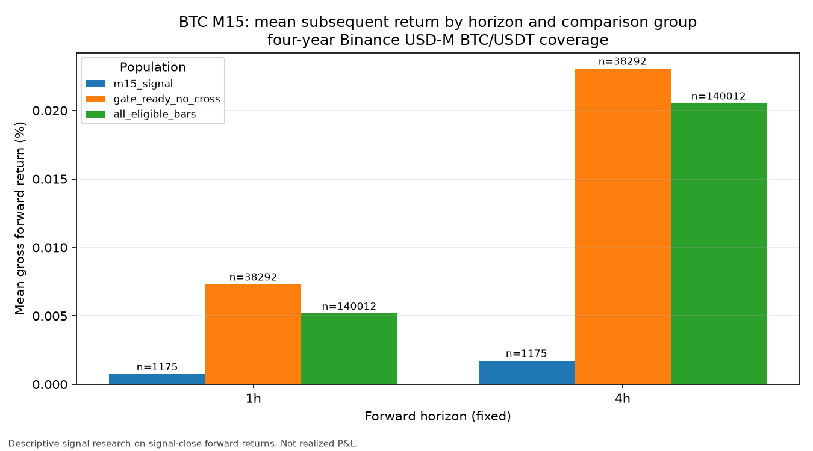
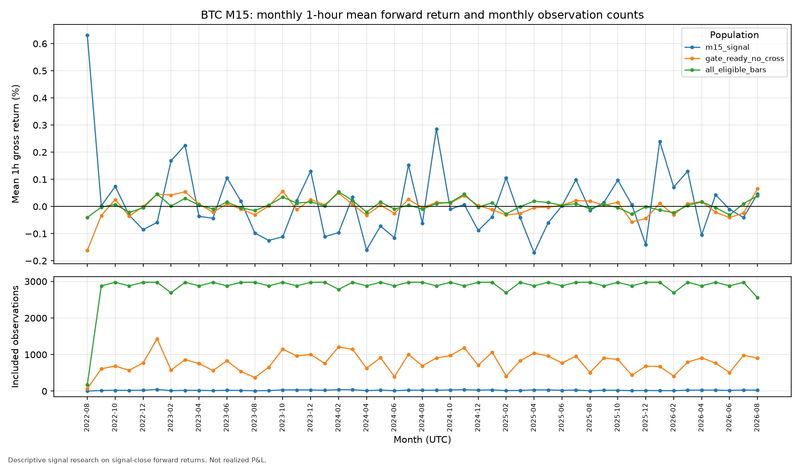
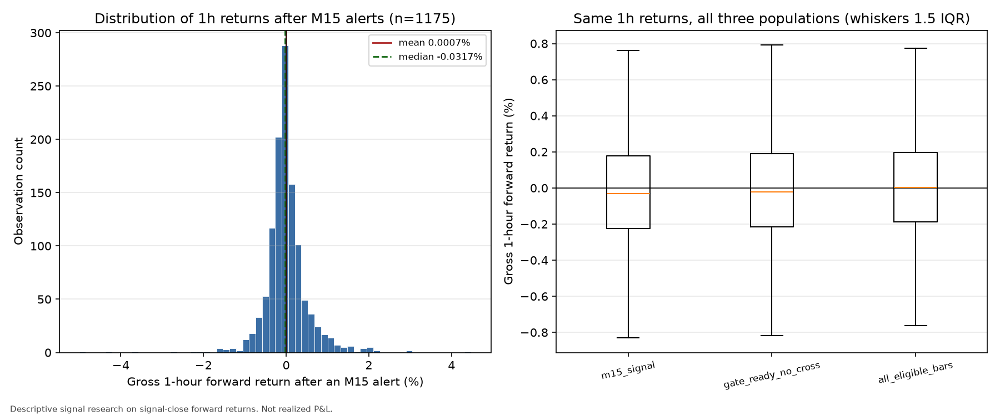

# BTC signal research: four-year reproduction and focused M15 diagnostic

Date: 2026-09-18. Repository `rsi_bot`, branch `mua-tren-the-nang`, HEAD
`310789f0bb7287931fcefa174aa78ca575554d2e` (identical to the published snapshot
named in the task). The working tree was clean before this work began.

**Everything here is descriptive signal research on signal-close forward
returns.** It is not realized P&L, not a fill/fee/slippage model, not a trading
policy, and not evidence of an edge. `alpha_assessment = NOT_ASSESSED`
throughout. No production strategy rule, live configuration, Telegram behaviour,
dataset, manifest, database, or historical report was modified. Nothing was
committed, pushed, merged, or switched. The bot was never started, no orders
were placed, and no external model provider was called.

---

## Part A — Establishing the evidence

### A.1 Current M5/M15 signal rules

Both timeframes share one preparation routine
(`app/trading/strategy/btc_rsi_cross_alert/evaluator.py`) and differ only in the
decision function. On a closed trigger bar, the preparation computes Wilder
RSI(21) on closes, EMA(9) and WMA(45) of that RSI, and EMA(21) of closes. A bar
is `READY` only with at least 67 contiguous closed trigger bars (the 66-row
finite RSI bundle plus the previous bar) and an exact point-in-time H1 and H4
context: the latest native close **at or before** the trigger close, with at
least 21 contiguous rows each.

**M15 — the primary focus** (`m15_checker.py`), evaluated in this order:

1. *Fresh bullish RSI cross*: previous bar `EMA9 ≤ WMA45` **and** current bar `EMA9 > WMA45`.
2. H4 close `>` EMA21 of H4 closes.
3. H1 close `>` EMA21 of H1 closes.
4. M15 trigger close `>` EMA21 of M15 closes.

Alert only if all four hold (reason `ALERT_FRESH_BULLISH_CROSS_H4_BULLISH`),
then the one-hour per-timeframe cooldown and duplicate-event suppression apply.

**M5** (`m5_checker.py`) is *not* a fresh-cross rule. It requires, in order:
`RSI21 > EMA9 > WMA45` (alignment, not a cross); H4 close `>` EMA21; H1 close `>`
EMA21; `RSI21 < 60`; `EMA9 − WMA45 ≥ 2`; `WMA45 > 45`; M5 trigger close `>`
EMA21 of M5 closes — then the same one-hour cooldown.

This asymmetry matters for interpretation: the M15 rule is an *event* rule (a
crossover), while the M5 rule is a *state* rule with an RSI ceiling and spread
floor.

### A.2 The saved four-year research used the same signal logic

The saved four-year packet records revision `62656448062f975190eea6f65ca0117b111e3da8`
with a dirty tree. Comparing that revision with HEAD, the repository blobs are
**identical** for `evaluator.py`, `m5_checker.py`, `m15_checker.py`, `models.py`,
`_price_context.py`, `__init__.py`, `signal_replay.py`,
`signal_replay_preparation.py`, `signal_replay_indicators.py`,
`signal_replay_models.py`, and `core_v2_1/indicators.py`. The single differing
file, `signal_replay_data.py`, differs only in line endings
(`git diff --ignore-all-space` is empty across 165 changed lines).

So the saved four-year research used the **same M15 rule, the same M5 rule, and
the same preparation arithmetic** as the current checkout. No strategy-version
gap exists to explain any count difference.

### A.3 Dataset verification

Directory `research/data/btc_four_year_20220828_20260828`. The four source
SHA-256 values match both `acquisition_manifest.json`'s recorded outputs and the
saved four-year packet's manifest:

| Timeframe | Rows | SHA-256 (first 16) | Native coverage (close, UTC) | Non-cadence | Gaps |
|---|---:|---|---|---:|---:|
| 5m | 455,097 | `97d3c169eaa68cbf` | 2022-05-01T00:05Z → 2026-08-28T04:45Z | 0 | 0 |
| 15m | 151,699 | `991fd4d1a132331b` | 2022-05-01T00:15Z → 2026-08-28T04:45Z | 0 | 0 |
| 1h | 37,947 | `8d299ae0006b41ea` | 2022-05-01T01:00Z → 2026-08-29T03:00Z | 0 | 0 |
| 4h | 9,482 | `729aacc845656014` | 2022-05-01T04:00Z → 2026-08-28T08:00Z | 0 | 0 |

- **Instrument identity**: Binance USD-M Futures, `BTC/USDT`, venue instrument
  `BTC/USDT:USDT`, native local CSVs (recorded in the packet manifest).
- **Requested window**: `[2022-08-28T00:00:00Z, 2026-08-27T23:59:59.999999Z]`,
  fully inside the common coverage `2022-05-01T04:00Z → 2026-08-28T04:45Z`.
- **Warmup**: M5 and M15 both become evaluable at `2022-05-04T12:00:00Z`;
  the requested start is well past it. All 561,024 requested trigger bars were
  preparation-ready with **zero** exclusions.
- **Missing-data handling**: an outcome is `COMPLETE` only if the *exact* target
  close exists and no native cadence gap intervenes. Otherwise it is
  `INCOMPLETE_TAIL`, `MISSING_TARGET`, or `GAP`; a later candle is never
  substituted and gaps are never bridged. Eight signal-horizon rows are
  incomplete (12h/24h tails), which is why the run is `SUCCESS` operationally
  `INCOMPLETE`.

### A.4 Reproduction in a new output directory

```
python btc_research_phase1.py --data-dir research/data/btc_four_year_20220828_20260828 --output-dir research/results/phase1_reproduction_local --start 2022-08-28T00:00:00Z --end 2026-08-27T23:59:59.999999Z
```

New packet: `research/results/phase1_reproduction_local/run_20260918T092140133007Z_97d3c169`.
No existing artifact was touched or overwritten.

### A.5 Comparison with the saved four-year report

| Item | Saved 2026-09-04 packet | New reproduction |
|---|---|---|
| M5 / M15 signals | 2865 / 1175 | **2865 / 1175** |
| `signals.csv` SHA-256 | `3bd31f378d3c4598…e1f` | **`3bd31f378d3c4598…e1f` (byte-identical)** |
| Replay counters | candidates 420768/140256; cooldown 9282/37; rejected 408621/139044 | identical |
| Preparation | 561,024 requested = 561,024 evaluable, 0 exclusions | identical |
| Comparator | 420,176 (5m) / 140,012 (15m) eligible bars | identical |
| All 8 horizon means and medians | see saved report | identical to 12 decimal places |
| Monthly summaries | — | identical |
| Warnings | "8 signal-horizon outcomes are incomplete…" | identical |
| Python / numpy / pandas | 3.13.12 / 2.2.6 / 3.0.2 | 3.14.3 / 2.4.4 / 3.0.2 |
| Git revision | `6265644` (dirty) | `310789f` (dirty: this session's new files) |

M15 headline rows reproduce exactly:

| Horizon | Signals | Mean gross % | Median gross % | All-eligible mean % |
|---|---:|---:|---:|---:|
| 1h | 1175 | 0.000746629783 | −0.031662246004 | 0.005170834171 |
| 4h | 1175 | 0.001730586778 | −0.069309240121 | 0.020529709007 |

**Differences, and their explanations — nothing was forced into agreement:**

1. **Environment** (Python 3.13 → 3.14, numpy 2.2 → 2.4) produced *zero*
   numeric difference. This is a real, checked agreement, not an assumption.
2. **Git revision and dirty-code identity differ** because that identity hashes
   the content of every tracked and untracked repository file, which legitimately
   changed between 2026-09-04 and now. It is a repository-content fingerprint,
   not a signal-logic fingerprint; the logic fingerprint is the blob comparison
   in A.2.
3. **The legacy `research/results/btc_signal_ev_summary.csv` disagrees** (M5
   1399, M15 589, M15 4h mean +0.042165%). It is *not* a strategy-version
   difference. That CSV is the artifact of the earlier **two-year** packet
   `research/results/phase1_runs/run_20260904T073543149279Z_2572884b`
   (window 2024-08-31T17:00Z → 2026-08-28T16:59Z, same revision `6265644`), and
   every number in it matches that packet exactly. The Phase 1 report already
   labels it "comparison evidence only".
   Reconciling the M15 populations against it:
   - 588 of the two-year run's 589 M15 IDs also appear in the four-year run;
     exactly **one** ID differs, which is the documented effect of the replay
     re-initialising cooldown at a different window start (Phase 1's
     `replay_boundary_cooldown` definition).
   - All 587 remaining four-year-only M15 IDs fall **outside** the two-year
     window: a pure coverage effect, not a disagreement.
   - The coverage effect is economically large for this diagnostic. On the 588
     IDs shared with the two-year window, the four-year data give an M15 4h mean
     of **+0.043495%**; on all 1,175 four-year alerts it is **+0.001731%**. The
     587 alerts added by extending history back to 2022-08 carry an implied mean
     4h return of about **−0.0401%**. Extending coverage moved the estimate by
     roughly 0.04 percentage points, which is the same order as every contrast
     reported in Part B.

### A.6 Successful execution, valid coverage, and edge are three different things

- **Execution**: `SUCCESS` — the replay ran to completion and wrote a complete packet.
- **Coverage**: valid and fully prepared over the requested window (0 exclusions,
  0 cadence gaps), but operationally `INCOMPLETE` because 8 long-horizon tail
  outcomes are explicitly missing. Coverage is *not* the same as completeness.
- **Edge**: not assessed by anything here. The reproduced means are
  indistinguishable from zero relative to their sampling variability, all
  medians are negative, and no fee, fill, or position constraint is modelled.

All of this history has already been examined. It is **development evidence**:
population definitions, horizons, and comparisons chosen now are post-selection.

---

## Part B — Focused M15 diagnostic

New offline module `research/btc_m15_signal_diagnostic.py` (read-only; it reuses
the existing replay preparation, the existing pure M15 evaluator, and the
existing exact close-to-close outcome arithmetic). Canonical packet:
`research/results/m15_signal_diagnostic_runs/run_20260918T092839840861Z_991fd4d1`.

```
python -m research.btc_m15_signal_diagnostic --baseline-run research/results/phase1_reproduction_local/run_20260918T092140133007Z_97d3c169 --output-dir research/results/m15_signal_diagnostic_runs
```

**Fixed rules.** Only the 1-hour and 4-hour horizons are used. No horizon,
threshold, or cooldown was searched or tuned. Timestamps are exact UTC trigger
closes; readiness is the shared per-event preparation; the calendar window is the
first-to-last emitted M15 signal close, identical to the Phase 1 matched
comparator window; an observation enters a statistic only when **both** fixed
horizons are `COMPLETE`.

### B.1 Populations, counts, and cooldown policy

| Group | Rule | Cooldown | n |
|---|---|---|---:|
| **A** `m15_signal` | Emitted replay alerts: fresh RSI21 EMA9/WMA45 bullish cross **and** M15, H1, H4 closes above native EMA21 | One-hour per-timeframe cooldown applied | **1,175** |
| **B** `gate_ready_no_cross` | Preparation-ready M15 bars with M15, H1, H4 closes above native EMA21; **no** crossover requirement | None | **38,292** |
| **C** `all_eligible_bars` | Every preparation-ready M15 bar in the window; no gate | None | **140,012** |

They nest: A ⊂ B ⊂ C. The signal funnel over the matched window
(`2022-08-30T04:15Z → 2026-08-27T15:00Z`) is:

`140,012` candidate bars → `140,012` preparation-ready → `38,292` pass all three
price gates → `1,212` also show a fresh RSI crossover → `1,175` emitted after the
one-hour cooldown (`37` suppressed). A further `2,379` bars crossed but failed at
least one price gate. The independently derived 37 cooldown suppressions equal
the replay's own `m15_cooldown_suppressed` counter exactly.

**Overlap warning.** Adjacent M15 bars are at most 15 minutes apart and their
1-hour/4-hour windows overlap heavily. These counts are *observations*, not
independent trades; the effective independent sample is far smaller, and these
series must never be compounded into an equity curve.

### B.2 Mean and median forward returns

Only bars whose 1h **and** 4h targets are both exact and complete enter every
statistic, so all three groups share one complete-outcome basis (0 exclusions in
this dataset).

| Horizon | Group | n | Mean gross % | Median gross % | Positive share |
|---|---|---:|---:|---:|---:|
| 1h | A `m15_signal` | 1,175 | 0.000747 | −0.031662 | 45.19% |
| 1h | B `gate_ready_no_cross` | 38,292 | 0.007310 | −0.020881 | 46.82% |
| 1h | C `all_eligible_bars` | 140,012 | 0.005171 | +0.003473 | 50.55% |
| 4h | A `m15_signal` | 1,175 | 0.001731 | −0.069309 | 45.11% |
| 4h | B `gate_ready_no_cross` | 38,292 | 0.023076 | −0.048971 | 46.19% |
| 4h | C `all_eligible_bars` | 140,012 | 0.020530 | +0.012043 | 50.97% |

### B.3 Time-block uncertainty (reused, descriptive)

The paired circular 7-day UTC calendar-block calculation is reused unchanged from
`research/btc_m5_horizon_diagnostic.py` (2,000 replicates, `default_rng(20260904)`,
identical draws for both populations, observation-weighted means, 2.5th/97.5th
percentiles). These are **post-selection descriptive sensitivity intervals**, not
significance tests; they do not correct for prior exploration, overlapping
observations, or horizon choice.

| Horizon | Contrast | Difference (pp) | Interval (pp) | Valid replicates |
|---|---|---:|---|---:|
| 1h | A − B | −0.006563 | [−0.036693, +0.023982] | 2000 |
| 1h | B − C | +0.002139 | [−0.005725, +0.010454] | 2000 |
| 1h | A − C | −0.004424 | [−0.036585, +0.026645] | 2000 |
| 4h | A − B | −0.021345 | [−0.077259, +0.034819] | 2000 |
| 4h | B − C | +0.002546 | [−0.024809, +0.030096] | 2000 |
| 4h | A − C | −0.018799 | [−0.075959, +0.039218] | 2000 |

Every interval spans zero. Anything not backed by these reused block
calculations — the funnel counts, the medians, the positive shares, the monthly
and yearly tables, and the return distribution — is **purely descriptive** and
carries no interval at all.

### B.4 Charts







**Chart 1 — mean subsequent return by horizon and group.** B (the price gates
alone) and C (no gate at all) are nearly identical at both horizons. A (the
emitted alert) sits slightly below both, with its interval spanning zero.

**Chart 2 — monthly 1-hour returns and observation counts.** The alert count
per month is small (single digits to ~40), so monthly alert means are noisy; the
lower panel shows why. Yearly aggregation of the same monthly file:

| Year (UTC) | A n | A mean 1h % | B n | B mean 1h % | C n | C mean 1h % |
|---|---:|---:|---:|---:|---:|---:|
| 2022 (partial) | 88 | −0.0039 | 2,704 | −0.0122 | 11,887 | −0.0056 |
| 2023 | 288 | +0.0140 | 9,693 | +0.0210 | 35,040 | +0.0118 |
| 2024 | 335 | −0.0109 | 10,514 | +0.0139 | 35,136 | +0.0106 |
| 2025 | 279 | −0.0192 | 9,433 | −0.0060 | 35,040 | +0.0004 |
| 2026 (partial) | 185 | +0.0334 | 5,948 | +0.0032 | 22,909 | −0.0004 |

**Chart 3 — distribution of 1-hour returns after M15 alerts.** n = 1,175,
mean +0.000747%, median −0.031662%, standard deviation 0.561%, range −5.00% to
+4.48%; 11.1% of alerts exceed +0.5% and 9.1% fall below −0.5%. The right panel
compares the same 1h returns across all three populations.

### B.5 What this says, stated carefully

Over the examined four years the M15 alert population is **not** better than the
population that merely satisfied the same three price-above-EMA21 gates, and the
gate population is **not** distinguishable from the ungated eligible-bar
population. The alert population's *median* 1h and 4h return is negative while
the all-bar median is slightly positive — alerts tend to fire in states whose
typical outcome is a small loss and whose mean is rescued by a right tail. None
of this is a tradability conclusion: the intervals span zero, observations are
overlapping, the history is already examined, and no execution cost is modelled.

---

## Part C — Verification

### C.1 Existing tests re-run

```
python -m pytest tests/test_btc_research_phase1.py tests/test_btc_m5_horizon_diagnostic.py tests/test_btc_m5_regime_review.py tests/test_btc_four_year_data.py tests/test_btc_m15_signal_diagnostic.py tests/test_signal_replay.py tests/test_core_v2_1_replay_data.py tests/test_btc_rsi_cross_alert_evaluator.py tests/test_btc_rsi_cross_alert_preparation.py tests/test_btc_rsi_cross_alert_timeframe_checkers.py tests/test_btc_rsi_cross_alert_formatter.py tests/test_btc_rsi_cross_alert_config.py -q
```

Result: **241 passed**. `python -m ruff check research/btc_m15_signal_diagnostic.py tests/test_btc_m15_signal_diagnostic.py`
→ **All checks passed**. `python scripts/check_markdown_links.py` →
**222 Markdown files checked, links passed**. `mypy` is not installed in this
environment.

### C.2 New focused tests

`tests/test_btc_m15_signal_diagnostic.py` — 10 tests, all passing (included in
the 241 above). Each maps to a required obligation:

| Test | Obligation it proves |
|---|---|
| `test_horizons_are_fixed_to_one_and_four_hours` | No horizon search; populations and timeframe are frozen |
| `test_h1_and_h4_context_closes_never_postdate_the_decision_time` | H1/H4 context is already closed at the decision time and equals the latest native boundary at or before it |
| `test_future_candles_cannot_alter_an_earlier_evaluation` | Truncating every frame at the trigger close leaves the earlier bar's prepared record bit-identical |
| `test_missing_target_gap_and_incomplete_tail_stay_explicit` | `MISSING_TARGET`, `GAP`, `INCOMPLETE_TAIL` remain distinct; no return is substituted |
| `test_comparison_group_eligibility_rules_nest_and_are_documented` | A ⊂ B ⊂ C; an emitted alert failing a documented gate is a hard error |
| `test_gate_predicate_must_agree_with_the_locked_decision_reasons` | The gate predicate is checked against the locked M15 decision precedence, in both directions |
| `test_manually_checked_synthetic_returns_match_the_calculated_values` | Hand-computed +2.0% (1h) and −3.0% (4h) examples match exactly |
| `test_parent_horizon_parity_rejects_a_changed_return` | Tampered parent returns/targets are rejected, so the reproduction check has teeth |
| `test_monthly_summaries_count_only_the_fixed_complete_population` | Monthly rows use the fixed complete population and carry both horizons |
| `test_end_to_end_synthetic_run_writes_a_complete_packet` | A full synthetic run writes manifest/summary/observations/monthly/report, with the funnel arithmetic closing on `eligible_bar_count` |

The gate-consistency check earned its keep immediately: it rejected the first
draft of the diagnostic, which had mis-mapped `M15_CLOSE_NOT_ABOVE_EMA21` as a
passing reason. That was a defect in the new diagnostic, not in the strategy.

### C.3 Determinism

An unchanged-input repeat was run into
`research/results/m15_signal_diagnostic_repeat_check/run_20260918T092951028554Z_991fd4d1`
(`--no-charts`). `bars.csv`, `observations.csv`, `monthly.csv`, `summary.json`,
and `report.md` are **byte-identical** to the canonical packet.

---

## Deliverables and identities

**Written by this work (all new; nothing overwritten):**

| Path | SHA-256 (first 16) |
|---|---|
| `research/btc_m15_signal_diagnostic.py` | `7b46b9163aa5e325` |
| `tests/test_btc_m15_signal_diagnostic.py` | `bf8eb923891d5c43` |
| `research/results/phase1_reproduction_local/run_20260918T092140133007Z_97d3c169/signals.csv` | `3bd31f378d3c4598` |
| `research/results/m15_signal_diagnostic_runs/run_20260918T092839840861Z_991fd4d1/manifest.json` | `29f240d0ec17d6c4` |
| `…/summary.json` | `9bd205bac78c52e5` |
| `…/report.md` | `796c528485b92715` |
| `…/observations.csv` (358,958 rows) | `cee3720e3785f439` |
| `…/monthly.csv` | `87f2a32b3a70e875` |
| `…/bars.csv` (140,012 bars) | `2b0c7593ad27ded6` |
| `…/charts/mean_returns_by_group.png` | `181567899a07f6cb` |
| `…/charts/monthly_1h_returns_and_counts.png` | `1f47e0879e5e7ee4` |
| `…/charts/m15_alert_1h_distribution.png` | `19d5fb7dd514ecf3` |
| `docs/06_quant_research/research-workflow.md` (new M15 section) | edited |

An earlier packet `research/results/m15_signal_diagnostic_runs/run_20260918T092630436473Z_991fd4d1`
is preserved but **superseded**: it was produced by an earlier revision of the
module, before the signal-funnel audit was added. Its data files are identical;
only its manifest and report lack the funnel fields. The canonical packet is
`run_20260918T092839840861Z_991fd4d1`.

The canonical packet's manifest records the parent packet hashes, the four source
hashes, the environment, the scan audit, the population rules, and the SHA-256 of
all seven code files that produced it. No historical dataset, manifest, database,
or report was altered.

---

## Reproduced findings, new descriptive findings, unresolved questions

### Reproduced (Part A)

1. The four-year baseline reproduces **exactly**: 2,865 M5 and 1,175 M15 alerts,
   byte-identical `signals.csv`, identical horizon means/medians, identical
   monthly tables, identical comparator, preparation, coverage, warnings, and
   replay counters — across a Python 3.13→3.14 and numpy 2.2→2.4 change.
2. The saved four-year research used the same signal and preparation logic as
   HEAD (blob-identical modules).
3. The legacy `btc_signal_ev_summary.csv` is the two-year artifact, and its count
   difference is a coverage difference plus one documented window-boundary
   cooldown effect — not a logic difference.

### New (Part B) — descriptive only

4. The M15 signal funnel over four years: 140,012 eligible → 38,292 passing the
   three price gates (27.3%) → 1,212 also crossing (0.87% of eligible) → 1,175
   emitted after cooldown.
5. The three price gates alone carry essentially all of the (tiny) positive mean
   of the M15 population: B − C is +0.0021 pp at 1h and +0.0025 pp at 4h.
6. The RSI crossover requirement adds no measured mean benefit over the gates
   alone: A − B is −0.0066 pp at 1h and −0.0213 pp at 4h, both intervals
   spanning zero.
7. The M15 alert population has a **negative median** 1h/4h return
   (−0.032% / −0.069%) and a below-50% positive share, while the ungated
   eligible-bar population has a slightly positive median and ~51% positive.
8. Coverage changed the answer materially: the M15 4h mean is +0.0435% on the
   window shared with the two-year study and +0.0017% over four years.

### Unresolved

9. Whether any of this survives execution. Signal-close entries are bookkeeping
   references, not fills; no fee, spread, slippage, funding, or sizing is modelled.
10. How much of the mean is tail-driven and how much is capturable — the median
    and the positive share say a typical alert loses slightly.
11. Whether the M15 crossover carries information that this four-year sample
    cannot resolve, given overlapping observations and already-examined history.
12. Whether the M5 state rule and the M15 event rule behave differently out of
    sample; only the M15 side was examined here in detail.
13. Anything about live behaviour: no live configuration, Telegram path, or
    strategy rule was touched or tested here.

---

## One recommended next experiment (not implemented)

**A pre-registered prospective shadow evaluation of the M15 alert against its own
gate population, with the first executable price recorded at decision time.**

Freeze, before any new data is collected: the 4-hour horizon only; the contrast
A − B; the paired circular 7-day calendar-block interval with a fixed seed and
replicate count; a fixed calendar stopping date and a pre-declared minimum alert
count; and the exact definition of the "first executable price" (the open of the
first M15 bar that begins at or after the alert's close, rather than the alert's
own close). Then log, observability-only, every live M15 alert together with
which gate-population bars occurred at the same time, and analyse once at the
stopping date.

Why this one: findings 5–8 show the retrospective four-year sample is exhausted —
every contrast is within roughly ±0.04 pp with intervals spanning zero, coverage
demonstrably moves the estimate by a comparable amount, and the whole history has
now been examined. Only *new*, untouched observations plus an executable
reference price can separate "no effect" from "an effect this sample cannot
resolve". It requires no change to production strategy rules, no new framework,
no external model calls, and no money; it does require wall-clock time and
explicit separate authorization before any logging is enabled.
