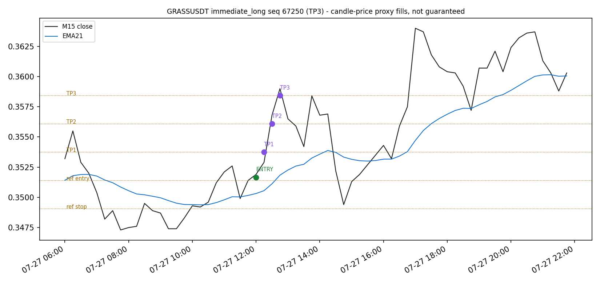
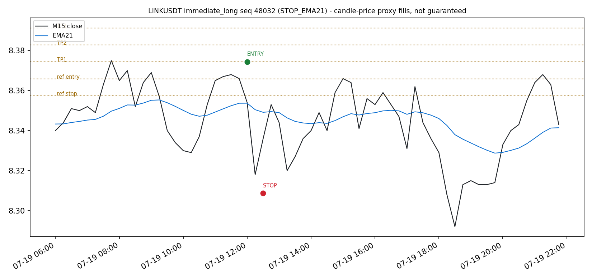
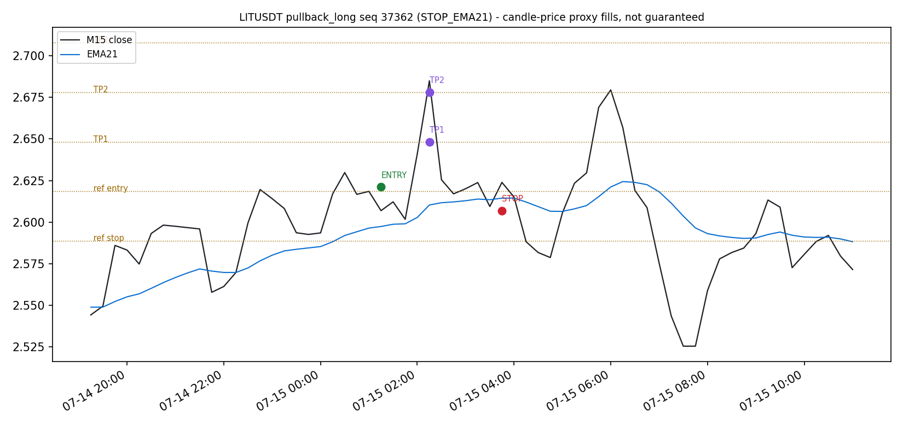

# Core V2.1 reference simulation (core-v2.1-reference-backtest-v1)

Date: 2026-09-19. Repository `rsi_bot`, branch `mua-tren-the-nang`.
Packet: `research/results/core_v2_1_reference_sim_v1/` (protocol, trades,
results, charts, manifest). Companion to the 2026-09-19 audit
`research/2026-09-19_core_v2_1_rule_data_audit.md`.

**Research-only candle-price simulation over the audited signal replay.** Not
realized P&L, not a fill guarantee, not evidence of an edge, and not a live
recommendation. `alpha_assessment = NOT_ASSESSED`. No parameter search was
run and nothing was promoted to production. Funding is EXCLUDED_BY_DESIGN
(not observed zero). No pooled cross-venue returns are reported.

## 1. Protocol freeze and rule basis

`protocol.json` was frozen and hashed BEFORE any performance number was
computed. Final SHA-256 of the protocol payload:
`c1d30bc5caf808b4d3fca1904061796e23c51e67ab20d9e3016270e8598340c1`.
(An earlier freeze of the same rules with less precise TP-quantity wording
had hash `f0f8d4a2e79188825361b5d21012ac72f4d8a48e699ef6581d0c414db9d1fedc`;
the only delta is the wording documented in section 2, re-frozen before any
published number.) The run aborts if the code `PROTOCOL` dict drifts from
the frozen file.

| Element | Content | Basis |
|---|---|---|
| Signals | audited point-in-time replay, locked anchor/universe/config; only A_PLUS_LONG and PULLBACK_LONG open positions | DOCUMENTED |
| Entry fill | next M15 open x (1 + slippage) | DOCUMENTED (decision 3); candle-price proxy, not a guaranteed obtainable fill |
| TP levels | original reference TP1/TP2/TP3 (1R/2R/3R) | DOCUMENTED |
| TP allocation | 1/3 of original quantity at each TP; final third fills the exact remainder | ASSUMPTION_NOT_A_DECISION |
| TP activation | limit-fill proxy: fills at TP price when candle high >= level | ASSUMPTION_NOT_A_DECISION |
| Strategy stop trigger | fully closed M15 Close < current EMA21 (wicks ignored) | DOCUMENTED (decision 2) |
| Strategy stop exit | remaining quantity at following M15 open x (1 - slippage) | ASSUMPTION_NOT_A_DECISION |
| Disaster stop | none added; reference stop is an R/sizing reference only, not an executed stop or guaranteed loss cap | DOCUMENTED boundary |
| Max holding | NOT applied | GENUINELY_UNRESOLVED (see section 3) |
| Same-bar ordering | TPs start the candle after entry; if a candle both reaches a TP and closes below EMA21, the close-based stop wins and that candle's TP fill is ignored | ASSUMPTION_NOT_A_DECISION |
| Gap fills | entry/stop fill at the candle open regardless of gap; TP fills only at its level price | ASSUMPTION_NOT_A_DECISION |
| Overlap | one position per strategy+symbol; extra entries recorded OVERLAP_SKIPPED; signal state machine unaffected | DOCUMENTED (decision 6) |
| Slippage rate | 0.1% per side (frozen headline) | ASSUMPTION_NOT_A_DECISION |
| Funding | excluded | EXCLUDED_BY_DESIGN |

## 2. Sizing and inherited settings resolved from code + config

Resolved by reading `app/trading/portfolio/position_sizer.py` and
`config.yaml`, pinned by unit tests (`tests/test_core_v2_1_reference_sim.py`
plus `tests/test_position_sizer.py`):

- `risk_per_trade_pct: 0.002` is a FRACTION -> risk 200 USDT per trade on the
  100,000 USDT `backtest.initial_balance`. The YAML comment says 2%, which is
  wrong for the value in the file.
- `use_risk_based_sizing: true` and `use_initial_capital_for_risk: true`:
  size = risk_amount / SL_distance_pct / price, risk basis fixed at initial
  capital (no compounding), SL distance measured from the simulated entry to
  the advisory reference stop.
- `max_position_size_pct: 10` is used as a margin fraction (10x) -> notional
  cap 100x capital at leverage 10; non-binding at 200 USDT risk.
- `min_sl_distance_pct: 0.003` is a fraction (0.3%). The YAML comment says 1%.
  In code this branch does NOT skip the trade (despite its comment); it caps
  size at the leverage cap, which is non-binding here.
- `leverage: 10` is used only inside the (non-binding) cap formula.
- **Genuinely unresolved**: maximum holding. The signal-mode resolver
  (`app/signal/strategy_config.py`) returns `strategy_params: {}` and never
  forwards per-strategy params, so the older-strategy
  `max_holding_enabled/max_holding_bars` defaults (96 M15 bars, force-close)
  cannot be established for Core V2.1 from config. Per the decisions doc
  (do not silently replace an unresolved item with a runtime default), the
  simulation applies NO max-holding force-close and reports this gap.
- Hyperliquid positions are sized with the same USDT-denominated constants
  against USDC quotes (1 USDC = 1 USDT assumption); no pooled returns are
  computed and venues are reported separately.

## 3. Fee verification (official sources, checked 2026-09-19)

| Venue | Maker | Taker | Source | Applicability caveat |
|---|---:|---:|---|---|
| Binance USD-M (regular user) | 0.02% | 0.05% | binance.info FAQ 360033544231, page updated 2026-05-01 (worked example states Regular User maker 0.02% / taker 0.05%; matches the repo's MockExchange defaults) | rates as published 2026-05-01; the simulated window is 2026-06-29..2026-08-20; Binance can change rates |
| Hyperliquid perps (base tier) | 0.015% | 0.045% | hyperliquid.gitbook.io docs, fees page, perps fee tiers table, base rate column; page marked 'last updated ~1 month ago' at fetch | 14-day volume tiers can move a user off the base tier; standard-user assumption |

Fee formula: `qty * price * rate` on every fill; maker rate on TP fills
(resting limit proxy), taker on entry and stop exits. Funding excluded by
design. Fee rates are recorded in the frozen protocol with source and date.
## 4. Signal reproduction before simulation

The replay was REGENERATED from the locked anchor and asserted row-identical
(sequence, close time, symbol, event type, decision kind) to the audited
ledger `research/results/core_v2_1_audit_replay/core_v2_1_replay.csv`
(125,000 rows, 477 events) BEFORE any trade was simulated. The parity-check
ledger and its export hashes are reproducible; the large CSV/JSONL is
git-ignored (`research/results/core_v2_1_reference_sim_v1/replay_check/`).

Entry events: 63 A_PLUS_LONG + 19 PULLBACK_LONG = 82. Simulated positions:
80 (62 immediate-long + 18 pullback-long). 2 A_PLUS_LONG XRPUSDT
entries were OVERLAP_SKIPPED while a position was already open (one-position-
per-symbol honored; signal processing unaffected). Zero-size and no-fill-
candle skips: none. No re-anchoring; window remains
2026-06-29T11:30:00Z..2026-08-20T13:15:00Z.

## 5. Results (headline, slippage 0.1%, verified fees)

All quote values in USDT (Binance) / USDC-equivalent-for-sizing (PUMP);
venues kept separate; no pooled figure is presented as an account return.

| Group | Positions | Gross P&L | Net P&L | Gross R | Net R |
|---|---:|---:|---:|---:|---:|
| Immediate long (A_PLUS_LONG) | 62 | -14,277.75 | -19,252.73 | -71.39 | -96.26 |
| Pullback long (PULLBACK_LONG) | 18 | -583.30 | -1,533.74 | -2.92 | -7.67 |
| All | 80 | -14,861.06 | -20,786.46 | -74.31 | -103.93 |
| Binance venue (76 pos) | | -14,948.53 | -20,803.64 | | |
| Hyperliquid PUMP (3 pos) | | +87.47 | +17.18 | | |

Close-reason mix (all 80 closed; none open at end): 60 STOP_EMA21, 20 full
TP3 ladders. Fill-pattern census: ENTRY|STOP 44; ENTRY|TP1|STOP 12;
ENTRY|TP1|TP2|STOP 4; ENTRY|TP1|TP2|TP3 20. Partial-exit quantities, per-
fill fees, reference prices, and simulated fills are preserved per position
in `trades.json`; gross and net realized R are stored separately.

Hand-verified example (GRASSUSDT seq 67250): entry = 2026-07-27 12:00 open
0.3513 x 1.001 = 0.3516513; TPs at exact 1R/2R/3R reference prices on
high-touch candles (12:15, 12:30, 12:45); risk amount 200 USDT; entry fee
15.0163 (taker), TP fees 2.0141/2.0274/2.0407 (maker); gross 378.54 =
sum(qty_i x (tp_i - fill)) with thirds summing exactly to the original
quantity; net 357.44; realized R 1.8927 gross / 1.7872 net on a 200 USDT
risk basis.

## 6. Holding-time distribution (closed positions)

Median 3 bars (45 min), mean ~5.7, min 1, max 16 bars:

| Bars held | 1-4 | 5-12 | 13-24 | 25-48 | 49-96 | 97+ |
|---|---:|---:|---:|---:|---:|---:|
| Positions | 52 | 24 | 4 | 0 | 0 | 0 |

Chart: `charts/holding_time.png`.

## 7. Cost sensitivity (frozen grid, not a search)

Net P&L (USDT) across the frozen slippage x fee-scale grid:

| Slippage \\ fee scale | 0.5x | 1.0x (verified) | 1.5x |
|---|---:|---:|---:|
| 0.000% | -6,930.57 | -9,892.67 | -12,854.76 |
| 0.050% | -12,377.17 | -15,339.57 | -18,301.96 |
| 0.100% (headline) | -17,823.76 | -20,786.46 | -23,749.17 |
| 0.200% | -28,716.95 | -31,680.26 | -34,643.57 |

Decomposition at headline: price-only P&L (zero slippage) -3,968.48;
slippage adds about -10,892.58; fees about -5,925.41. Even with zero
slippage and half fees the outcome is -6,930.57, so costs amplify but do
not create the negative result.

## 8. Representative trade charts

-  -
  GRASSUSDT immediate long, full ladder to TP3 (+357.44 net).
-  -
  LINKUSDT immediate long, stopped below EMA21 (-1,750.99 net).
-  -
  first PULLBACK_LONG entry.

All charts mark candle-price-proxy fills against closed candles and the
advisory reference levels.

## 9. Verification performed

1. Hand-calculated partial exits (thirds), close-only stop trigger (wick
   below EMA21 does not trigger), stop-on-entry-candle, event ordering (TP
   vs stop in one candle; no TP on the entry candle), overlap skipping,
   adverse-slippage signs, fee math per venue and fee scale, zero-size and
   end-of-window handling, protocol freeze round-trip - unit tests
   (`tests/test_core_v2_1_reference_sim.py`, 9 tests).
2. Full-suite regression: nothing outside the research tree changed.
3. Deterministic reproduction: a second independent run (fresh process,
   including the replay parity assertion) produced byte-identical
   `trades.json` and `results.json`.
4. Dust-quantity defect found and fixed during review: Decimal `qty/3`
   rounding left a ~1e-22 residue so one position emitted a dust STOP fill;
   the final third now fills the exact remainder (documented in the frozen
   protocol wording).

## 10. One clear finding

**The close-below-EMA21 strategy stop dominates outcomes, and for A+ entries
it sits structurally close to entry.** 56 of 80 positions (70%) exited via
the stop, median holding 3 bars, and only 32 of 80 ever touched TP1 (20
completed the full ladder). A_PLUS_LONG entries must pass anti-chase with
DistanceATR <= 1.0, i.e. entry close is within one ATR of EMA21, so the
trigger (a close below the CURRENT EMA21) requires only a modest adverse
drift while the reward ladder starts 1R above reference entry. Under this
protocol the strategy is negative in every frozen cost scenario, including
zero slippage with half fees (-6,930.57), so the result is a property of the
approved signal/exit geometry under candle-price proxies - not of trading
costs - and it says nothing about live profitability (funding excluded,
proxy fills, one 52-day regime, 80 trades).

## 11. Limitations

- 52-day single-regime window, locked anchor; no longer history exists under
  the seed contract and none was manufactured.
- 80 positions is a small sample; per-symbol results are 1-8 positions each.
- Candle-price proxies: entry/stop fills at next-open with slippage, TP at
  level price on high-touch; intrabar path unknown; no queue/partial-fill
  realism; not guaranteed obtainable fills.
- Funding EXCLUDED_BY_DESIGN; can be a material cost or credit for perps.
- Fee rates verified on 2026-09-19 against pages whose own effective dates
  may not match the historical window.
- Max-holding inheritance is unresolved (resolver gap) and was not simulated.
- Venue quote separation: no pooled returns; per-venue aggregates only.