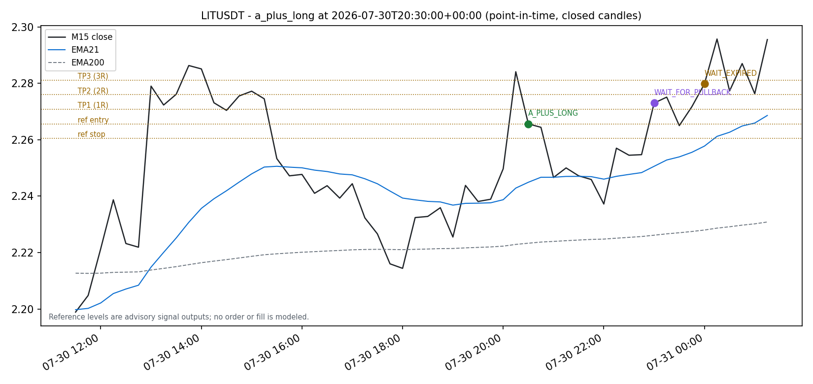
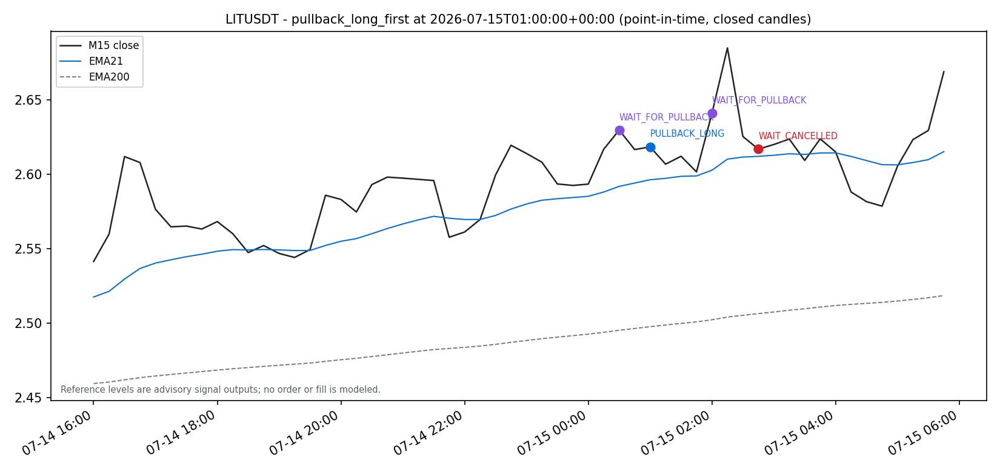
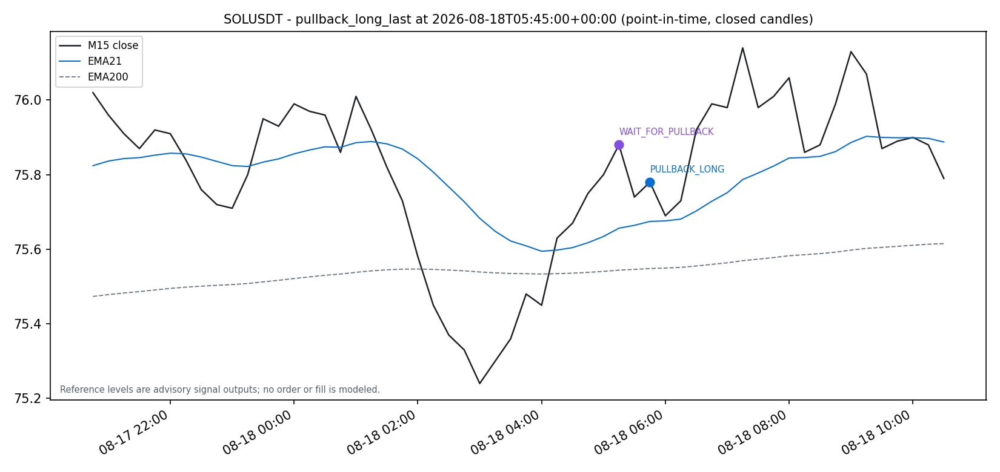
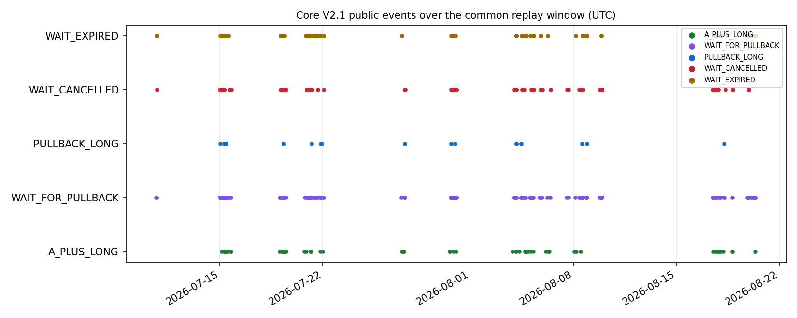

# Core V2.1 rule/data audit and historical signal replay

Date: 2026-09-19. Repository `rsi_bot`, branch `mua-tren-the-nang`.
Run packet: `research/results/core_v2_1_audit_replay/` (see `manifest.json` for
SHA-256 hashes; the ~100 MB decision ledger CSV/JSONL is git-ignored and
deterministically reproducible).

**This is a signal/state-machine audit over recorded historical candles.** It
is not realized P&L, not a fill simulation, and not evidence of an edge. No
order, fill, fee, funding, slippage, sizing, or portfolio metric is modeled.
No provider calls were made for this audit; all inputs are the previously
verified local CSV snapshots.

## 1. Scope and method

1. Read the reviewer-approved contract `docs/07_trading_strategies/core-v2-1.md`
   and `core-v2-1-execution-decisions.md`.
2. Read the pure evaluator `app/trading/strategy/core_v2_1/evaluator.py`, its
   locked config (`config.py`), the live signal runtime
   (`app/signal/core_v2_1/`), and the deterministic replay
   (`app/backtest/core_v2_1/`). Evaluator code matches the documented contract
   clause for clause (fresh cross, mandatory filters, anti-chase, WAIT state
   machine, re-arm, reference levels).
3. Re-ran the *existing* point-in-time replay CLI, unchanged, into a new
   directory: `python -m app.backtest.core_v2_1 --universe-mode full
   --data-dir app\backtest\data --output-dir research\results\core_v2_1_audit_replay`
   (`full:common_window`). Historical `artifacts/core_v2_1/` untouched.
4. Aggregated with `research/core_v2_1_audit_analysis.py` (new, research-only);
   regression tests in `tests/test_core_v2_1_audit_analysis.py`.

## 2. Recovered exact rules

Long-only, closed-candle setup scanner on Alt M15, evaluated point-in-time with
the latest fully closed Alt H1, BTC H1, BTC H4 contexts at the M15 close.
BTC is benchmark-only and never a trade candidate.

- **Fresh cross**: previous M15 RSI_EMA9 <= RSI_WMA45 and current >. One cross
  creates at most one cycle.
- **Mandatory filters** (all on the cross candle): M15 Close > EMA21, EMA21 >
  EMA200, EMA21 rising vs 3 bars ago; M15 RSI21 > 50, RSI21 > EMA9, RSI21 >
  WMA45; Alt H1 RSI21 > 50 and EMA9 >= WMA45; BTC H1 Close > EMA21, RSI21 > 50,
  EMA9 >= WMA45; BTC H4 RSI21 > EMA9 > WMA45 (strict chain). Any failure =
  silent reject, cycle consumed, symbol disarmed.
- **Anti-chase**: DistanceATR = (Close - EMA21)/ATR14 <= 1.0 and
  SignalRangeATR = (High - Low)/ATR14 <= 1.5 -> `A_PLUS_LONG` (immediate long).
  Otherwise `WAIT_FOR_PULLBACK` with reasons
  `PRICE_EXTENDED_FROM_EMA21` / `SIGNAL_CANDLE_TOO_LARGE`; cross candle is WAIT
  bar 0; displayed zone = [EMA21, EMA21 + 0.25*ATR14] recomputed per candle.
- **WAIT machine**: only the next 4 closed M15 candles; priority cancellation
  -> pullback confirmation -> expiry. Cancellation: M15 Close < EMA21, M15
  RSI21 < 50, M15 EMA9 <= WMA45, BTC H1 Close <= EMA21, BTC H1 RSI21 <= 50,
  BTC H1 EMA9 < WMA45, BTC H4 RSI21 <= EMA9, BTC H4 EMA9 <= WMA45.
  Confirmation: Low <= EMA21 + 0.25*ATR14 and all M15/H1/BTC filters bullish
  (no slope or anti-chase re-requirement). WAIT#4 without cancel/confirm =
  `WAIT_EXPIRED`; no WAIT#5.
- **Re-arm**: after any cycle-consuming outcome, a subsequent closed candle
  with RSI_EMA9 <= RSI_WMA45 re-arms. A terminal WAIT candle never also
  re-arms.
- **Reference levels (advisory)**: entry = signal candle Close; stop = candle
  Low - 0.25*ATR14; TP1/2/3 = entry + 1R/2R/3R. No execution floor; extreme
  inputs can produce non-positive stops by design.

Locked config `core-v2.1-locked-2026-08-20`: RSI threshold 50, max distance
1.0 ATR, max signal range 1.5 ATR, pullback/stop ATR fraction 0.25, 4 WAIT
candles, TP multiples (1, 2, 3).

## 3. Locked universe and timeframes

- 24 Binance USD-M futures candidates: ETH, SOL, BNB, XRP, DOGE, ADA, LINK,
  AVAX, SUI, HYPE, ZEC, LIT, AAVE, NEAR, XMR, TAO, ENA, WLD, FARTCOIN, JTO,
  INJ, UNI, ONDO, GRASS (USDT linear perps).
- 1 Hyperliquid candidate: PUMP (`PUMP/USDC:USDC`; no cross-venue
  substitution).
- BTCUSDT (Binance) benchmark context only.
- Indicators: Alt M15 EMA21/EMA200/ATR14/RSI21/EMA9(RSI)/WMA45(RSI); Alt H1,
  BTC H1 (+Close, EMA21), BTC H4 RSI bundles. No RSI14, no H2.

## 4. Warm-up / anchor contract

- Anchor `core-v2.1-anchor-2026-06-29T11:15Z-v1`: M15 source opens at
  2026-06-29T11:15:00Z; first complete closes M15 11:30Z, H1 13:00Z, H4 16:00Z.
- Recursive indicators seed from this absolute anchor, never a moving window;
  minimum 5,000 anchored M15 rows per source.
- Readiness: RSI21/EMA9/WMA45 bundle needs 66 closed candles; M15 evaluation
  needs 67 (current + previous bundle). ATR14 must be positive.
- Re-anchor or seed change requires an explicit strategy-version migration.

## 5. Historical coverage and exclusions

- All 25 candidates plus BTC benchmark present and valid; no missing/invalid
  sources. Common window: **2026-06-29T11:30:00Z through 2026-08-20T13:15:00Z**
  (52.07 days), limited by the alt snapshots (5,000 M15 candles each).
- BTC benchmark file was legitimately extended after the recorded run (commit
  `16348ea`, BTC signal review lab; now ends 2026-08-28T04:45Z). The replay
  common window is alt-limited, so results are unaffected; the row-by-row
  parity check below confirms it.
- 26,450 NOT_READY ledger rows are deterministic warm-up rows, dominated by
  the BTC H4 WMA45 seed (26,000 reason hits across 25 symbols = 1,040 triggers
  each, i.e. the first ~10.8 days until the first complete H4 bundle). Exact
  reason counts in `analysis_summary.json` (`not_ready_reasons`).
- 36 non-universe CSVs in `app/backtest/data/` are excluded by rule (other
  symbols or non-M15 timeframes); full list in `coverage_exclusions.json`.
- A synthetic `BTC_USDT_15m.csv` fixture is present and correctly excluded
  from the benchmark identity.

## 6. Replay results (signal audit only)

125,000 ledger records; 98,550 evaluated; 26,450 NOT_READY; 477 public events:

| Family | Event | Count |
|---|---|---:|
| **Immediate long** | `A_PLUS_LONG` | 63 |
| Pullback long | `WAIT_FOR_PULLBACK` (cycle opened) | 207 |
| Pullback long | `PULLBACK_LONG` (confirmed) | 19 |
| Pullback long | `WAIT_CANCELLED` | 72 |
| Pullback long | `WAIT_EXPIRED` | 116 |

Immediate-long is the A+ cross that passes anti-chase at the cross candle;
pullback-long events are the WAIT lifecycle. 207 WAIT cycles resolve to 19
confirmations + 72 cancellations + 116 expiries (207 = 19 + 72 + 116, exact).
Decision mix on evaluated rows: 92,800 QUIET, 2,534 REARMED, 2,274 REJECTED,
465 WAIT_CONTINUES, plus the 477 events.

Per-symbol breakdown in `analysis_summary.json` (`events_per_symbol`). Most
active: SOL 38, ETH 29, DOGE/LIT 26. ENA, HYPE, ONDO, XMR produced pullback
cycles but zero A+ events. PUMP (Hyperliquid) emitted 3 A+ and 9 WAIT cycles.

Representative point-in-time charts (closed candles only; markers at the
decision candle close):

- 
- 
- 
- 

The A+ chart shows the advisory reference entry/stop/TP1-3 levels as dotted
horizontals; these are signal outputs, not orders or fills.

## 7. Reproducibility

- This run reproduces the recorded 2026-08-20 run exactly: 125,000/98,550/
  26,450/477 and per-event counts (63/207/19/72/116) match
  `artifacts/core_v2_1/full_replay/core_v2_1_replay.metadata.json`; the full
  125,000-row key sequence and all 477 events are row-identical to the
  historical ledger.
- The run metadata recount in `analysis_summary.json`
  (`event_counts_match_recount = true`).
- Input hashes: all 25 alt sources match the recorded run; the BTC benchmark
  hash differs only because of the committed 2026-08-28 extension (Section 5).

## 8. Specified vs reference-only vs unresolved execution rules

Source of truth: `docs/07_trading_strategies/core-v2-1-execution-decisions.md`
(approved 2026-08-20, documented but **not yet implemented** in the runtime).

| Rule | Status |
|---|---|
| TP target prices 1R/2R/3R | **Specified** (locked multiples) |
| TP1/TP2/TP3 close percentages | **Unresolved** - do not infer |
| Strategy stop trigger: fully closed M15 Close < EMA21 (strict; wicks do not count) | **Specified** |
| Strategy-stop exit price/fill mechanics | **Unspecified** (trigger only) |
| Disaster/flash-crash stop in addition to strategy stop | **Unresolved** |
| Entry fill: next M15 open x (1 + slippage), adverse | **Specified** for execution backtests; close-as-fill allowed only in labelled signal-validation mode |
| Position sizing / account risk | **Specified by inheritance**: shared `config.yaml` risk block (no V2-only block); percentage fields are fractions - units must be test-verified before live use |
| Maximum holding | **Specified by inheritance**: same settings/behavior as older strategies; note the current signal-mode resolver does not yet forward per-strategy `strategy_params` |
| Overlapping signals | **Specified**: max one active advisory/position per strategy+symbol; portfolio-wide rule is an explicit non-decision |
| Canonical realized R gross vs net | **Unresolved** - store both |
| Hyperliquid fees | **Policy only**: standard-user tier, numeric rate must be verified from an authoritative source at implementation time (no hard-coded unverified rate); record rate + effective date |
| Reference entry/stop/TP values | **Reference levels only** - auditable advisory outputs, never fills |

## 9. Proposed reference-backtest protocol (single protocol, to freeze)

`core-v2.1-reference-backtest-v1`, frozen to `protocol.json` with SHA-256
before any performance number is computed:

1. **Signals**: the deterministic point-in-time replay ledger regenerated from
   the locked anchor (engine `core_v2_1_point_in_time`, strategy `2.1`, config
   `core-v2.1-locked-2026-08-20`); immediate-long and pullback-long entries
   reported separately.
2. **Entry**: `simulated_fill = next_M15_open * (1 + configured_slippage_rate)`
   per decision 3. A second close-as-fill pass is permitted only labelled
   `signal-validation`, never as execution P&L.
3. **Exits**: strategy stop evaluated on fully closed M15 Close < EMA21; TP
   orders at the 1R/2R/3R reference prices. TP allocation percentages and
   stop-exit fill mechanics are **unresolved**: any run must either record an
   explicitly flagged `ASSUMPTION_NOT_A_DECISION` in the protocol (and not
   present results as approved-policy P&L) or defer execution P&L entirely.
   No one-hour time-exit policy is carried over from the BTC M15/M5 research.
4. **Sizing/risk**: shared `config.yaml` risk settings only, after unit tests
   pin the numeric meaning of the percentage fields.
5. **Overlap**: one active position per strategy+symbol; state machine keeps
   processing so re-arm stays deterministic.
6. **Costs**: Binance USD-M taker/maker rates recorded with effective date;
   Hyperliquid standard-user rate verified at implementation time; funding
   either measured from data or labelled `EXCLUDED_BY_DESIGN` (never presented
   as observed zero).
7. **Accounting**: persist every audit field from the decisions doc; report
   gross and net realized R side by side until the canonical convention is
   chosen.
8. **Claims boundary**: the protocol measures execution/accounting behavior of
   the approved signal set. It is not an optimization harness; no
   profitability or live-suitability claim may be drawn from the signal
   replay in Section 6 alone.

## 10. Limitations

- Window is 52 days (2026-06-29 to 2026-08-20) - one market regime, alt-limited;
  no coverage before the anchor is possible under the locked seed contract.
- 477 events / 82 actionable entries (63 A+ + 19 pullback) is a small sample.
- Signal counts say nothing about fills, costs, or P&L.
- Charts are illustrative of point-in-time decisions, not trade outcomes.
