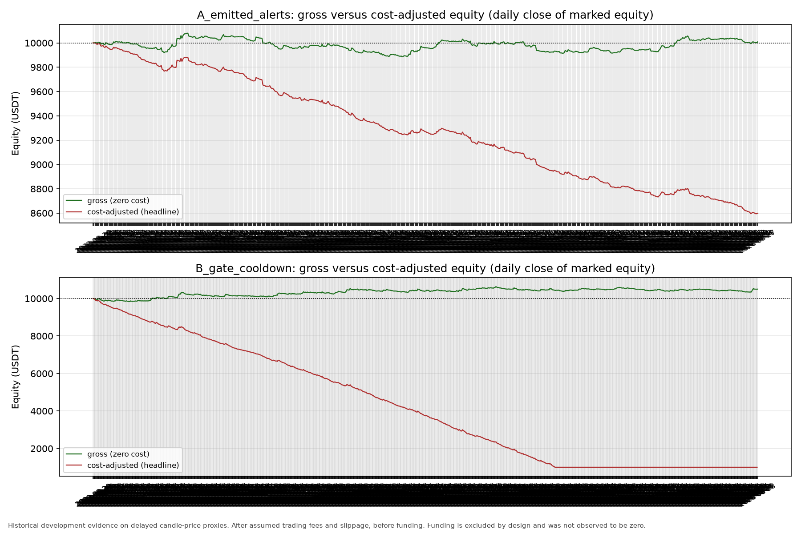
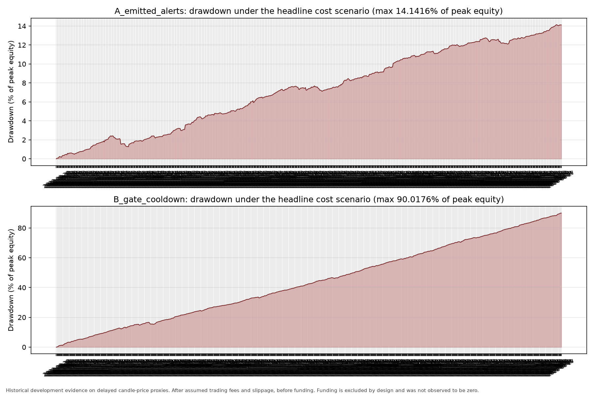
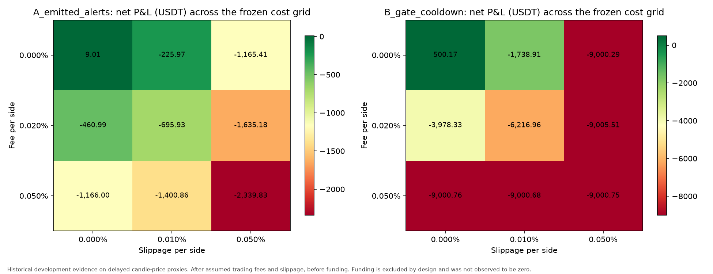

# BTC M15 reference backtest — frozen protocol, two policies

**Historical development evidence.** Both policies were traded over a window
that has already been examined in this repository, on delayed candle-price
proxies rather than guaranteed fills. This is not realized P&L, not a live
sizing recommendation, and not evidence of an edge.
Alpha assessment: `NOT_ASSESSED`.

**Cost-adjusted results are labelled: After assumed trading fees and slippage,
before funding.** Perpetual funding is deliberately excluded from this
experiment (`funding_status = EXCLUDED_BY_DESIGN`); no funding data was
downloaded and no funding accounting was implemented. Excluded funding must not
be read as *observed zero* funding — real funding could have been a cost or a
credit and is simply not measured here. Entry and exit rules were not adjusted
to avoid or capture funding settlements.

## Frozen protocol

- Protocol version: `btc-m15-reference-backtest-v2` (correction of `btc-m15-reference-backtest-v1`; the corrected execution, accounting, and drawdown contract supersedes the version-1 wording — see `protocol.json` correction notes), frozen before any performance number was computed (`protocol.json` SHA-256 `e4b8f00b9e3bc1abd598f08063b5ff8f…`).
- Evaluation window (UTC): `2022-08-28T00:00:00Z` → `2026-08-27T23:59:59.999999Z`.
- Capital: `10,000` USDT initial equity, `1,000` USDT fixed entry notional (research constants).
- Entry: open of the native M5 candle at the first 5-minute boundary strictly after the signal close (`floor(signal, 5m) + 5m`, derived from the signal time alone). If that exact candle is missing, the signal is skipped as `MISSING_ENTRY_CANDLE`; no later candle is substituted. Exit: exactly 60 minutes later at that candle's open.
- No stop-loss, take-profit, trailing rule, or alternative horizon. One active position per policy, no pyramiding, exits processed before entries at the same timestamp. A deferred entry is priced at its actual deferred timestamp, never at the original scheduled index.
- Open equity is wallet cash plus unrealized P&L (`cash + unrealized`; equivalently available cash + reserved + unrealized). Unresolved positions retain paid fees and exposure, report unrealized as unknown, and are never presented as flat. Drawdown is research-local and positional; a new equity peak always resets pointwise drawdown to zero.

## Populations and policy definitions

| Policy | Signal rule | Cooldown | Signals |
|---|---|---|---:|
| `A_emitted_alerts` | Emitted replay M15 alerts: fresh RSI21 EMA9/WMA45 bullish cross **and** M15, H1, H4 closes above native EMA21 | Replay one-hour per-timeframe | 1,175 |
| `B_gate_cooldown` | The same three price-above-EMA21 gates **without** the RSI crossover | **Its own** independent one-hour cooldown | 11,196 |

Policy B is **not** the descriptive `gate_ready_no_cross` population from the M15
diagnostic, which had no cooldown. That population counted **38,292** bars over
the diagnostic's earlier matched window (`2022-08-30T04:15:00Z` → `2026-08-27T15:00:00Z`),
whereas the same cooldown-free gate rule yields **38,335** bars over this
experiment's wider evaluation window. Policy B applies the one-hour cooldown and
is therefore far smaller, with accepted bars at least 60 minutes apart.

## Headline results (fee 0.050% per side, slippage 0.010% per side)

| Metric | A `emitted_alerts` | B `gate_cooldown` |
|---|---:|---:|
| Signals | 1,175 | 11,196 |
| Trades entered | 1,175 | 7,863 |
| Entries skipped | 0 | 3,333 |
| Entries deferred to a position exit | 0 | 0 |
| Unresolved trades | 0 | 0 |
| Gross P&L (USDT) | 9.01 | 434.28 |
| Execution friction P&L (USDT) | -234.98 | -1,572.53 |
| Fee P&L (USDT) | -1,174.89 | -7,862.43 |
| Net P&L (USDT) | -1,400.86 | -9,000.68 |
| Gross P&L per trade (USDT) | 0.0077 | 0.0552 |
| Net P&L per trade (USDT) | -1.1922 | -1.1447 |
| Final equity (USDT) | 8,599.14 | 999.32 |
| Total return (%) | -14.0086 | -90.0068 |
| Max drawdown (% of peak equity) | 14.1416 | 90.0176 |
| Time in market (%) | 3.35% | 22.42% |
| Average deployed notional (USDT) | 33.51 | 224.25 |
| Total turnover (USDT) | 2,349,774.03 | 15,724,861.75 |
| Turnover / initial equity | 234.98 | 1572.49 |
| Win rate (%) | 29.36 | 30.87 |
| Expectancy per trade (USDT) | -1.1922 | -1.1447 |

Gross, friction, and fee components are disjoint and sum to net P&L; nothing is
double counted. `time_in_market_fraction` is position-seconds divided by window
seconds, and `average_deployed_notional_usdt` is notional-seconds divided by window
seconds, so neither is inflated by overlapping exposure — there is none.

Every row above is **After assumed trading fees and slippage, before funding.**

### Capital exhaustion must be read alongside these totals

- `A_emitted_alerts`: capital exhausted = `False`; 0 of 1,175 signals were never entered.
- `B_gate_cooldown`: capital exhausted = `True`; 3,333 of 11,196 signals were never entered.

The frozen constants (10,000 USDT equity, 1,000 USDT fixed non-compounding notional,
one position at a time) mean that a policy which loses money at this trade count stops
being able to afford the next fixed-size entry and stops entering. `INSUFFICIENT_FREE_CASH`
means inability to afford the next `1,000` USDT entry plus its fee — not necessarily
bankruptcy: the wallet can remain positive but below the fixed entry threshold (for example,
policy B ends near `999` USDT, which cannot fund another `1,000` USDT entry). Any policy
that hits this capital stop has its *realized* net P&L truncated by that stop, so the
headline net totals are **not** a clean like-for-like comparison. Dividing account totals
by executed trades does **not** make results capital-independent or automatically like-for-like:
the account's trade set is truncated to early affordable entries (a timing- and affordability-
conditioned subset), so per-trade averages remain conditional and are not a full-opportunity average.
See the separately labelled full-opportunity-set diagnostic below for the affordability-free view.

### Why both policies lose: costs dominate the gross edge

- `A_emitted_alerts`: gross +0.0077 USDT per trade, net -1.1922 USDT per trade, so assumed costs remove about 1.1999 USDT (≈0.120% of the 1,000 USDT entry notional) on every round trip.
- `B_gate_cooldown`: gross +0.0552 USDT per trade, net -1.1447 USDT per trade, so assumed costs remove about 1.1999 USDT (≈0.120% of the 1,000 USDT entry notional) on every round trip.

At the headline assumptions the round-trip fee plus slippage is roughly 0.12% of notional,
while the measured gross edge per trade is a small fraction of that. Policy B trades far
more often (turnover 1,572× initial equity versus 235× for A), so it pays that toll far
more times. This is a cost-drag observation about trade frequency, not a claim about
either signal's predictive quality.


## Full-opportunity-set diagnostic (not an account, not compounded)

The same frozen signals, entry/exit rules, and headline cost assumptions, evaluated
hypothetically per signal **without** cash-based admission and **without**
position-overlap blocking. Each signal is priced independently; hypothetical P&L is
summed without compounding into an account-equity curve. Do not read this as an
executable account history.

| Metric | A `emitted_alerts` | B `gate_cooldown` |
|---|---:|---:|
| Signals | 1,175 | 11,196 |
| Hypothetical trades (exact entry and exit present) | 1,175 | 11,196 |
| Skipped or unresolved signals | 0 | 0 |
| Unresolved (missing exact exit) | 0 | 0 |
| Hypothetical gross P&L (USDT) | 9.01 | 500.17 |
| Hypothetical friction P&L (USDT) | -234.98 | -2,239.08 |
| Hypothetical fee P&L (USDT) | -1,174.89 | -11,195.13 |
| Hypothetical net P&L (USDT) | -1,400.86 | -12,934.04 |
| Hypothetical net per signal (USDT) | -1.1922 | -1.1552 |
| Hypothetical net per hypothetical trade (USDT) | -1.1922 | -1.1552 |

Date coverage (both views share the same frozen signals and evaluation window):

- `A_emitted_alerts` account entries: `1175` signals (2022-08-30T04:15:00Z → 2026-08-27T15:00:00Z); account entered 1175 (2022-08-30T04:20:00Z → 2026-08-27T15:05:00Z); diagnostic hypothetical 1175 (2022-08-30T04:20:00Z → 2026-08-27T15:05:00Z).
- `B_gate_cooldown` account entries: `11196` signals (2022-08-29T16:00:00Z → 2026-08-27T23:00:00Z); account entered 7863 (2022-08-29T16:05:00Z → 2025-05-16T20:05:00Z); diagnostic hypothetical 11196 (2022-08-29T16:05:00Z → 2026-08-27T23:05:00Z).

Every row in this section is **After assumed trading fees and slippage, before funding**,
exactly like the account view, but without affordability filtering and without equity compounding.


## Cost sensitivity (every frozen scenario)

Cost sensitivity below shows the capital-constrained **account** view. The full-opportunity
diagnostic is computed for every frozen scenario as well and is stored in `summary.json`
under `full_opportunity_diagnostic`; only the headline diagnostic is tabulated in this report.

| Fee / side | Slippage / side | A net P&L | A gross P&L | A fees | A friction | B net P&L | B gross P&L | B fees | B friction |
|---|---:|---:|---:|---:|---:|---:|---:|---:|---:|
| 0.000% | 0.000% | 9.01 | 9.01 | 0.00 | 0.00 | 500.17 | 500.17 | 0.00 | 0.00 |
| 0.000% | 0.010% | -225.97 | 9.01 | 0.00 | -234.98 | -1,738.91 | 500.17 | 0.00 | -2,239.08 |
| 0.000% | 0.050% | -1,165.41 | 9.01 | 0.00 | -1,174.42 | -9,000.29 | 411.42 | 0.00 | -9,411.71 |
| 0.020% | 0.000% | -460.99 | 9.01 | -470.00 | 0.00 | -3,978.33 | 500.17 | -4,478.50 | 0.00 |
| 0.020% | 0.010% | -695.93 | 9.01 | -469.95 | -234.98 | -6,216.96 | 500.17 | -4,478.05 | -2,239.08 |
| 0.020% | 0.050% | -1,635.18 | 9.01 | -469.77 | -1,174.42 | -9,005.51 | 553.78 | -2,731.15 | -6,828.14 |
| 0.050% | 0.000% | -1,166.00 | 9.01 | -1,175.00 | 0.00 | -9,000.76 | 412.44 | -9,413.21 | 0.00 |
| 0.050% | 0.010% | -1,400.86 | 9.01 | -1,174.89 | -234.98 | -9,000.68 | 434.28 | -7,862.43 | -1,572.53 |
| 0.050% | 0.050% | -2,339.83 | 9.01 | -1,174.42 | -1,174.42 | -9,000.75 | 427.18 | -4,713.86 | -4,714.07 |

Fees use the Binance USD-M defaults in `app/core/constants.py` as illustrative
research assumptions, not as verified account fees. Slippage is an assumed
research friction. Perpetual funding is **excluded by design** and is not zero
observed funding, so none of these scenarios is fully net profit.

## Charts







- `charts/equity_gross_vs_cost.png` — gross versus cost-adjusted equity per policy.
- `charts/drawdown.png` — drawdown under the headline cost scenario per policy.
- `charts/cost_sensitivity.png` — net P&L across the full frozen fee/slippage grid.

## Missing data and unresolved trades

- Unresolved trades excluded from realized P&L: **0** (A) and **0** (B).
- Skipped entries and their reasons: A `{}`, B `{"INSUFFICIENT_FREE_CASH": 3333}`.
- A missing exact entry candle skips the entry as `MISSING_ENTRY_CANDLE`; a missing exact exit candle leaves the trade explicitly unresolved (`UNRESOLVED_MISSING_EXIT_CANDLE`) and blocks new exposure. A position still open because its scheduled exit falls past the window end is labelled `OPEN_AT_EVALUATION_END`. No price is ever substituted and no later candle is ever used silently.
- Entries are bounded by the window end; a trade already entered runs to its exact scheduled exit, which may fall after the window end (equity timestamps remain monotonic past the window end).
- Open equity uses the available native M5 close as its mark; unresolved rows retain paid fees and known exposure with unrealized reported as unknown and equity reported as the fee-adjusted cash floor (never as flat).

## Verification

- An independent one-hour cooldown over the 1,212 cross-and-gate M15 bars reproduces the replay's emitted alerts exactly: `True` (1,175 vs 1,175).
- Source hashes re-checked against the parent packet: `True`.
- Every signal produces exactly one entry outcome (filled, deferred then filled, or skipped with a reason), enforced at run time.
- Every executed trade holds exactly 60 minutes, deploys exactly the frozen 1,000 USDT entry notional, and ends `CLOSED_AT_SCHEDULED_EXIT`; there are no unresolved trades in this dataset.
- The trade ledger reconciles with the equity curve: final equity equals initial equity plus the sum of net trade P&L; open equity equals wallet cash plus unrealized (a flat-price, zero-cost open leaves equity unchanged); a new equity peak always yields zero drawdown.

## Limitations

- Every observation is historical development evidence on an already-examined window; there is no untouched holdout.
- Candle opens are delayed proxies. Real fills, partial fills, queue position, spread, and market impact are not modelled.
- Perpetual funding is `EXCLUDED_BY_DESIGN`: excluded on purpose, never measured, and not observed to be zero.
- Cost-adjusted numbers are therefore *After assumed trading fees and slippage, before funding* and are not fully net profit.
- Only one policy pair, one horizon, and one exit rule were tested. Nothing here was optimized, and nothing should be promoted to live trading.
- No conclusion here changes any production strategy, sizing, risk control, or configuration.
- No historical funding data was downloaded, and no production trading logic was touched.

## Exact reproduction

```powershell
python -m research.btc_m15_reference_reporting --baseline-run "C:\Users\hkpug\Documents\GitHub\rsi_bot\research\results\phase1_reproduction_local\run_20260918T092140133007Z_97d3c169" --output-dir "C:\Users\hkpug\Documents\GitHub\rsi_bot\research\results\m15_reference_backtest_runs"
```
