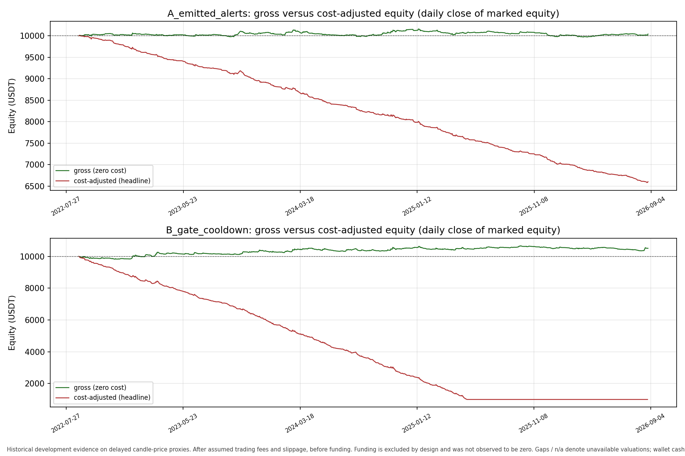
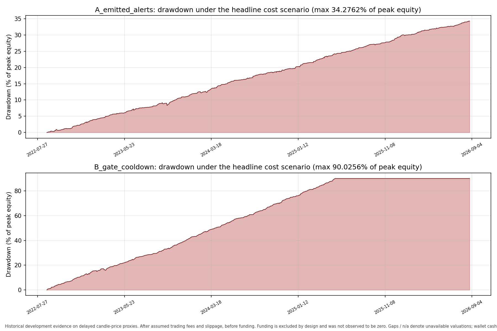
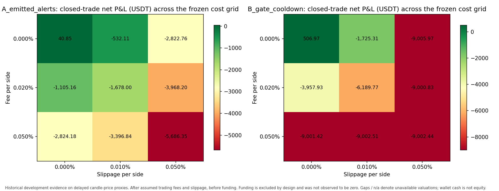

# Frozen BTC M5 reference backtest

**Historical development evidence. Alpha NOT_ASSESSED. No optimization or untouched holdout.**

Funding: **EXCLUDED_BY_DESIGN**, not observed zero. Every cost-adjusted figure is **after assumed trading fees and slippage, before funding**; it is not fully net profit.

## Frozen protocol

- A: unchanged emitted M5 RSI alignment/state alerts, evaluated by `evaluate_m5_cross`; no fresh crossover is required.
- B: only M5/H1/H4 native close > EMA21(price), with 21 contiguous price candles on each timeframe; no RSI conditions or readiness. B has its own independent one-hour cooldown.
- Window: 2022-08-28 inclusive to 2026-08-28 exclusive (UTC); full earlier native history supplies indicator warmup.
- Entry: next exact M5 boundary strictly after signal close; missing exact candles never jump forward. Exit: exact entry + 60 minutes at native open, even past the signal window when available.
- One position per policy, exits before simultaneous entries, no deferred M5 entries, no stops/targets/new filters/parameter search. Missing exits leave unresolved exposure and block new entries.
- Capital 10,000.00 USDT; fixed notional 1,000.00 USDT. Headline fee 0.050%/side and slippage 0.010%/side (approximately 12 bps round trip).
- Candle-price proxies, not guaranteed executable fills. All nine frozen cost scenarios are reported, never selected for performance.

## Capital-constrained accounts — headline costs

| Metric | A emitted alerts | B price gates |
|---|---:|---:|
| Signals | 2,865 | 11,162 |
| Entered trades | 2,865 | 7,882 |
| Closed trades | 2,865 | 7,882 |
| Skipped entries | 0 | 3,280 |
| Unresolved trades | 0 | 0 |
| Gross P&L, admitted trades (USDT) | 40.85 | 455.26 |
| Slippage P&L (USDT) | -572.95 | -1,576.33 |
| Fee P&L, closed trades (USDT) | -2,864.73 | -7,881.44 |
| Cost-adjusted P&L, closed trades (USDT) | -3,396.84 | -9,002.51 |
| Final wallet cash (USDT) | 6,603.16 | 997.49 |
| Final equity (USDT) | 6,603.16 | 997.49 |
| Account return (%) | -33.9684 | -90.0251 |
| Gross return / closed trade | 0.00143% | 0.00578% |
| Cost-adjusted return / closed trade | -0.11856% | -0.11422% |
| Approx. break-even round-trip cost (bps) | 0.1426 | 0.5776 |
| Max drawdown (% of peak marked equity) | 34.2762 | 90.0256 |
| Time in market | 8.1708% | 22.4789% |
| Average deployed notional (USDT) | 81.71 | 224.79 |
| Turnover, entry + exit notionals (USDT) | 5,729,467.89 | 15,762,878.93 |
| Turnover / initial equity | 572.95 | 1,576.29 |

Per-trade account averages are **conditional on affordability and timing**, not capital-independent. INSUFFICIENT_FREE_CASH means inability to afford the next fixed entry, **not bankruptcy**.

- A_emitted_alerts: skips `{}`; account entry coverage `{'count': 2865, 'first_utc': '2022-08-30T00:05:00Z', 'last_utc': '2026-08-27T22:40:00Z'}`; valuation `COMPLETE`; final equity timestamp `2026-08-27T23:59:59.999999Z`; last valuation `2026-08-27T23:59:59.999999Z` = 6,603.16 USDT.
- B_gate_cooldown: skips `{"INSUFFICIENT_FREE_CASH": 3280}`; account entry coverage `{'count': 7882, 'first_utc': '2022-08-29T16:05:00Z', 'last_utc': '2025-05-20T18:05:00Z'}`; valuation `COMPLETE`; final equity timestamp `2026-08-27T23:59:59.999999Z`; last valuation `2026-08-27T23:59:59.999999Z` = 997.49 USDT.

Wallet cash is not an equity floor. Unavailable equity/unrealized P&L is null, not flat or zero; paid fees and known exposure are retained. COMPLETE means all reported mark/event rows are valued, not uninterrupted M5 coverage or continuous-price drawdown. Drawdown uses full-resolution available marks, not the compact daily CSV. Missing valuations make dependent metrics incomplete.

## Full-opportunity diagnostics — NOT accounts

Every signal is priced independently at fixed notional with the same execution/cost rules, no cash admission or overlap blocking. This is **not an account**, is not compounded into equity, and has no account drawdown.

| Metric | A emitted alerts | B price gates |
|---|---:|---:|
| Hypothetical trades | 2,865 | 11,162 |
| Skipped or unresolved | 0 | 0 |
| Gross P&L sum (USDT) | 40.85 | 506.97 |
| Cost-adjusted P&L sum (USDT) | -3,396.84 | -12,886.45 |
| Gross return / hypothetical trade | 0.00143% | 0.00454% |
| Cost-adjusted return / hypothetical trade | -0.11856% | -0.11545% |
| Approx. break-even round-trip cost (bps) | 0.1426 | 0.4542 |

Approximate break-even round-trip cost = mean gross return on fixed entry notional × 10,000. It ignores nonlinear fee/slippage interactions; a negative value cannot support any nonnegative cost. Diagnostic drawdown/equity are not defined; account values must not be substituted.

## Entire frozen cost grid

All P&L values below are USDT, after assumed fees/slippage and before funding.

| Fee/side (%) | Slip/side (%) | A account P&L | B account P&L | A diagnostic P&L | B diagnostic P&L |
|---:|---:|---:|---:|---:|---:|
| 0.000 | 0.000 | 40.85 | 506.97 | 40.85 | 506.97 |
| 0.000 | 0.010 | -532.11 | -1,725.31 | -532.11 | -1,725.31 |
| 0.000 | 0.050 | -2,822.76 | -9,005.97 | -2,822.76 | -10,649.96 |
| 0.020 | 0.000 | -1,105.16 | -3,957.93 | -1,105.16 | -3,957.93 |
| 0.020 | 0.010 | -1,678.00 | -6,189.77 | -1,678.00 | -6,189.77 |
| 0.020 | 0.050 | -3,968.20 | -9,000.83 | -3,968.20 | -15,112.63 |
| 0.050 | 0.000 | -2,824.18 | -9,001.42 | -2,824.18 | -10,655.29 |
| 0.050 | 0.010 | -3,396.84 | -9,002.51 | -3,396.84 | -12,886.45 |
| 0.050 | 0.050 | -5,686.35 | -9,002.44 | -5,686.35 | -21,806.64 |

## M5 versus M15 — matching trading assumptions

Same sources/window, capital, fixed notional, execution delay, holding time, fee/slippage grid and excluded funding. Signals differ by definition; M5 B uses price-only readiness, whereas historical M15 B used shared preparation. The comparison is historical, not an isolated causal estimate of timeframe or RSI value.

| Timeframe/policy | Signals | Account trades | Account net (USDT) | Account max DD (%) | Full-opportunity gross/trade | Full-opportunity net (USDT) |
|---|---:|---:|---:|---:|---:|---:|
| M5 A | 2,865 | 2,865 | -3,396.84 | 34.2762 | 0.00143% | -3,396.84 |
| M5 B | 11,162 | 7,882 | -9,002.51 | 90.0256 | 0.00454% | -12,886.45 |
| M15 A | 1,175 | 1,175 | -1,400.86 | 14.1416 | 0.00077% | -1,400.86 |
| M15 B | 11,196 | 7,863 | -9,000.68 | 90.0176 | 0.00447% | -12,934.04 |

## Verification and reproduction

- Ordered M5 signal parity: `{'matches': True, 'emitted_count': 2865, 'reconstructed_count': 2865, 'method': 'Every M5 bar prepared and evaluated with existing state evaluator, then independent 60-minute cooldown; exact ordered timestamp equality'}`.
- Price-only B scan: `{'candidate_bars': 420768, 'price_ready_bars': 420768, 'price_gated_bars': 92720, 'excluded_bars': 0, 'exclusion_reasons': {}, 'readiness': '21 contiguous native price candles per timeframe; no RSI readiness or conditions'}`.
- Runtime ledger checks passed for all 18 policy/scenario combinations.
- All native source hashes match the accepted parent and M15 comparison. Historical packets are read-only.
- Full ledgers are local under `full/`; manifest records physical SHA-256 hashes and counts. Regenerate with the command below. Compact daily rows use the LAST row per day (including nulls); they are not used to calculate maximum drawdown.

```text
python -m research.btc_m5_reference_reporting --baseline-run "research\results\phase1_reproduction_local\run_20260918T092140133007Z_97d3c169" --data-dir "research\data\btc_four_year_20220828_20260828" --m15-run "research\results\m15_reference_backtest_runs\run_20260918T125747028014Z_991fd4d1" --output-dir "research\results\m5_reference_backtest_runs"
```






